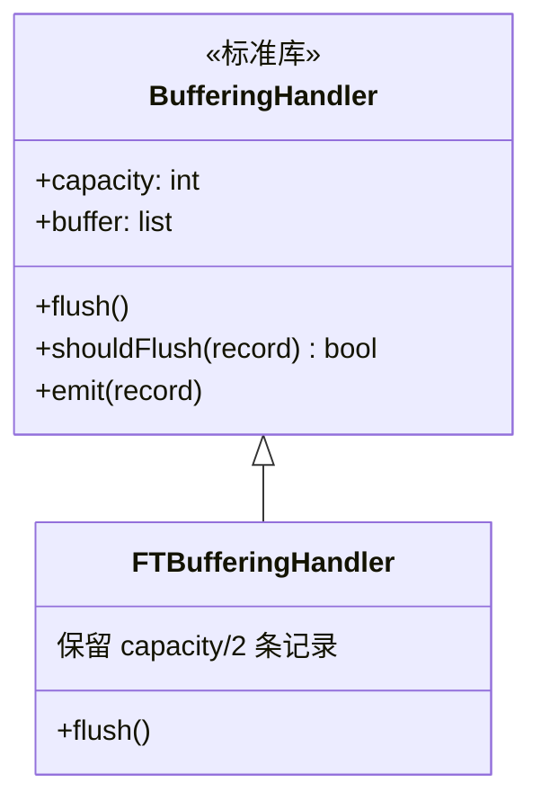

# buffering_handler.py

## 概述

`freqtrade/loggers/buffering_handler.py` 定义了自定义的内存缓冲日志处理器 `FTBufferingHandler`，继承自 Python 标准库的 `BufferingHandler`。该处理器在内存中保留最近的日志记录，主要用于 API `/log` 端点，让用户通过 Web 界面查看最近的日志输出。与标准 `BufferingHandler` 的区别在于自定义的 `flush` 行为——不会清空所有缓冲，而是保留一半容量的记录。

## 架构图



## 核心类/函数

### FTBufferingHandler(BufferingHandler)

自定义内存缓冲日志处理器。

#### flush(self) -> None

重写的缓冲刷新方法。

- **标准行为**：`BufferingHandler.flush()` 会清空整个 buffer
- **自定义行为**：只保留最近 `capacity / 2` 条记录
- **职责**：
  1. 获取线程锁（`self.acquire()`）
  2. 计算保留记录数：`-int(self.capacity / 2)`（取负数用于列表切片）
  3. 将 buffer 截断为后半部分
  4. 释放线程锁（`self.release()`）
- **设计意图**：避免日志轮转时出现"空白期"，确保用户查看 `/log` 端点时总能看到一些历史记录
- **线程安全**：使用 `acquire/release` 锁机制确保并发安全

#### 使用方式

在 `freqtrade/loggers/__init__.py` 中实例化：
```python
bufferHandler = FTBufferingHandler(1000)  # 容量 1000 条
bufferHandler.setFormatter(Formatter(LOGFORMAT))
```

当缓冲区满（达到 1000 条）时，`shouldFlush` 返回 True，触发 `flush()`，保留最近 500 条记录。

## 依赖关系

### 内部依赖（本项目模块）
无

### 外部依赖（第三方库）
- `logging.handlers.BufferingHandler` — 标准库，内存缓冲日志处理器基类

### 被依赖（谁引用了本文件）
- `freqtrade.loggers.__init__` — 导入 `FTBufferingHandler`，创建全局 `bufferHandler` 实例
