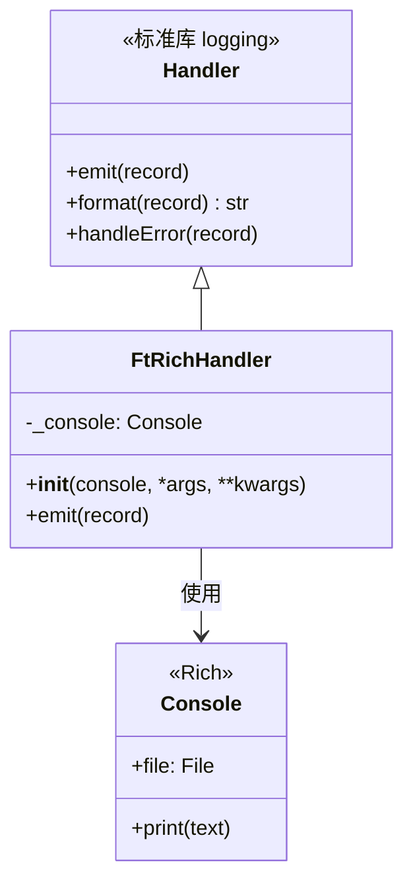
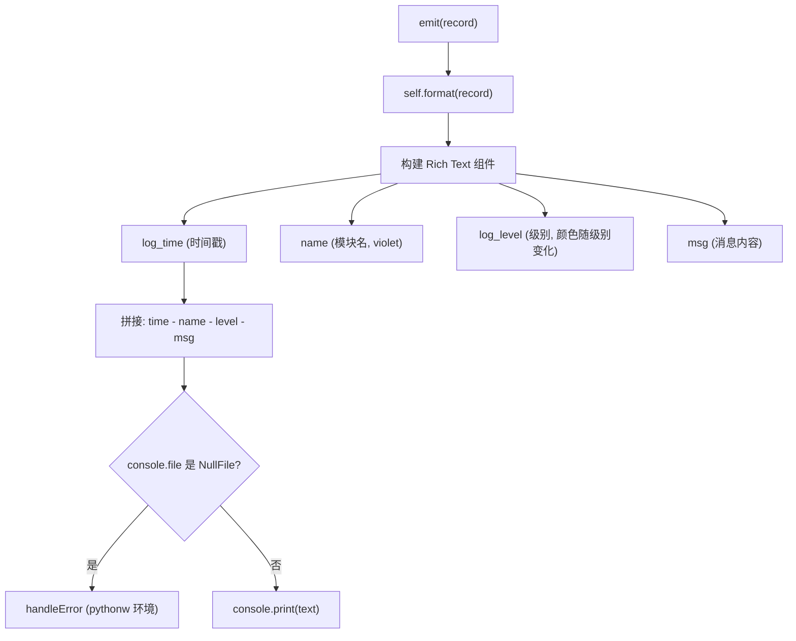

# ft_rich_handler.py

## 概述

`freqtrade/loggers/ft_rich_handler.py` 定义了基于 Rich 库的自定义日志处理器 `FtRichHandler`。它替代了标准的 `StreamHandler`，提供彩色的、格式化良好的控制台日志输出。该处理器使用硬编码的日志格式（时间 - 模块名 - 级别 - 消息），通过 Rich 的 `Text` 对象实现语法高亮和颜色控制。

## 架构图

## 核心类/函数

### FtRichHandler(Handler)

基于 Rich 的彩色日志处理器。

#### `__init__(self, console: Console, *args, **kwargs) -> None`

- **参数**：
  - `console` — Rich `Console` 实例，通常输出到 stderr
  - `*args, **kwargs` — 传递给 `Handler.__init__`
- **职责**：保存 Console 引用

#### `emit(self, record) -> None`

输出一条日志记录。

- **参数**：`record` — `logging.LogRecord` 对象
- **职责**：
  1. 调用 `self.format(record)` 获取格式化后的消息文本
  2. 构建 Rich `Text` 组件：
     - **时间戳**：`YYYY-MM-DD HH:MM:SS,mmm` 格式
     - **模块名**：紫色（`violet`）样式
     - **日志级别**：根据级别自动着色（`logging.level.debug/info/warning/error`）
     - **分隔符**：灰色（`gray46`）的 ` - `
  3. 检查 `console.file` 是否为 `NullFile`（pythonw 环境下 stdout/stderr 为 null）
  4. 调用 `console.print()` 输出组合后的 Rich Text

- **异常处理**：
  - `RecursionError` — 直接重新抛出（避免日志系统递归死循环）
  - `ImportError` — 静默忽略（关闭时 console 可能不可用）
  - 其他异常 — 调用 `handleError(record)` 走标准错误处理

- **关键逻辑**：
  - 不支持标准 `logging.Handler` 的所有功能（如格式化字符串中的所有占位符），使用硬编码格式
  - `NullFile` 检测处理 pythonw（无控制台窗口的 Python）环境

## 依赖关系

### 内部依赖（本项目模块）
无

### 外部依赖（第三方库）
- `logging.Handler` — 标准库，日志处理器基类
- `datetime.datetime` — 标准库，时间戳格式化
- `rich.console.Console` — Rich 库，控制台输出
- `rich.text.Text` — Rich 库，富文本对象
- `rich._null_file.NullFile` — Rich 库，空文件检测

### 被依赖（谁引用了本文件）
- `freqtrade.loggers.__init__` — 导入 `FtRichHandler`，用于 `setup_logging_pre()` 和 `FT_LOGGING_CONFIG`
- 日志配置字典中通过类路径字符串引用：`"freqtrade.loggers.ft_rich_handler.FtRichHandler"`
