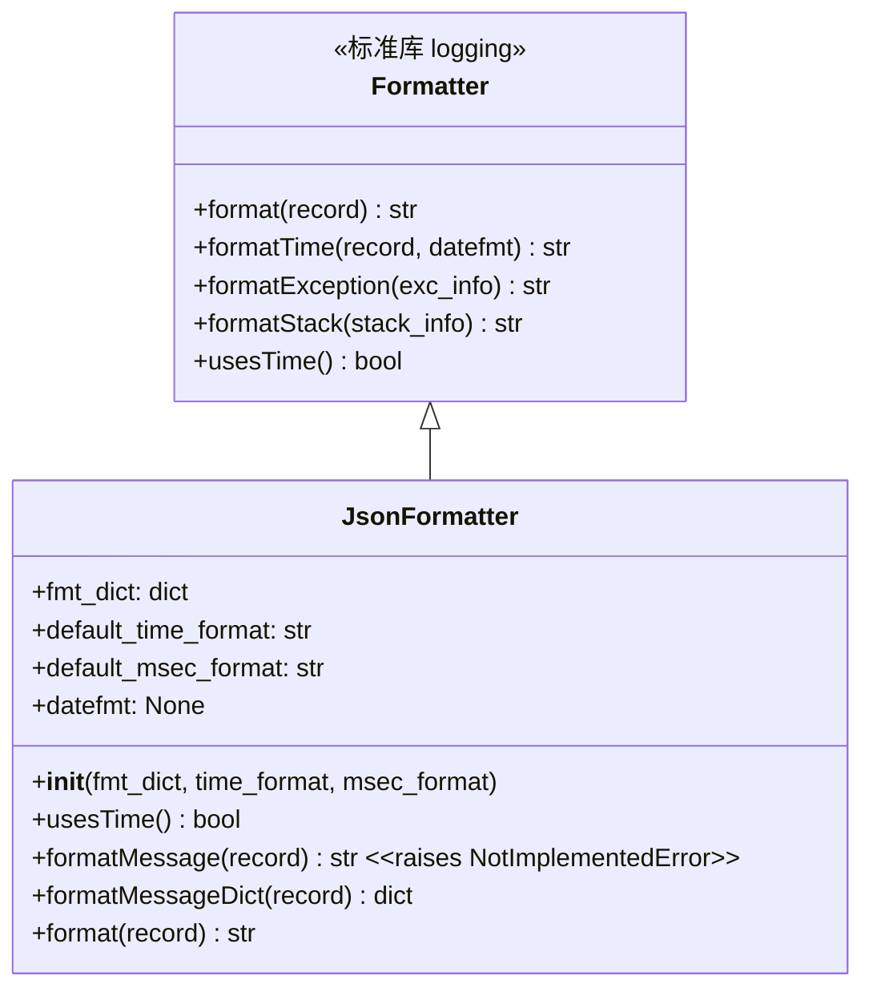
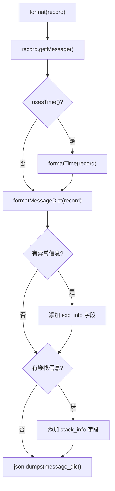

# json_formatter.py

## 概述

`freqtrade/loggers/json_formatter.py` 定义了 `JsonFormatter` 类，一个将日志记录输出为 JSON 格式的自定义日志格式化器。该格式化器继承自 `logging.Formatter`，但不输出传统的文本格式日志，而是输出结构化的 JSON 字符串。适用于需要机器可读日志的场景，如日志聚合系统（ELK Stack、Splunk 等）。

## 架构图





## 核心类/函数

### JsonFormatter(logging.Formatter)

JSON 格式的日志格式化器。

#### `__init__(self, fmt_dict=None, time_format="%Y-%m-%dT%H:%M:%S", msec_format="%s.%03dZ")`

- **参数**：
  - `fmt_dict` — 输出 JSON 的键与 LogRecord 属性的映射字典。默认值：
    ```python
    {
        "timestamp": "asctime",    # JSON 键 "timestamp" 映射到 LogRecord.asctime
        "level": "levelname",      # JSON 键 "level" 映射到 LogRecord.levelname
        "logger": "name",          # JSON 键 "logger" 映射到 LogRecord.name
        "message": "message",      # JSON 键 "message" 映射到 LogRecord.message
    }
    ```
  - `time_format` — 时间格式，默认 ISO 8601 格式
  - `msec_format` — 毫秒格式，默认带 Z 后缀的 UTC 格式

#### `usesTime(self) -> bool`

判断是否需要格式化时间戳。

- **逻辑**：检查 `fmt_dict` 的值中是否包含 `"asctime"`（而不是检查格式字符串）

#### `formatMessage(self, record) -> str`

- **行为**：直接抛出 `NotImplementedError`
- **设计意图**：`JsonFormatter` 不使用字符串格式化，改用 `formatMessageDict`

#### `formatMessageDict(self, record) -> dict

将 LogRecord 转换为字典。

- **参数**：`record` — LogRecord 对象
- **返回值**：根据 `fmt_dict` 映射构建的字典
- **异常**：如果 `fmt_dict` 中引用了不存在的 LogRecord 属性，抛出 `KeyError`

#### `format(self, record) -> str`

核心格式化方法，将 LogRecord 转换为 JSON 字符串。

- **参数**：`record` — LogRecord 对象
- **返回值**：JSON 格式字符串
- **职责**：
  1. 调用 `record.getMessage()` 获取消息文本
  2. 如果需要时间戳，调用 `formatTime`
  3. 调用 `formatMessageDict` 获取基础字典
  4. 如果存在异常信息（`record.exc_info`），添加 `exc_info` 字段
  5. 如果存在堆栈信息（`record.stack_info`），添加 `stack_info` 字段
  6. 使用 `json.dumps` 序列化为 JSON 字符串
- **输出示例**：
  ```json
  {
    "timestamp": "2024-01-15T10:30:45.123Z",
    "level": "INFO",
    "logger": "freqtrade.worker",
    "message": "Bot heartbeat. PID=12345"
  }
  ```

## 依赖关系

### 内部依赖（本项目模块）
无

### 外部依赖（第三方库）
- `json` — 标准库，JSON 序列化
- `logging` — 标准库，日志格式化器基类

### 被依赖（谁引用了本文件）
- 可通过用户自定义 `log_config` 配置使用。在 `logging.config.dictConfig` 的 formatters 部分引用类路径 `"freqtrade.loggers.json_formatter.JsonFormatter"` 即可启用
