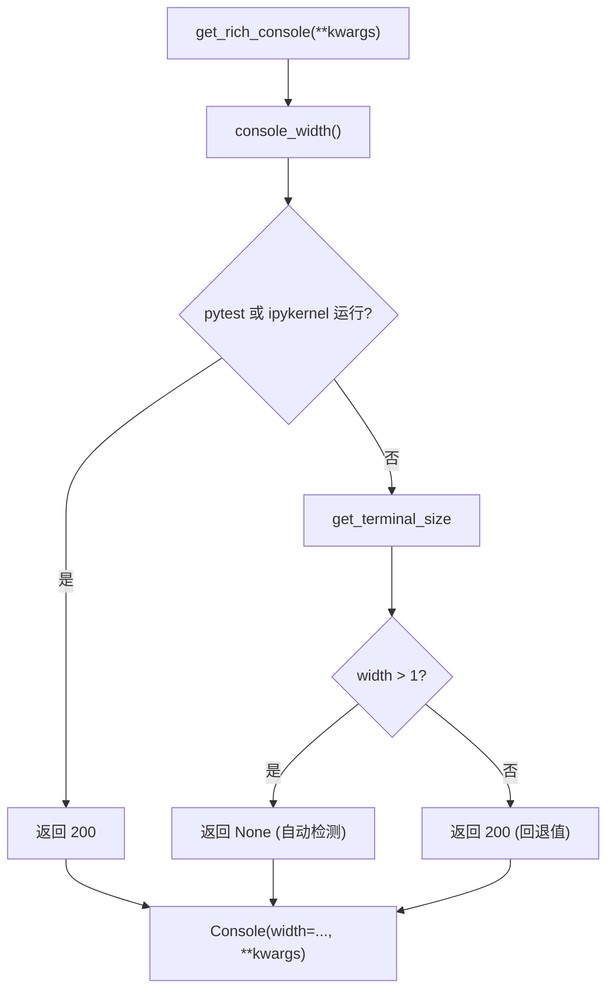

# rich_console.py

## 概述

`freqtrade/loggers/rich_console.py` 提供 Rich `Console` 实例的工厂函数，用于在整个 Freqtrade 项目中统一创建具有一致配置的 Rich 控制台对象。核心功能是自动检测终端宽度，并在测试环境或无终端环境下提供合理的回退值。

## 架构图



## 核心类/函数

### console_width() -> int | None

获取控制台输出宽度。

- **返回值**：
  - `200` — 测试环境（pytest）或 Jupyter 环境（ipykernel）
  - `None` — 正常终端环境（让 Rich 自动检测宽度）
  - `200` — 无法获取终端宽度时的回退值
- **职责**：
  1. 检查是否在 pytest 或 ipykernel 中运行（通过 `sys.modules` 检测）
  2. 如果是测试/Jupyter 环境，返回固定宽度 200（确保输出不被截断）
  3. 否则调用 `shutil.get_terminal_size`，默认回退宽度为 (1, 24)
  4. 如果获取到的宽度 > 1，返回 `None`（让 Rich 使用实际终端宽度）
  5. 如果宽度 <= 1（通常表示无终端），返回 200 作为安全回退值

### get_rich_console(**kwargs) -> Console

创建配置好的 Rich Console 实例。

- **参数**：`**kwargs` — 传递给 `Console()` 的关键字参数（如 `stderr`, `color_system` 等）
- **返回值**：`Console` 实例
- **职责**：
  1. 如果 kwargs 中未指定 `width`，使用 `console_width()` 的返回值
  2. 创建并返回 `Console` 实例
- **用法示例**：
  ```python
  console = get_rich_console(stderr=True, color_system=None)  # 日志输出用
  console = get_rich_console(color_system="auto")              # 表格输出用
  ```

## 依赖关系

### 内部依赖（本项目模块）
无

### 外部依赖（第三方库）
- `sys` — 标准库，检测运行环境
- `shutil.get_terminal_size` — 标准库，获取终端尺寸
- `rich.console.Console` — Rich 库，控制台对象

### 被依赖（谁引用了本文件）
- `freqtrade.loggers.__init__` — 导入 `get_rich_console` 创建 `error_console`
- `freqtrade.commands.list_commands` — 在 `start_list_exchanges` 和 `_print_objs_tabular` 中导入创建 Console 实例
- `freqtrade.util.rich_tables` — 导入 `get_rich_console` 用于表格输出
