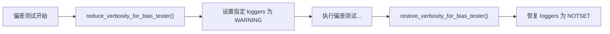

# set_log_levels.py

## 概述

`freqtrade/loggers/set_log_levels.py` 提供偏差测试器（bias tester）运行期间的日志级别动态调整功能。偏差测试器（lookahead-analysis 和 recursive-analysis）需要多次加载同一策略，这会产生大量重复的日志输出。该模块通过临时将特定 logger 的级别提升到 WARNING 来抑制这些噪音日志，并在测试完成后恢复原始级别。

## 架构图

## 核心类/函数

### 模块级变量

**`__BIAS_TESTER_LOGGERS`** — 需要降低日志详细度的 logger 名称列表：
- `"freqtrade.resolvers"` — 策略/组件解析器（多次加载策略时产生大量日志）
- `"freqtrade.strategy.hyper"` — 超参数检测（每次加载策略都会输出参数信息）
- `"freqtrade.configuration.config_validation"` — 配置验证（每次加载都会验证配置）

### reduce_verbosity_for_bias_tester() -> None

降低偏差测试器的日志详细度。

- **职责**：
  1. 记录 INFO 日志 "Reducing verbosity for bias tester."
  2. 将 `__BIAS_TESTER_LOGGERS` 中列出的所有 logger 级别设置为 `WARNING`
- **效果**：这些 logger 只输出 WARNING 及以上级别的日志，INFO/DEBUG 日志被抑制

### restore_verbosity_for_bias_tester() -> None

恢复偏差测试器运行后的日志详细度。

- **职责**：
  1. 记录 INFO 日志 "Restoring log verbosity."
  2. 将 `__BIAS_TESTER_LOGGERS` 中列出的所有 logger 级别恢复为 `NOTSET`
- **效果**：`NOTSET` 表示使用父 logger 的级别，即恢复到全局配置的日志级别

## 依赖关系

### 内部依赖（本项目模块）
无

### 外部依赖（第三方库）
- `logging` — 标准库，日志级别管理

### 被依赖（谁引用了本文件）
- `freqtrade.optimize.analysis.lookahead` — 前瞻偏差分析模块，导入 `reduce_verbosity_for_bias_tester` 和 `restore_verbosity_for_bias_tester`
- `freqtrade.optimize.analysis.recursive` — 递归公式分析模块，导入同上两个函数
- `tests/test_log_setup.py` — 测试中导入并验证这两个函数的行为
