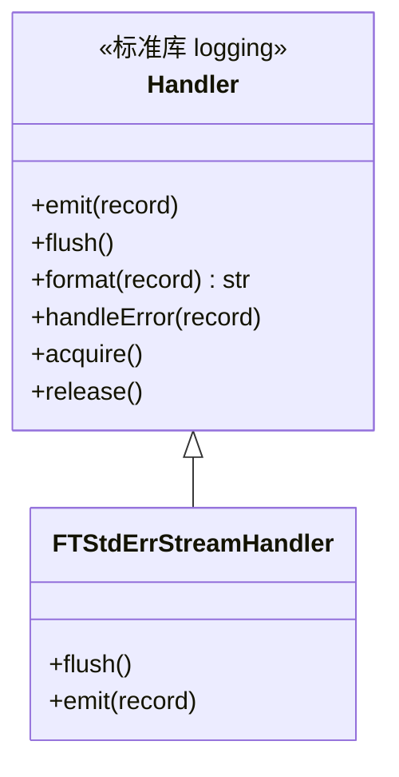

# std_err_stream_handler.py

## 概述

`freqtrade/loggers/std_err_stream_handler.py` 定义了自定义的 stderr 流日志处理器 `FTStdErrStreamHandler`。该处理器将日志消息直接写入 `sys.stderr`，与标准 `StreamHandler` 不同的是，它不持有 stderr 的引用，而是每次写入时动态获取当前的 `sys.stderr`。这一设计避免了与进度条等组件的冲突。目前该处理器在代码中被注释掉，已被 `FtRichHandler` 替代。

## 架构图



## 核心类/函数

### FTStdErrStreamHandler(Handler)

自定义 stderr 日志处理器。

#### `flush(self) -> None`

刷新 stderr 输出流。

- **职责**：
  1. 获取线程锁
  2. 调用 `sys.stderr.flush()` 刷新输出
  3. 释放线程锁
- **注意**：方法中的文档字符串描述与实际行为不完全匹配（文档字符串描述的是 BufferingHandler 的行为），实际这里是简单的 stderr 刷新

#### `emit(self, record) -> None`

输出一条日志记录到 stderr。

- **参数**：`record` — `logging.LogRecord` 对象
- **职责**：
  1. 调用 `self.format(record)` 格式化日志消息
  2. 直接写入 `sys.stderr`（不持有 stderr 引用，每次动态获取）
  3. 追加换行符
  4. 调用 `self.flush()` 确保立即输出
- **异常处理**：
  - `RecursionError` — 直接重新抛出
  - 其他异常 — 调用 `handleError(record)`
- **设计意图**：注释中说明 "Don't keep a reference to stderr - this can be problematic with progressbars."，这是因为某些进度条库会临时替换 `sys.stderr`，如果持有引用则会写入错误的流

## 当前状态

该处理器目前**未被使用**。在 `freqtrade/loggers/__init__.py` 中：
```python
# from freqtrade.loggers.std_err_stream_handler import FTStdErrStreamHandler
```
导入被注释掉，`FtRichHandler` 已经完全替代了它的功能，提供了更好的彩色输出支持。

## 依赖关系

### 内部依赖（本项目模块）
无

### 外部依赖（第三方库）
- `sys` — 标准库，获取 stderr 流
- `logging.Handler` — 标准库，日志处理器基类

### 被依赖（谁引用了本文件）
- `freqtrade.loggers.__init__` — 导入被注释掉，目前无活跃引用
