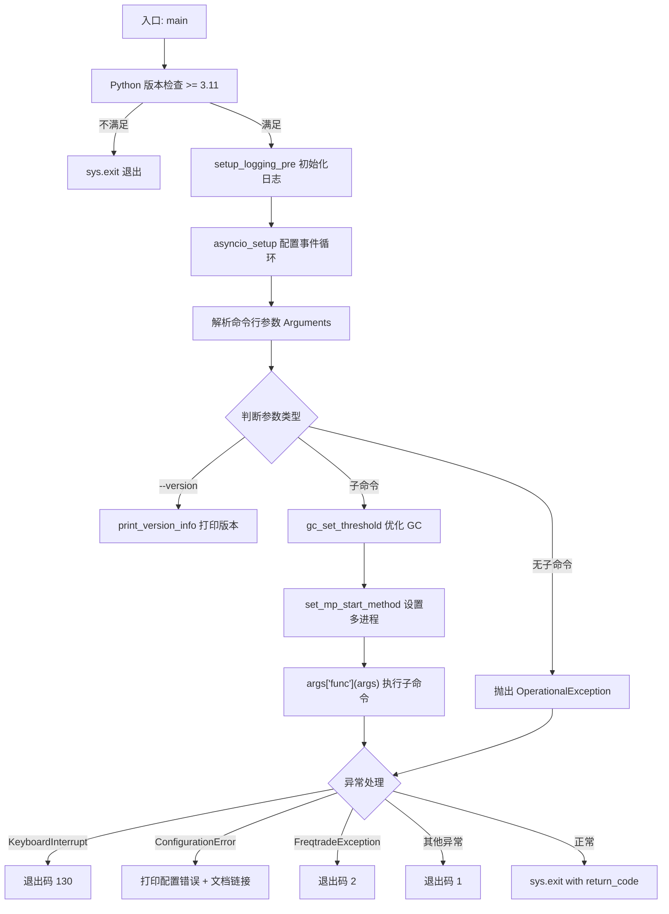

# main.py

## 概述
`freqtrade/main.py` 是 freqtrade 的主入口脚本，负责启动 bot 并协调整个交易循环的初始化过程。它执行 Python 版本检查、初始化日志系统、配置 asyncio 事件循环、设置垃圾回收和多进程启动方式，然后解析命令行参数并将控制权交给对应的子命令函数。同时，它也是所有顶层异常的最终捕获点。

## 架构图

## 核心函数

### `main(sysargv: list[str] | None = None) -> None`
- **参数**:
  - `sysargv`: 可选的命令行参数列表。如果为 `None`，使用 `sys.argv`
- **返回值**: 无（通过 `sys.exit()` 退出）
- **职责**: 作为程序的总入口，按顺序执行以下操作：
  1. **日志预初始化**: 调用 `setup_logging_pre()` 设置基本日志
  2. **Asyncio 配置**: 调用 `asyncio_setup()` 为 Windows 平台设置事件循环策略
  3. **参数解析**: 创建 `Arguments` 实例并解析命令行参数
  4. **分发执行**:
     - 如果传入 `--version` 参数，打印版本信息并以退出码 0 退出
     - 如果解析到子命令（`args` 中有 `func` 键），先优化 GC、设置多进程启动方式，然后调用该子命令函数
     - 如果没有子命令，抛出 `OperationalException` 提示用户
  5. **异常处理**:
     - `KeyboardInterrupt`: 退出码 130（标准 SIGINT 退出码）
     - `ConfigurationError`: 打印配置错误信息和文档链接
     - `FreqtradeException`: 打印错误信息，退出码 2
     - 其他异常: 打印完整堆栈，退出码 1
  6. **必然退出**: `finally` 块中调用 `sys.exit(return_code)` 确保程序退出

### 版本检查（模块级）
在导入任何 freqtrade 模块之前，检查 Python 版本是否 >= 3.11。如果不满足，直接调用 `sys.exit()` 退出。这确保了在低版本 Python 上不会出现语法错误。

## 依赖关系

### 内部依赖（本项目模块）
- `freqtrade.__version__` — 版本号字符串
- `freqtrade.commands.Arguments` — 命令行参数解析
- `freqtrade.constants.DOCS_LINK` — 文档链接
- `freqtrade.exceptions` — 异常类: ConfigurationError, FreqtradeException, OperationalException
- `freqtrade.loggers.setup_logging_pre` — 日志预初始化
- `freqtrade.system` — 系统配置: asyncio_setup, gc_set_threshold, print_version_info, set_mp_start_method

### 外部依赖（第三方库）
- `logging` — 标准日志模块
- `sys` — 系统相关功能，用于版本检查和程序退出

### 被依赖（谁引用了本文件）
- `freqtrade.__main__` — 通过 `python -m freqtrade` 调用 `main()`
- `tests/test_main.py` — 测试主入口函数
- CLI 入口点 — 通过 setuptools/pyproject.toml 配置的 `freqtrade` 命令
