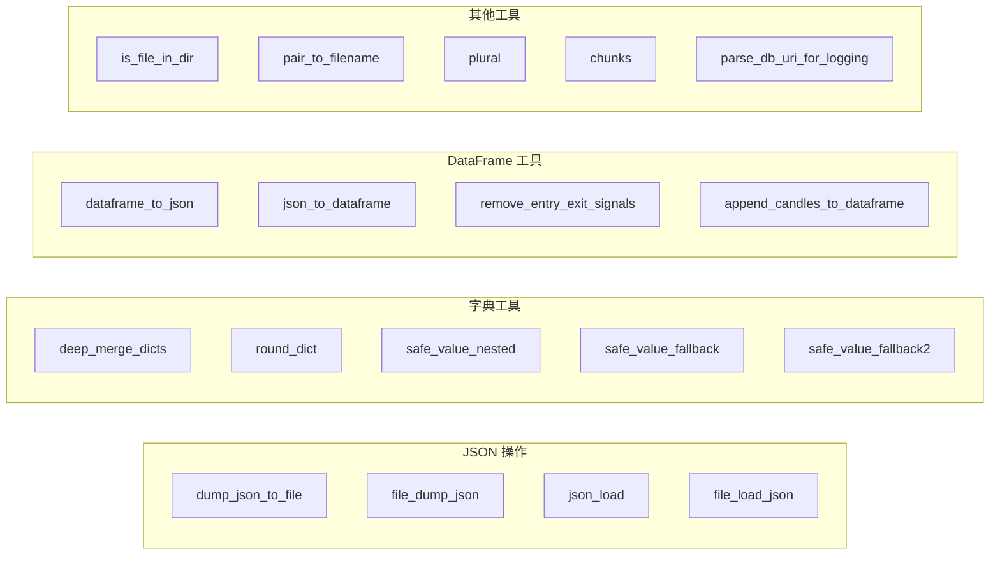

# misc.py

## 概述
`freqtrade/misc.py` 是一个通用工具函数集合，提供了 JSON 文件读写、字典深度合并、安全值查找、DataFrame 序列化与操作、字符串处理等多种实用功能。这些函数被项目中的许多模块广泛使用，是基础工具层的核心组件。

## 架构图

## 核心函数

### JSON 操作

#### `dump_json_to_file(file_obj: TextIO, data: Any) -> None`
- **职责**: 将 JSON 数据写入文件对象
- **说明**: 使用 `rapidjson` 库进行序列化，启用 `NM_NATIVE` 数字模式以获得最佳性能，`default=str` 处理不可序列化的对象

#### `file_dump_json(filename: Path, data: Any, is_zip: bool = False, log: bool = True) -> None`
- **职责**: 将 JSON 数据写入磁盘文件
- **参数**:
  - `filename`: 目标文件路径
  - `data`: 要保存的数据
  - `is_zip`: 是否压缩为 gzip 格式。如果为 True 且文件后缀不是 `.gz`，会自动添加
  - `log`: 是否记录日志

#### `json_load(datafile: TextIO) -> Any`
- **职责**: 使用 rapidjson 从文件对象加载 JSON 数据
- **说明**: 使用 `NM_NATIVE` 模式以获得最高速度

#### `file_load_json(file: Path) -> Any | None`
- **职责**: 从磁盘加载 JSON 文件，优先尝试 gzip 压缩版本
- **逻辑**: 先检查 `.gz` 文件是否存在，存在则加载压缩版本；否则尝试加载原始文件；如果都不存在返回 `None`

### 字典工具

#### `deep_merge_dicts(source, destination, allow_null_overrides: bool = True)`
- **职责**: 深度合并两个字典。source 中的值会覆盖 destination 中的值
- **参数**:
  - `source`: 源字典（覆盖方）
  - `destination`: 目标字典（被修改并返回）
  - `allow_null_overrides`: 是否允许 `None` 值覆盖已有值
- **返回值**: 修改后的 destination 字典
- **注意**: destination 会被就地修改

#### `round_dict(d, n)`
- **职责**: 将字典中的浮点数值四舍五入到 n 位小数

#### `safe_value_nested(obj: DictMap, keys: str, default_value=None)`
- **职责**: 在嵌套字典中安全地查找值
- **参数**:
  - `obj`: 要搜索的字典
  - `keys`: 用点号分隔的键路径，如 `"first.rows.pass"`
  - `default_value`: 键不存在或值为 None 时的默认值

#### `safe_value_fallback(obj: DictMap, key1: str, key2: str | None = None, default_value=None)`
- **职责**: 在单个字典中按优先级查找值。先找 key1，找不到再找 key2，都找不到返回默认值

#### `safe_value_fallback2(dict1: DictMap, dict2: DictMap, key1: str, key2: str, default_value=None)`
- **职责**: 跨两个字典查找值。先在 dict1 中找 key1，再在 dict2 中找 key2

### DataFrame 工具

#### `dataframe_to_json(dataframe: pd.DataFrame) -> str`
- **职责**: 将 DataFrame 序列化为 JSON 字符串（使用 `split` 方向），用于网络传输

#### `json_to_dataframe(data: str) -> pd.DataFrame`
- **职责**: 将 JSON 字符串反序列化为 DataFrame
- **特殊处理**: 如果包含 `date` 列，会自动将其转换为 UTC 时区的 datetime 类型

#### `remove_entry_exit_signals(dataframe: pd.DataFrame)`
- **职责**: 清除 DataFrame 中的所有交易信号列（入场/出场的多空信号以及标签），将信号值设为 0，标签设为 None

#### `append_candles_to_dataframe(left: pd.DataFrame, right: pd.DataFrame) -> pd.DataFrame`
- **职责**: 将 right DataFrame 追加到 left DataFrame 中
- **限制**: 仅在最后一条数据的日期不同时才追加，且最多保留最近 1500 条 K 线数据

### 其他工具

#### `is_file_in_dir(file: Path, directory: Path) -> bool`
- **职责**: 检查文件是否直接位于指定目录下（不含子目录）
- **安全说明**: 用于 API 中时，directory 参数不应由用户控制以避免安全问题

#### `pair_to_filename(pair: str) -> str`
- **职责**: 将交易对名称转换为安全的文件名，将 `/`、空格、`.`、`@`、`$`、`+`、`:` 替换为 `_`

#### `plural(num: float, singular: str, plural: str | None = None) -> str`
- **职责**: 根据数值返回单数或复数形式。当 num 为 1 或 -1 时返回单数形式

#### `chunks(lst: list[Any], n: int) -> Iterator[list[Any]]`
- **职责**: 将列表分割为大小为 n 的块，返回迭代器

#### `parse_db_uri_for_logging(uri: str)`
- **职责**: 解析数据库 URI 并脱敏密码部分，用于安全日志输出。将密码替换为 `*****`

### 类型别名

#### `DictMap`
- **定义**: `dict[str, Any] | Mapping[str, Any]`
- **说明**: 字典或 Mapping 类型的联合类型，用于安全值查找函数的参数类型

## 依赖关系

### 内部依赖（本项目模块）
- `freqtrade.enums.SignalTagType` — 信号标签类型枚举
- `freqtrade.enums.SignalType` — 信号类型枚举

### 外部依赖（第三方库）
- `rapidjson` — 高性能 JSON 序列化/反序列化库
- `pandas` — DataFrame 操作
- `gzip` — gzip 文件压缩/解压
- `pathlib.Path` — 文件路径操作
- `urllib.parse.urlparse` — URL 解析

### 被依赖（谁引用了本文件）
- `freqtrade.freqtradebot` — 使用 safe_value_fallback, safe_value_fallback2
- `freqtrade.wallets` — 使用 safe_value_fallback
- `freqtrade.exchange` — 使用多种 JSON 工具和安全值查找函数
- `freqtrade.data` — 使用 JSON 文件读写、DataFrame 工具
- `freqtrade.configuration` — 使用 deep_merge_dicts 等
- `freqtrade.optimize` — 使用 JSON 文件操作
- `freqtrade.rpc` — 使用 dataframe_to_json, pair_to_filename
- `freqtrade.strategy` — 使用 deep_merge_dicts
- `freqtrade.persistence` — 使用 pair_to_filename
- `freqtrade.plugins` — 使用 safe_value_nested, round_dict
- 还有 30+ 个模块引用此文件
