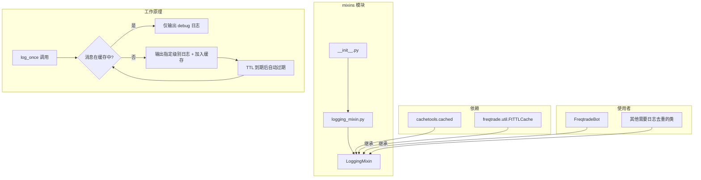
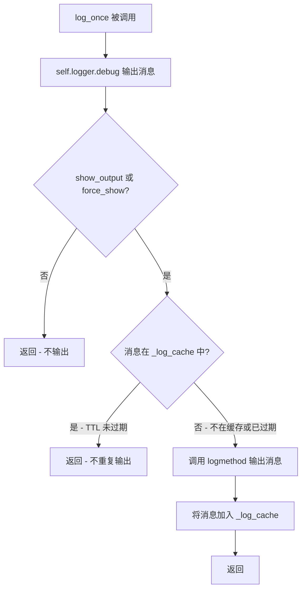
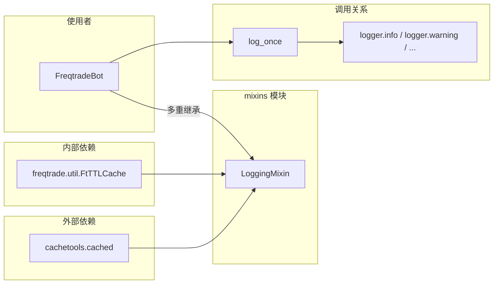
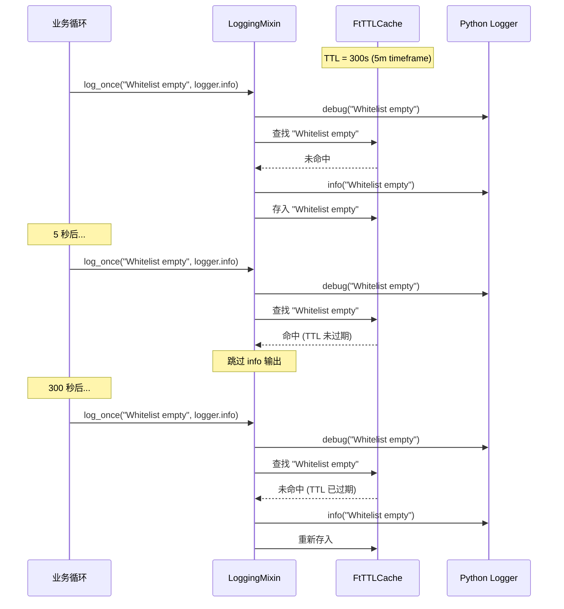
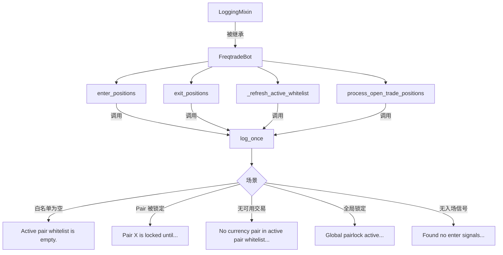

# Freqtrade Mixin 类模块源码文档

## 1. 模块概述

`freqtrade/mixins/` 模块提供了可复用的 Mixin 类,用于为其他类添加横切关注点(cross-cutting concerns)的功能。当前模块仅包含一个 Mixin: `LoggingMixin`,用于解决高频交易环境中的日志重复问题。

Mixin 设计模式的优势:
- **组合优于继承**: 通过多重继承将日志去重能力"混入"到任意类中
- **关注点分离**: 将日志控制逻辑与业务逻辑解耦
- **可复用**: 同一 Mixin 可被多个不同的类使用

`LoggingMixin` 被 Freqtrade 的核心交易引擎 `FreqtradeBot` 使用,确保在主循环的每次迭代中(通常每 5 秒一次)不会重复输出相同的日志消息。

## 2. 目录结构

| 文件 | 功能说明 |
|------|---------|
| `__init__.py` | 模块入口,导出 `LoggingMixin` 类 |
| `logging_mixin.py` | `LoggingMixin` 类实现,提供带 TTL 缓存的去重日志功能 |

## 3. 架构图



## 4. 核心类/函数说明

### 4.1 `LoggingMixin` 类 (`logging_mixin.py`)

```python
class LoggingMixin:
    """
    Logging Mixin
    Shows similar messages only once every `refresh_period`.
    """
    show_output = True  # 类级别开关

    def __init__(self, logger, refresh_period: int = 3600):
        self.logger = logger
        self.refresh_period = refresh_period
        self._log_cache: FtTTLCache = FtTTLCache(maxsize=1024, ttl=self.refresh_period)

    def log_once(self, message: str, logmethod: Callable, force_show: bool = False) -> None:
```

#### 构造函数参数

| 参数 | 类型 | 默认值 | 描述 |
|------|------|--------|------|
| `logger` | `logging.Logger` | - | 标准 Python Logger 实例 |
| `refresh_period` | `int` | 3600 (1小时) | 相同消息的去重时间窗口(秒) |

#### 类属性

| 属性 | 类型 | 默认值 | 描述 |
|------|------|--------|------|
| `show_output` | `bool` | `True` | 全局输出开关,设为 False 可禁用所有 `log_once` 的正常输出(debug 日志仍然输出) |

#### 实例属性

| 属性 | 类型 | 描述 |
|------|------|------|
| `self.logger` | `Logger` | 关联的 Logger 实例 |
| `self.refresh_period` | `int` | 刷新周期(秒) |
| `self._log_cache` | `FtTTLCache` | TTL 缓存实例(maxsize=1024) |

### 4.2 `log_once` 方法

```python
def log_once(self, message: str, logmethod: Callable, force_show: bool = False) -> None:
```

#### 参数说明

| 参数 | 类型 | 描述 |
|------|------|------|
| `message` | `str` | 要输出的日志消息 |
| `logmethod` | `Callable` | 日志输出方法,如 `logger.info`、`logger.warning` |
| `force_show` | `bool` | 是否强制输出(忽略 `show_output` 开关) |

#### 执行逻辑



#### 内部实现

```python
def log_once(self, message: str, logmethod: Callable, force_show: bool = False) -> None:
    @cached(cache=self._log_cache)
    def _log_once(message: str):
        logmethod(message)

    # 始终输出 debug 级别日志
    self.logger.debug(message)

    # 仅当 show_output 或 force_show 时才调用缓存版本
    if self.show_output or force_show:
        _log_once(message)
```

核心技巧:
1. 使用 `cachetools.cached` 装饰器将 `_log_once` 的调用结果缓存
2. 缓存的 key 就是 `message` 字符串
3. `FtTTLCache` 中的条目在 `ttl` 秒后自动过期
4. 过期后,下一次调用 `_log_once(same_message)` 会重新执行(即输出日志)

### 4.3 `FtTTLCache` 说明

`FtTTLCache` 是 Freqtrade 对 `cachetools.TTLCache` 的封装(来自 `freqtrade.util` 模块)。关键参数:

| 参数 | 值 | 说明 |
|------|---|------|
| `maxsize` | 1024 | 最大缓存条目数(防止内存泄漏) |
| `ttl` | `refresh_period` | 条目存活时间(秒) |

当缓存满时(超过 1024 条消息),最旧的条目会被淘汰,对应的消息在下次 `log_once` 时会重新输出。

## 5. 依赖关系



### 依赖详情

| 依赖 | 来源 | 用途 |
|------|------|------|
| `cachetools.cached` | 第三方库 `cachetools` | 函数结果缓存装饰器 |
| `FtTTLCache` | `freqtrade.util` | 带 TTL 过期的 LRU 缓存实现 |
| `Callable` | `collections.abc` | 类型注解 |

## 6. 使用场景与数据流

### 6.1 在 FreqtradeBot 中的使用

`FreqtradeBot` 通过多重继承获得 `LoggingMixin` 的能力:

```python
class FreqtradeBot(LoggingMixin):
    def __init__(self, config: Config) -> None:
        # ... 初始化各种组件 ...
        timeframe_secs = timeframe_to_seconds(self.strategy.timeframe)
        LoggingMixin.__init__(self, logger, timeframe_secs)
```

注意:
- `refresh_period` 被设置为策略的 timeframe 对应的秒数(如 5m = 300s)
- 这意味着同一消息在一根 K 线的生命周期内只输出一次
- 在下一根 K 线开始时,缓存过期,消息可以再次输出

### 6.2 典型调用示例

```python
# FreqtradeBot 中的典型使用
self.log_once("Active pair whitelist is empty.", logger.info)

self.log_once(
    f"No currency pair in active pair whitelist, but checking to exit open trades.",
    logger.info,
)

self.log_once(
    f"Pair {pair} {lock.side} is locked until {lock.lock_end_time}...",
    logger.info,
)
```

这些消息都是在主循环中可能每 5 秒就重复触发的场景:
- 白名单为空 -> 每次迭代都会检测到,但只需提醒用户一次
- Pair 被锁定 -> 锁定期间每次迭代都会检测到
- 没有交易信号 -> 大部分时间都没有信号

### 6.3 日志输出行为对比

假设主循环每 5 秒执行一次,timeframe = 5m (300s):

| 时间 | 事件 | 无 LoggingMixin | 有 LoggingMixin |
|------|------|----------------|-----------------|
| 0s | 首次检测到空白名单 | INFO: Active pair whitelist is empty. | INFO: Active pair whitelist is empty. |
| 5s | 再次检测 | INFO: Active pair whitelist is empty. | DEBUG: Active pair whitelist is empty. (INFO 被缓存抑制) |
| 10s | 再次检测 | INFO: Active pair whitelist is empty. | DEBUG: ... |
| ... | 每 5 秒重复 | 持续输出 INFO | 仅 DEBUG |
| 300s | 新 K 线,缓存过期 | INFO: ... | INFO: Active pair whitelist is empty. (缓存过期,重新输出) |
| 305s | 再次检测 | INFO: ... | DEBUG: ... |

**效果**: 5 分钟内,从 60 条 INFO 日志减少到 1 条 INFO + 59 条 DEBUG,大幅减少日志噪音。



## 7. 设计考量

### 7.1 为什么使用 Mixin 而不是装饰器

使用 Mixin 的优势:
- 缓存实例是与对象绑定的(通过 `self._log_cache`),不同实例互不干扰
- 可以在构造时自定义 `refresh_period`
- `show_output` 类属性可以全局控制输出(如在 Backtesting 中可以关闭日志)

### 7.2 `show_output` 在 Backtesting 中的使用

在回测模式下,`FreqtradeBot` 的子类(或 Backtesting 引擎)可以将 `show_output` 设为 `False`:
- 此时 `log_once` 仅输出 DEBUG 级别日志
- 避免回测数千根 K 线时产生海量重复日志
- 但通过 `force_show=True` 参数仍可强制输出关键信息

### 7.3 缓存大小的选择

`maxsize=1024` 的设计考量:
- 白名单通常包含 20-100 个交易对,每个交易对可能产生 2-3 种不同的日志消息
- 加上全局状态消息,总共可能有几百种不同的消息
- 1024 提供了足够的余量,同时不会占用过多内存

### 7.4 Debug 日志始终输出

`log_once` 始终调用 `self.logger.debug(message)`,这是一个关键设计决策:
- 在正常日志级别(INFO)下,用户不会看到重复消息
- 在调试时(设置 `-vvv` 或 logLevel=DEBUG),可以看到每次迭代的完整信息
- 这在排查问题时非常有用("为什么 Bot 不开仓?"),可以通过 DEBUG 日志追踪每次迭代的决策过程

## 8. 与其他模块的交互关系


