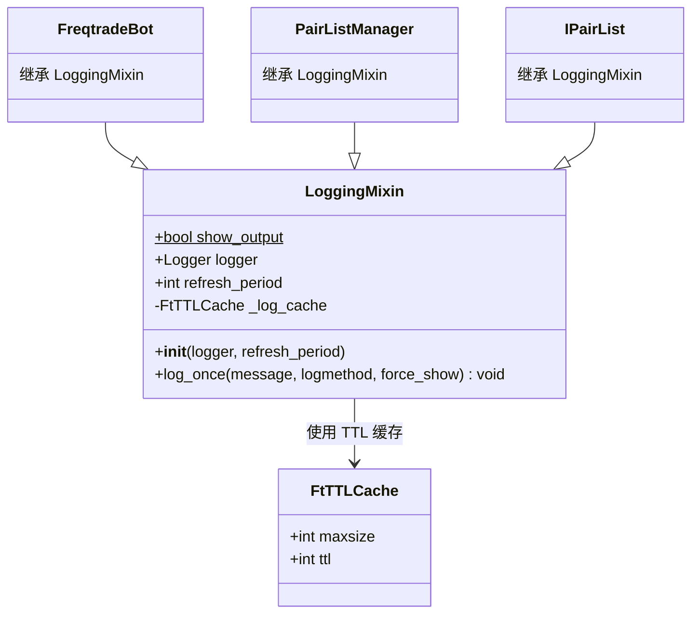
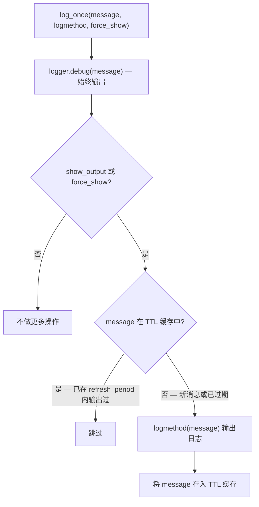

# mixins/logging_mixin.py

## 概述
`freqtrade/mixins/logging_mixin.py` 定义了 `LoggingMixin` 类，提供基于时间的日志去重功能。在交易 bot 的主循环中，相同的日志消息可能每几秒钟就重复一次（如"正在等待新 K 线"），LoggingMixin 通过 TTL 缓存确保相同消息在指定时间间隔内只输出一次，同时始终保留 debug 级别的完整输出以便调试。

## 架构图

## 核心类

### LoggingMixin

#### 类属性
- `show_output: bool = True` — 类级别的输出开关。设为 `False` 可完全禁用 `log_once` 的输出（debug 除外）

#### `__init__(self, logger, refresh_period: int = 3600)`
- **参数**:
  - `logger`: logging.Logger 实例
  - `refresh_period`: 相同消息的最小输出间隔（秒），默认 3600 秒（1 小时）
- **初始化逻辑**: 创建一个 `FtTTLCache` 实例（最大容量 1024 条，TTL 等于 refresh_period），用于缓存已输出过的消息

#### `log_once(self, message: str, logmethod: Callable, force_show: bool = False) -> None`
- **参数**:
  - `message`: 日志消息字符串
  - `logmethod`: 日志输出函数（如 `logger.info`、`logger.warning`）
  - `force_show`: 是否强制输出，忽略 `show_output` 开关
- **职责**: 智能日志输出，避免重复消息刷屏
- **实现机制**:
  1. **始终**以 debug 级别输出消息（便于开发调试）
  2. 如果 `show_output` 为 True 或 `force_show` 为 True，调用内部 `_log_once()` 函数
  3. `_log_once()` 使用 `@cached` 装饰器和 TTL 缓存：
     - 如果消息在缓存中（即在 refresh_period 内已输出过），直接跳过
     - 如果消息不在缓存中（新消息或已过期），调用 `logmethod(message)` 输出并缓存

## 设计亮点
- **性能友好**: 在回测等高频场景下，可通过 `show_output = False` 完全禁用输出
- **调试友好**: debug 级别始终输出，开发者只需调高日志级别即可看到所有消息
- **缓存机制**: 使用 TTL 缓存而非简单的去重集合，确保长时间运行时重要消息仍能周期性输出
- **灵活控制**: 支持 `force_show` 参数覆盖全局开关

## 依赖关系

### 内部依赖（本项目模块）
- `freqtrade.util.FtTTLCache` — 带 TTL 的缓存实现

### 外部依赖（第三方库）
- `cachetools.cached` — 缓存装饰器
- `collections.abc.Callable` — 类型注解

### 被依赖（谁引用了本文件）
- `freqtrade.mixins.__init__` — 重新导出 LoggingMixin
- `freqtrade.freqtradebot.FreqtradeBot` — 继承 LoggingMixin，refresh_period 设为 timeframe 秒数
- `freqtrade.optimize.backtesting` — 回测引擎继承 LoggingMixin
- `freqtrade.plugins.pairlistmanager.PairListManager` — Pairlist 管理器继承
- `freqtrade.plugins.pairlist.IPairList` — Pairlist 基类继承
- `freqtrade.plugins.protections.iprotection` — 保护机制基类继承
- `freqtrade.exchange.common` — 交易所通用模块使用
- `freqtrade.rpc.fiat_convert` — 法币转换使用
