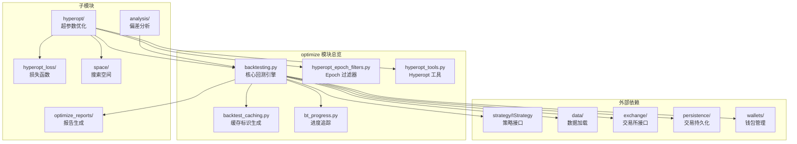
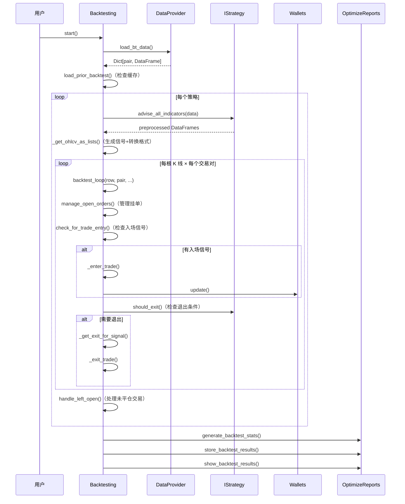
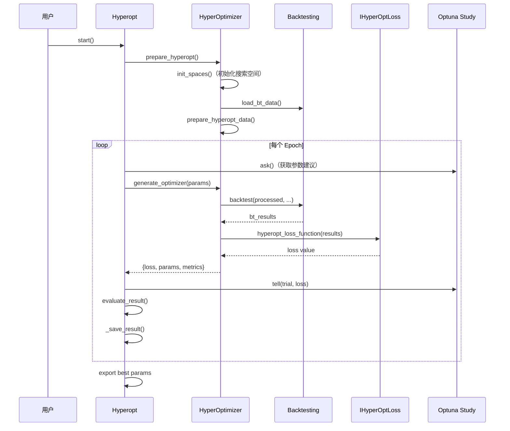
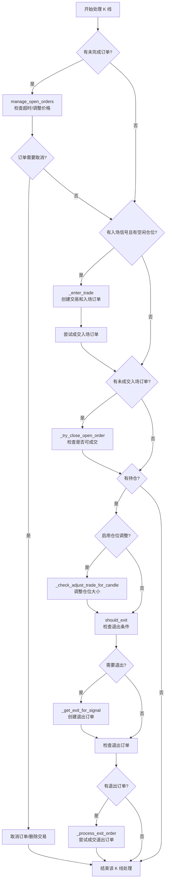

# Freqtrade 优化模块 (`freqtrade/optimize/`)

## 1. 模块概述

`freqtrade/optimize/` 是 Freqtrade 项目的核心优化模块，负责提供 **回测 (Backtesting)**、**超参数优化 (Hyperopt)** 以及 **策略分析 (Analysis)** 等功能。该模块是量化交易策略开发周期中最关键的环节之一，用户可以通过回测验证策略在历史数据上的表现，通过 Hyperopt 自动搜索最优参数组合，并通过分析工具检测策略中潜在的偏差问题（如 lookahead bias 和 recursive bias）。

核心文件 `backtesting.py` 约 79KB，是整个回测引擎的实现，包含了从数据加载、信号生成、订单模拟到结果统计的完整流程。

## 2. 目录结构

```
freqtrade/optimize/
├── __init__.py                  # 模块初始化文件（空文件）
├── backtesting.py               # 核心回测引擎（~1889行），模拟完整的交易生命周期
├── backtest_caching.py          # 回测缓存工具，基于策略文件和配置生成唯一 hash
├── bt_progress.py               # 回测进度追踪器，用于 UI 和 API 展示进度
├── hyperopt_epoch_filters.py    # Hyperopt 结果过滤器，按交易数/利润/持仓时间等条件筛选
├── hyperopt_tools.py            # Hyperopt 工具类，负责参数导入/导出/结果展示/CSV 生成
├── analysis/                    # 策略偏差分析子模块（lookahead / recursive bias 检测）
├── hyperopt/                    # 超参数优化核心子模块
├── hyperopt_loss/               # 超参数优化损失函数集合
├── optimize_reports/            # 回测/优化报告生成与输出
└── space/                       # 参数搜索空间定义（基于 Optuna）
```

## 3. 架构图



## 4. 核心类/函数说明

### 4.1 `Backtesting` 类 (`backtesting.py`)

这是整个优化模块的核心类，实现了完整的回测逻辑。

**主要属性：**
| 属性 | 类型 | 说明 |
|------|------|------|
| `config` | `Config` | 全局配置字典 |
| `strategylist` | `list[IStrategy]` | 待回测的策略列表 |
| `exchange` | `Exchange` | 交易所实例（用于精度、费率等） |
| `dataprovider` | `DataProvider` | 数据提供者 |
| `wallets` | `Wallets` | 钱包管理器，模拟资金 |
| `timeframe` | `str` | 主时间周期（如 "5m"） |
| `timeframe_detail` | `str` | 详细时间周期（可选，用于更精确模拟） |
| `trading_mode` | `TradingMode` | 交易模式（SPOT / FUTURES） |
| `results` | `BacktestResultType` | 回测结果存储 |
| `progress` | `BTProgress` | 进度追踪器 |

**关键方法：**

| 方法 | 说明 |
|------|------|
| `start()` | 回测入口，加载数据、执行策略、生成报告 |
| `backtest()` | 核心回测循环，遍历时间轴处理每根 K 线 |
| `backtest_loop()` | 单根 K 线/单个交易对的处理逻辑（被 Hyperopt 频繁调用，需高度优化） |
| `backtest_one_strategy()` | 对单个策略执行完整回测 |
| `load_bt_data()` | 加载回测所需的 OHLCV 数据 |
| `_enter_trade()` | 创建新交易或调整仓位 |
| `_exit_trade()` | 创建退出订单 |
| `_check_trade_exit()` | 检查交易是否满足退出条件（ROI / Stoploss / Signal） |
| `_get_close_rate()` | 计算退出价格（区分 stoploss / ROI / signal 等不同类型） |
| `_get_ohlcv_as_lists()` | 将 DataFrame 转换为 list 以提升循环性能 |
| `time_pair_generator()` | 时间-交易对生成器，支持 detail timeframe |
| `handle_left_open()` | 处理回测结束时仍未平仓的交易 |
| `manage_open_orders()` | 管理未成交的挂单（超时取消、价格调整） |

**数据索引常量：**
回测中为避免 Pandas 开销，OHLCV 数据被转换为 tuple list，通过常量索引访问：
```python
DATE_IDX = 0      # 日期
OPEN_IDX = 1      # 开盘价
HIGH_IDX = 2      # 最高价
LOW_IDX = 3       # 最低价
CLOSE_IDX = 4     # 收盘价
LONG_IDX = 5      # 做多信号
ELONG_IDX = 6     # 做多退出信号
SHORT_IDX = 7     # 做空信号
ESHORT_IDX = 8    # 做空退出信号
ENTER_TAG_IDX = 9 # 入场标签
EXIT_TAG_IDX = 10 # 退场标签
```

### 4.2 `BTProgress` 类 (`bt_progress.py`)

轻量级进度追踪器，用于追踪回测不同阶段（DATALOAD、CONVERT、ANALYZE、BACKTEST）的进度。

| 方法 | 说明 |
|------|------|
| `init_step(action, max_steps)` | 初始化新阶段 |
| `increment()` | 进度加 1 |
| `progress` | 属性，返回 0~1 之间的进度比例 |
| `action` | 属性，返回当前阶段名称 |

### 4.3 缓存工具 (`backtest_caching.py`)

| 函数 | 说明 |
|------|------|
| `get_strategy_run_id(strategy)` | 基于策略文件内容、配置和参数文件生成 SHA1 hash，用于缓存命中判断 |
| `get_backtest_metadata_filename(filename)` | 根据回测结果文件名生成对应的元数据文件名 (`.meta.json`) |

### 4.4 Epoch 过滤器 (`hyperopt_epoch_filters.py`)

| 函数 | 说明 |
|------|------|
| `hyperopt_filter_epochs()` | 主过滤函数，按多种条件筛选 Hyperopt epochs |
| `_hyperopt_filter_epochs_trade_count()` | 按交易数量范围过滤 |
| `_hyperopt_filter_epochs_duration()` | 按平均持仓时间过滤 |
| `_hyperopt_filter_epochs_profit()` | 按平均/总利润过滤 |
| `_hyperopt_filter_epochs_objective()` | 按目标函数值过滤 |

### 4.5 `HyperoptTools` 类 (`hyperopt_tools.py`)

Hyperopt 的工具类，提供参数导入导出、结果读取和格式化等功能。

| 方法 | 说明 |
|------|------|
| `get_strategy_filename()` | 获取策略文件路径 |
| `export_params()` | 将优化结果导出为 JSON 参数文件 |
| `load_params()` | 从文件加载参数 |
| `try_export_params()` | 尝试自动导出参数到策略同目录 |
| `has_space()` | 检查配置中是否包含指定的搜索空间 |
| `_read_results()` | 流式读取 `.fthypt` 结果文件 |
| `load_filtered_results()` | 加载并过滤历史 Hyperopt 结果 |
| `show_epoch_details()` | 格式化展示某个 epoch 的详细信息 |
| `export_csv_file()` | 将 Hyperopt 结果导出为 CSV 文件 |
| `is_best_loss()` | 判断当前 loss 是否为最佳 |
| `format_results_explanation_string()` | 格式化结果摘要字符串 |

**辅助类 `HyperoptStateContainer`：**
全局单例，用于跟踪 Hyperopt 运行状态（STARTUP / DATALOAD / INDICATORS / OPTIMIZE）。

## 5. 依赖关系

### 5.1 内部依赖

| 被依赖模块 | 依赖来源 | 说明 |
|------------|----------|------|
| `freqtrade.strategy.interface.IStrategy` | `backtesting.py` | 策略接口，提供信号和参数 |
| `freqtrade.data.history` | `backtesting.py` | 历史数据加载 |
| `freqtrade.data.dataprovider.DataProvider` | `backtesting.py` | 数据提供者 |
| `freqtrade.exchange.Exchange` | `backtesting.py` | 交易所接口（精度、费率、杠杆） |
| `freqtrade.persistence.LocalTrade` | `backtesting.py` | 本地交易对象 |
| `freqtrade.persistence.Order` | `backtesting.py` | 订单对象 |
| `freqtrade.wallets.Wallets` | `backtesting.py` | 钱包/资金管理 |
| `freqtrade.plugins.protectionmanager` | `backtesting.py` | 保护机制管理器 |
| `freqtrade.plugins.pairlistmanager` | `backtesting.py` | 交易对列表管理器 |
| `freqtrade.configuration.TimeRange` | `backtesting.py` | 时间范围解析 |
| `freqtrade.enums` | 多个文件 | 枚举类型定义 |
| `freqtrade.leverage` | `backtesting.py` | 杠杆和清算价格计算 |

### 5.2 外部依赖

| 库 | 用途 |
|----|------|
| `pandas` | DataFrame 操作（回测数据处理） |
| `numpy` | 数值计算 |
| `rapidjson` | 高性能 JSON 序列化/反序列化 |
| `optuna` | 超参数优化框架 |
| `joblib` | 并行执行和数据序列化 |
| `rich` | 终端格式化输出 |

## 6. 数据流

### 6.1 回测数据流



### 6.2 Hyperopt 数据流



### 6.3 回测引擎内部单根 K 线处理流程



## 7. 关键设计点

### 7.1 性能优化
- **List 替代 DataFrame**：`_get_ohlcv_as_lists()` 将 Pandas DataFrame 转换为 Python list，因为在逐行遍历场景下 list 的性能远超 DataFrame
- **信号偏移**：入场/退出信号向后偏移一根 K 线，避免使用"未来数据"（信号在 K 线收盘后才确认）
- **Detail Timeframe**：支持更小时间周期进行精细化模拟，提高回测精度

### 7.2 缓存机制
- 基于策略文件内容 + 配置的 SHA1 hash 进行缓存命中判断
- 支持 `day`、`week`、`month` 三种缓存有效期
- 缓存可避免对同一策略的重复回测

### 7.3 Futures 支持
- 完整支持 FUTURES 交易模式，包括 funding rate、mark price、清算价格计算
- 通过 `_run_funding_fees()` 在每个 funding fee 周期结算资金费率
- 通过 `update_liquidation_prices()` 实时更新清算价格

### 7.4 订单管理
- 支持 limit 和 market 订单类型
- 支持订单超时取消 (`check_order_cancel`)
- 支持订单价格调整 (`check_order_replace`)
- 支持部分退出 (`PARTIAL_EXIT`)
- 支持仓位调整 (`adjust_trade_position`)
