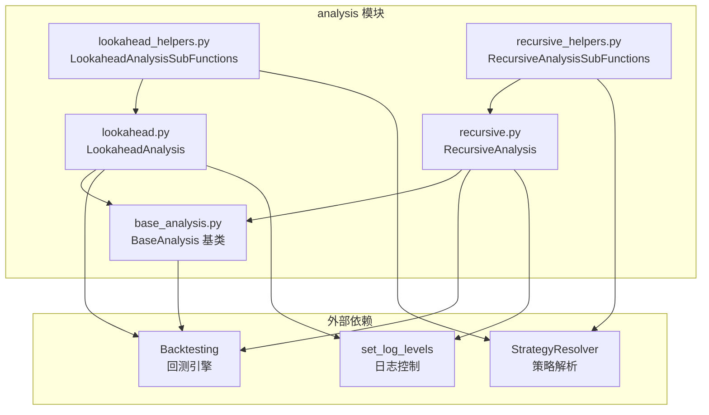
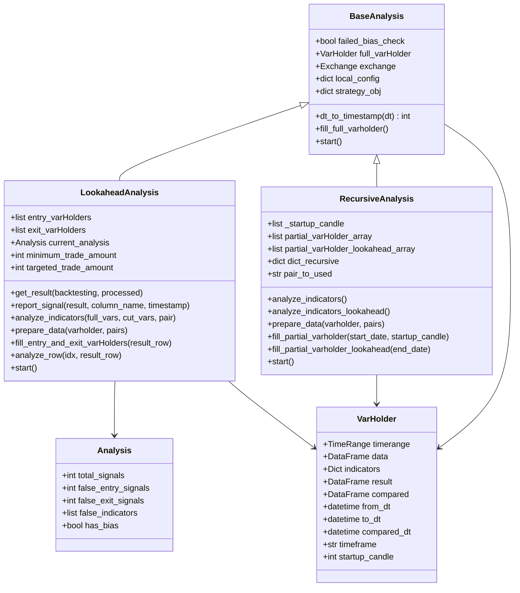
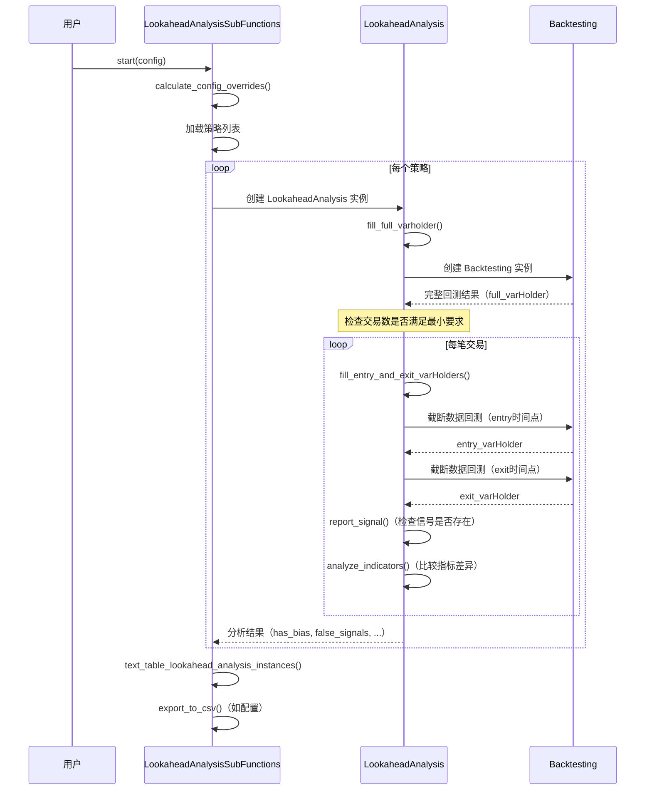
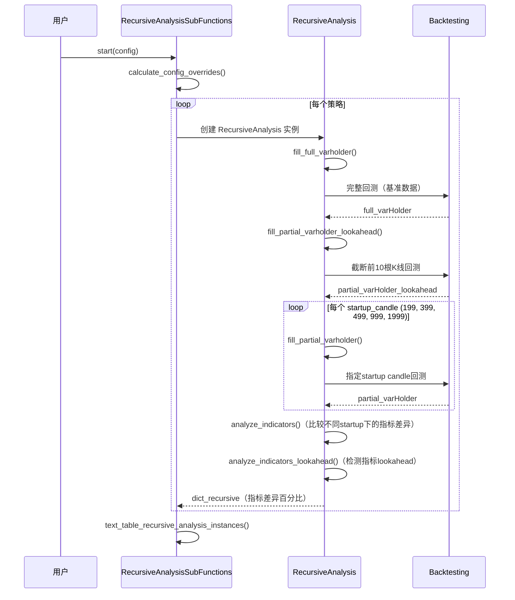

# Freqtrade 分析工具模块 (`freqtrade/optimize/analysis/`)

## 1. 模块概述

`freqtrade/optimize/analysis/` 模块提供了策略偏差检测工具，主要用于发现策略中两类常见的偏差问题：

1. **Lookahead Bias（前瞻偏差）**：策略在计算指标或生成信号时，无意中使用了"未来"数据。例如，某个指标的计算依赖于当前 K 线之后的数据，导致回测结果过于乐观但在实盘中无法复现。

2. **Recursive Bias（递归偏差）**：由于指标的递归计算特性（如 EMA、RSI 等），不同的 startup candle count 会导致同一时间点的指标值不同。如果 startup candle count 设置不足，指标可能尚未收敛，导致回测结果与实盘不一致。

这两个工具帮助策略开发者在上线前验证策略的可靠性，是策略质量保障的重要环节。

## 2. 目录结构

```
freqtrade/optimize/analysis/
├── __init__.py               # 模块初始化文件（空文件）
├── base_analysis.py          # 基础分析类，提供公共逻辑（VarHolder、数据加载）
├── lookahead.py              # Lookahead Bias 检测实现
├── lookahead_helpers.py      # Lookahead 分析辅助函数（结果展示、CSV 导出、配置覆盖）
├── recursive.py              # Recursive Bias 检测实现
└── recursive_helpers.py      # Recursive 分析辅助函数（结果展示、配置覆盖）
```

## 3. 架构图





## 4. 核心类/函数说明

### 4.1 `VarHolder` 类 (`base_analysis.py`)

数据容器类，用于存储单次回测运行的所有相关数据。每次偏差检测需要多次回测（完整数据 vs 截断数据），每次回测对应一个 `VarHolder` 实例。

| 属性 | 类型 | 说明 |
|------|------|------|
| `timerange` | `TimeRange` | 回测时间范围 |
| `data` | `DataFrame` | 原始 OHLCV 数据 |
| `indicators` | `dict[str, DataFrame]` | 计算后的指标数据（按交易对索引） |
| `result` | `DataFrame` | 回测结果（交易记录） |
| `from_dt` | `datetime` | 起始时间 |
| `to_dt` | `datetime` | 结束时间 |
| `compared_dt` | `datetime` | 比较基准时间点 |
| `timeframe` | `str` | 时间周期 |
| `startup_candle` | `int` | startup candle 数量（用于 recursive 分析） |

### 4.2 `BaseAnalysis` 类 (`base_analysis.py`)

偏差分析的基类，提供公共初始化逻辑和数据加载接口。

| 方法 | 说明 |
|------|------|
| `__init__(config, strategy_obj)` | 初始化，深拷贝配置，设置策略名称 |
| `dt_to_timestamp(dt)` | 静态方法，将 datetime 转换为 UNIX 时间戳 |
| `fill_full_varholder()` | 使用完整时间范围填充 `full_varHolder`，执行数据加载和指标计算 |
| `start()` | 启动分析流程的入口方法（调用 `fill_full_varholder`） |

### 4.3 `LookaheadAnalysis` 类 (`lookahead.py`)

Lookahead Bias 检测的核心实现。

**检测原理：**
1. 首先对完整的时间范围执行回测，获取交易信号和指标值
2. 对于每笔交易，创建一个截断到该交易开仓/平仓时间的子集
3. 在截断子集上重新执行回测并计算指标
4. 比较完整回测和截断回测的结果：
   - 如果某笔交易在截断数据上消失了 --> 存在 lookahead bias（信号依赖未来数据）
   - 如果某个指标在截断数据上值不同 --> 该指标存在 lookahead bias

**关键方法：**

| 方法 | 说明 |
|------|------|
| `get_result(backtesting, processed)` | 静态方法，执行回测并返回结果 |
| `report_signal(result, column_name, timestamp)` | 检查指定时间戳的信号是否存在于结果中 |
| `analyze_indicators(full_vars, cut_vars, pair)` | 比较完整和截断数据中的指标差异 |
| `prepare_data(varholder, pairs)` | 为指定的 VarHolder 准备数据（创建 Backtesting 实例、加载数据、计算指标） |
| `fill_entry_and_exit_varHolders(result_row)` | 为单笔交易创建入场和退场的 VarHolder |
| `analyze_row(idx, result_row)` | 分析单笔交易的偏差情况 |
| `start()` | 主流程：检查交易数量 -> 逐笔分析 -> 汇总报告 |

**辅助类 `Analysis`：**

| 属性 | 说明 |
|------|------|
| `total_signals` | 分析的总信号数 |
| `false_entry_signals` | 存在偏差的入场信号数 |
| `false_exit_signals` | 存在偏差的退出信号数 |
| `false_indicators` | 存在偏差的指标名称列表 |
| `has_bias` | 是否检测到偏差 |

### 4.4 `LookaheadAnalysisSubFunctions` 类 (`lookahead_helpers.py`)

Lookahead 分析的辅助函数集合，全部为静态方法。

| 方法 | 说明 |
|------|------|
| `text_table_lookahead_analysis_instances()` | 将分析结果格式化为 Rich 表格输出 |
| `export_to_csv()` | 将分析结果导出为 CSV 文件 |
| `calculate_config_overrides()` | 计算配置覆盖项（禁用保护、设置市价单、扩大钱包、固定 stake 等） |
| `initialize_single_lookahead_analysis()` | 初始化并执行单个策略的 lookahead 分析 |
| `start()` | 入口方法，遍历策略列表执行分析并输出结果 |

**配置覆盖的关键设置：**
- 禁用保护机制（避免误报）
- 强制使用 market 订单（除非明确允许 limit 订单）
- 设置 `max_open_trades = -1`（不限制持仓数）
- 设置 `dry_run_wallet = 1,000,000,000`（避免资金不足的误报）
- 固定 `stake_amount = 10,000`
- 禁用缓存 (`backtest_cache = "none"`)

### 4.5 `RecursiveAnalysis` 类 (`recursive.py`)

Recursive Bias 检测的核心实现。

**检测原理：**
1. 使用完整数据执行一次基准回测
2. 使用不同的 startup candle count（如 199, 399, 499, 999, 1999）分别执行回测
3. 比较最后一根 K 线上各指标的值
4. 如果值存在差异，说明指标依赖较长的历史数据（递归特性），当前 startup candle count 可能不足

**同时还检测指标级别的 lookahead bias：**
- 截取数据的前 10 根 K 线作为子集
- 比较子集最后一根 K 线与完整数据同一时间点的指标值
- 如果存在差异，说明指标有前瞻偏差

| 方法 | 说明 |
|------|------|
| `analyze_indicators()` | 比较不同 startup candle 下指标的差异 |
| `analyze_indicators_lookahead()` | 检测指标级别的 lookahead bias |
| `prepare_data(varholder, pairs)` | 准备数据（与 Lookahead 类似但仅使用第一个交易对） |
| `fill_partial_varholder(start_date, startup_candle)` | 创建指定 startup candle 的 VarHolder |
| `fill_partial_varholder_lookahead(end_date)` | 创建用于 lookahead 检测的截断 VarHolder |
| `start()` | 主流程：基准回测 -> 多组 startup candle 回测 -> 比较分析 |

### 4.6 `RecursiveAnalysisSubFunctions` 类 (`recursive_helpers.py`)

| 方法 | 说明 |
|------|------|
| `text_table_recursive_analysis_instances()` | 将递归分析结果格式化为 Rich 表格 |
| `calculate_config_overrides()` | 配置覆盖（主要是禁用缓存和要求时间范围） |
| `initialize_single_recursive_analysis()` | 初始化并执行单个策略的递归分析 |
| `start()` | 入口方法 |

## 5. 依赖关系

### 5.1 模块内部依赖

```
lookahead_helpers.py --> lookahead.py --> base_analysis.py
recursive_helpers.py --> recursive.py --> base_analysis.py
```

### 5.2 外部模块依赖

| 依赖模块 | 使用者 | 说明 |
|----------|--------|------|
| `freqtrade.optimize.backtesting.Backtesting` | `lookahead.py`, `recursive.py` | 回测引擎 |
| `freqtrade.configuration.TimeRange` | `base_analysis.py` | 时间范围解析 |
| `freqtrade.data.history.get_timerange` | `lookahead.py` | 获取数据时间范围 |
| `freqtrade.exchange.timeframe_to_minutes` | `lookahead.py`, `recursive.py` | 时间周期转换 |
| `freqtrade.resolvers.StrategyResolver` | `lookahead_helpers.py`, `recursive_helpers.py` | 策略加载 |
| `freqtrade.loggers.set_log_levels` | `lookahead.py`, `recursive.py` | 控制分析期间的日志级别 |
| `freqtrade.util.print_rich_table` | `lookahead_helpers.py`, `recursive_helpers.py` | Rich 表格输出 |

### 5.3 外部库依赖

| 库 | 用途 |
|----|------|
| `pandas` | DataFrame 操作和比较 |
| `rich` | 终端格式化输出 |

## 6. 数据流

### 6.1 Lookahead Bias 检测流程



### 6.2 Recursive Bias 检测流程



## 7. 使用示例

### Lookahead Bias 检测命令
```bash
freqtrade lookahead-analysis --strategy MyStrategy --timerange 20230101-20230601
```

### Recursive Bias 检测命令
```bash
freqtrade recursive-analysis --strategy MyStrategy --timerange 20230101-20230601
```

## 8. 关键设计点

### 8.1 日志级别控制
分析过程中会执行大量的回测（每笔交易两次），因此通过 `reduce_verbosity_for_bias_tester()` 降低日志级别以减少噪声，分析完成后通过 `restore_verbosity_for_bias_tester()` 恢复。

### 8.2 Exchange 实例复用
为避免频繁创建交易所实例，`LookaheadAnalysis` 和 `RecursiveAnalysis` 会缓存第一次创建的 exchange 实例（`self.exchange`）并传递给后续的 Backtesting 实例。

### 8.3 Fee 缓存
`LookaheadAnalysis` 缓存首次获取的手续费（`self._fee`），避免后续回测中因不同交易对的费率差异导致误报。

### 8.4 性能考量
Lookahead 分析是计算密集型操作（每笔交易需要 2 次完整回测），因此：
- 通过 `minimum_trade_amount` 设置最少分析的交易数量
- 通过 `targeted_trade_amount` 设置目标分析的交易数量，避免分析过多交易
- 对 `force_exit` 的交易跳过分析（避免误报）
