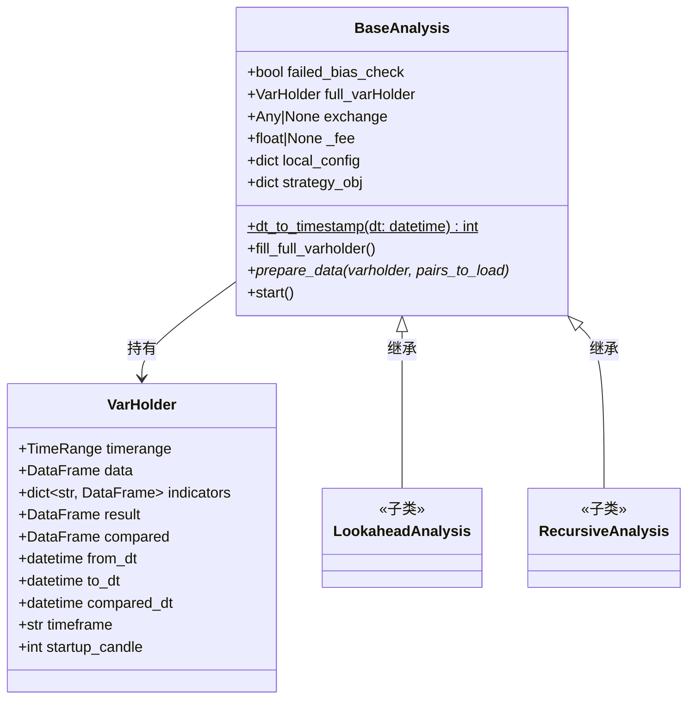

# base_analysis.py

## 概述

`base_analysis.py` 定义了回测偏差分析的基础类 `BaseAnalysis` 和数据容器类 `VarHolder`。`BaseAnalysis` 是 `LookaheadAnalysis` 和 `RecursiveAnalysis` 的公共基类，提供了配置管理、时间范围处理、数据准备的基础框架。`VarHolder` 是一个简单的数据持有类，存储回测分析中需要在不同阶段之间传递的变量。

## 架构图

## 核心类/函数

### VarHolder

数据容器类，存储回测分析过程中的各类变量。

**属性**：
- `timerange: TimeRange` — 时间范围对象
- `data: DataFrame` — 原始 OHLCV 数据
- `indicators: dict[str, DataFrame]` — 按交易对索引的指标数据
- `result: DataFrame` — 回测结果
- `compared: DataFrame` — 比对结果
- `from_dt / to_dt: datetime` — 起止时间
- `compared_dt: datetime` — 比对时间点
- `timeframe: str` — 时间框架字符串
- `startup_candle: int` — 启动 K 线数量

### BaseAnalysis

偏差分析基类。

#### \_\_init\_\_(config, strategy_obj)

- **参数**：
  - `config: dict` — 配置字典
  - `strategy_obj: dict` — 策略对象信息（包含 `name`、`location` 等）
- **初始化操作**：
  - 设置 `failed_bias_check = True`（默认假设检查失败）
  - 深拷贝配置到 `local_config`
  - 创建 `full_varHolder` 实例
  - 初始化交易所和费率为 None

#### dt_to_timestamp(dt) -> int

静态方法，将 `datetime` 转换为 UTC timestamp（整数秒）。

#### fill_full_varholder()

填充完整时间范围的 VarHolder 数据。

- 解析配置中的 `timerange`
- 设置起止时间（未指定时默认从 epoch 0 到当前时间）
- 调用子类实现的 `prepare_data()` 加载数据

#### start()

分析入口方法。调用 `fill_full_varholder()` 执行初始回测。子类会覆盖此方法并调用 `super().start()`。

## 依赖关系

### 内部依赖（本项目模块）
- `freqtrade.configuration.TimeRange` — 时间范围解析

### 外部依赖（第三方库）
- `copy.deepcopy` — 深拷贝配置
- `datetime` — 日期时间处理
- `pandas.DataFrame` — 数据类型

### 被依赖（谁引用了本文件）
- `freqtrade.optimize.analysis.lookahead.LookaheadAnalysis` — 继承 `BaseAnalysis`，导入 `VarHolder`
- `freqtrade.optimize.analysis.recursive.RecursiveAnalysis` — 继承 `BaseAnalysis`，导入 `VarHolder`
