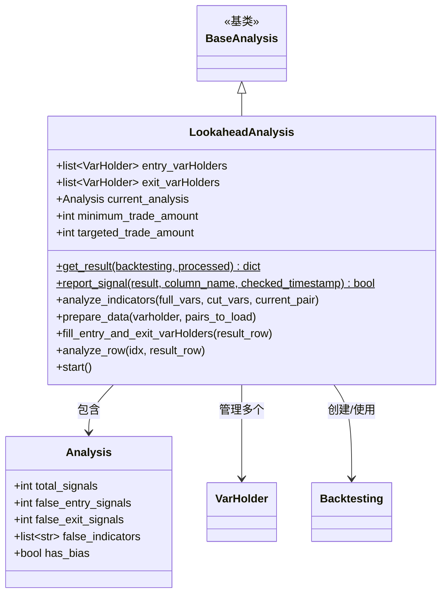

# lookahead.py

## 概述

`lookahead.py` 实现了 Lookahead Bias（前瞻偏差）检测分析。前瞻偏差是策略回测中的一个常见问题，指策略在计算指标或生成信号时使用了"未来"的数据。该模块通过比较完整时间范围回测和截断时间范围回测的结果差异来检测偏差。

检测原理：
1. 在完整时间范围内执行一次回测，记录所有交易信号
2. 对每个交易信号，创建一个截断到该信号时间点的子数据集，重新回测
3. 比较两次回测的指标值和信号——如果截断后信号消失或指标值发生变化，则说明存在前瞻偏差

## 架构图

## 核心类/函数

### Analysis

分析结果数据类。

- `total_signals: int` — 总信号数
- `false_entry_signals: int` — 偏差入场信号数
- `false_exit_signals: int` — 偏差出场信号数
- `false_indicators: list[str]` — 存在偏差的指标名列表
- `has_bias: bool` — 是否检测到偏差

### LookaheadAnalysis

前瞻偏差分析类，继承自 `BaseAnalysis`。

#### \_\_init\_\_(config, strategy_obj)

- 初始化 `entry_varHolders` 和 `exit_varHolders` 列表
- 创建 `Analysis` 实例
- 从配置读取 `minimum_trade_amount` 和 `targeted_trade_amount`

#### get_result(backtesting, processed) -> dict [staticmethod]

在给定的已处理数据上执行回测并返回结果。

#### report_signal(result, column_name, checked_timestamp) -> bool [staticmethod]

检查回测结果中指定时间戳是否存在信号。返回 `True` 表示信号存在。

#### analyze_indicators(full_vars, cut_vars, current_pair)

比较完整数据和截断数据的指标值差异。

- 将 `full_df` 裁剪到与 `cut_df` 相同的索引
- 使用 `DataFrame.compare()` 查找差异
- 将存在差异的指标名记录到 `false_indicators`

#### prepare_data(varholder, pairs_to_load)

数据准备方法（覆盖基类）。

- 如果配置了 FreqAI，先清除旧模型目录
- 创建 `Backtesting` 实例（复用交易所对象以提高性能）
- 加载数据、计算指标、执行回测
- 缓存费率以避免重复计算

#### fill_entry_and_exit_varHolders(result_row)

为一笔交易创建入场和出场的 VarHolder。

- **入场 VarHolder**：时间范围从原始起始到交易开仓时间 + 1 根 K 线
- **出场 VarHolder**：时间范围从原始起始到交易平仓时间 + 1 根 K 线

#### analyze_row(idx, result_row)

分析单笔交易是否存在偏差。

1. 跳过 force exit 的交易
2. 填充入场/出场 VarHolder
3. 检查入场信号是否在截断数据中仍然存在
4. 检查出场信号是否在截断数据中仍然存在
5. 比较指标值差异

#### start()

主入口方法。

1. 调用 `super().start()` 执行完整回测
2. 降低日志级别（减少噪音）
3. 检查信号数量是否满足最低要求
4. 遍历所有交易结果，逐笔分析
5. 恢复日志级别
6. 报告最终结果

## 依赖关系

### 内部依赖（本项目模块）
- `freqtrade.optimize.analysis.base_analysis` — `BaseAnalysis`、`VarHolder` 基类
- `freqtrade.optimize.backtesting.Backtesting` — 回测引擎
- `freqtrade.data.history.get_timerange` — 获取数据时间范围
- `freqtrade.exchange.timeframe_to_minutes` — 时间框架转换
- `freqtrade.loggers.set_log_levels` — 调整日志级别

### 外部依赖（第三方库）
- `copy.deepcopy` — 深拷贝数据
- `datetime` — 时间处理
- `shutil` — 清理 FreqAI 模型目录
- `pandas.DataFrame` — 数据处理和比较

### 被依赖（谁引用了本文件）
- `freqtrade.optimize.analysis.lookahead_helpers.LookaheadAnalysisSubFunctions` — 创建和管理 `LookaheadAnalysis` 实例
