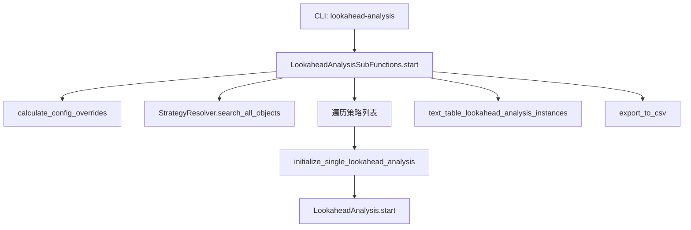

# lookahead_helpers.py

## 概述

`lookahead_helpers.py` 提供 Lookahead Bias 分析的辅助功能和入口点。`LookaheadAnalysisSubFunctions` 类封装了分析的配置处理、策略发现、结果展示和 CSV 导出等功能，是 CLI 命令 `freqtrade lookahead-analysis` 的核心实现。

## 架构图

## 核心类/函数

### LookaheadAnalysisSubFunctions

静态方法集合类。

#### text_table_lookahead_analysis_instances(config, lookahead_instances, caption=None)

生成并打印结果表格。

- **参数**：
  - `config` — 配置
  - `lookahead_instances` — `LookaheadAnalysis` 实例列表
  - `caption` — 表格标题（如有 FreqAI 指标会添加提示）
- **表格列**：filename、strategy、has_bias、total_signals、biased_entry_signals、biased_exit_signals、biased_indicators
- 当交易数量不足 `minimum_trade_amount` 时显示特殊提示
- 使用 `rich` 库的 `Text` 类为 "Yes"/"No" 添加颜色

#### export_to_csv(config, lookahead_analysis)

将分析结果导出到 CSV 文件。

- 如果 CSV 文件已存在，读取并更新；否则创建新文件
- 使用 `add_or_update_row` 辅助函数处理行的新增/更新
- 导出路径由 `config['lookahead_analysis_exportfilename']` 指定

#### calculate_config_overrides(config) -> Config

为 Lookahead 分析覆盖配置项以避免误报。

- 禁用保护机制（`enable_protections = False`）
- 强制使用市价单（除非 `lookahead_allow_limit_orders` 为 True）
- 验证 `targeted_trade_amount >= minimum_trade_amount`
- 设置 `max_open_trades = -1`（不限制）
- 设置 `dry_run_wallet` 为 10 亿（避免资金不足导致的误报）
- 要求必须配置 `timerange`
- 固定 `stake_amount = 10000`
- 强制 `backtest_cache = 'none'`

#### initialize_single_lookahead_analysis(config, strategy_obj) -> LookaheadAnalysis

初始化并执行单个策略的 Lookahead 分析。返回分析实例，并记录执行耗时。

#### start(config)

主入口方法。

1. 覆盖配置
2. 搜索所有策略对象
3. 统一 `--strategy` 和 `--strategy-list` 参数
4. 逐个执行策略的 Lookahead 分析
5. 展示结果表格，可选导出 CSV
6. 如有 FreqAI 相关指标，添加说明（以 `&` 开头的指标可忽略）

## 依赖关系

### 内部依赖（本项目模块）
- `freqtrade.optimize.analysis.lookahead.LookaheadAnalysis` — 核心分析类
- `freqtrade.resolvers.StrategyResolver` — 策略搜索
- `freqtrade.constants.Config` — 配置类型
- `freqtrade.exceptions.OperationalException` — 异常处理
- `freqtrade.util` — `get_dry_run_wallet`、`print_rich_table`

### 外部依赖（第三方库）
- `pandas` — CSV 读写和数据操作
- `rich.text.Text` — 带颜色的文本输出
- `time` — 性能计时
- `pathlib.Path` — 文件路径

### 被依赖（谁引用了本文件）
- `freqtrade.commands.optimize_commands` — CLI 命令入口调用 `LookaheadAnalysisSubFunctions.start()`
