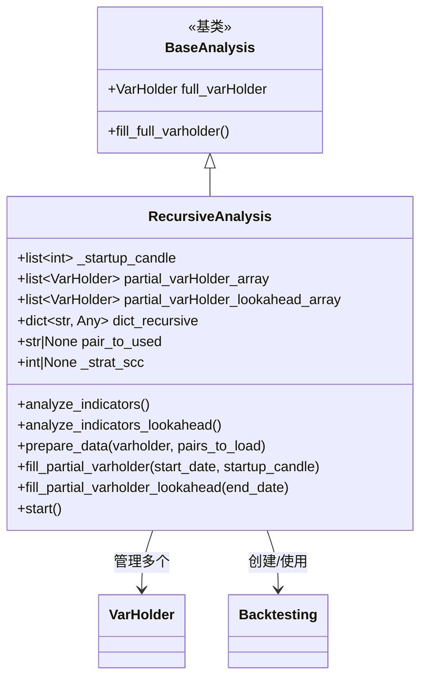

# recursive.py

## 概述

`recursive.py` 实现了递归偏差（Recursive Bias）和仅指标前瞻偏差（Indicator-only Lookahead Bias）的检测分析。

**递归偏差**指的是指标的计算依赖于历史数据的长度（即 startup candle 数量）。如果一个指标在不同的 startup candle 数量下产生不同的最终值，说明该指标存在递归依赖。例如 EMA 就是典型的递归指标——不同长度的历史数据会导致初始种子值不同，从而影响最终计算结果。

**指标前瞻偏差**则是检查在相同历史数据但不同的结束时间点，指标值是否会发生变化。

## 架构图

## 核心类/函数

### is_number(variable) -> bool

模块级辅助函数，判断变量是否为数值类型（排除 bool）。

### RecursiveAnalysis

递归偏差分析类，继承自 `BaseAnalysis`。

#### \_\_init\_\_(config, strategy_obj)

- **参数**：
  - `config` — 配置字典
  - `strategy_obj` — 策略对象信息
- **属性初始化**：
  - `_startup_candle` — 要测试的 startup candle 数量列表，默认 `[199, 399, 499, 999, 1999]`
  - `partial_varHolder_array` — 不同 startup candle 下的回测结果
  - `partial_varHolder_lookahead_array` — 前瞻偏差测试的回测结果
  - `dict_recursive` — 存储检测结果：`{indicator: {candle_count: diff_percentage}}`
  - `pair_to_used` — 用于分析的交易对（仅使用第一个）
  - `_strat_scc` — 策略定义的 startup candle count

#### analyze_indicators()

递归偏差检测核心方法。

- 取完整数据集的最后一行作为基准
- 将每个 partial VarHolder 的最后一行与基准比较
- 对于数值型差异，计算百分比差异并记录到 `dict_recursive`
- 对于非数值差异，记录为 "NaN"
- 如果某个 startup candle 下无差异，提前终止（更高的值也不会有差异）

#### analyze_indicators_lookahead()

仅指标的前瞻偏差检测。

- 取 partial lookahead 数据的最后一行
- 在完整数据中找到相同时间戳的行进行比较
- 输出存在差异的指标名称

#### prepare_data(varholder, pairs_to_load)

数据准备（覆盖基类）。

- 清理 FreqAI 模型目录（如果配置了）
- 创建 `Backtesting` 实例，复用交易所对象
- 仅使用第一个交易对进行分析
- 检查策略的 `startup_candle_count` 是否有效（>= 1），如无效抛出 `ConfigurationError`
- 如果策略的 `startup_candle_count` 不在测试列表中，自动添加
- 加载数据并计算所有指标

#### fill_partial_varholder(start_date, startup_candle)

创建指定 startup candle 数量的 partial VarHolder。

- 设置时间范围：从指定起始日期到完整数据的结束日期
- 将 `startup_candle_count` 配置为指定值
- 调用 `prepare_data()` 加载数据

#### fill_partial_varholder_lookahead(end_date)

创建用于前瞻偏差检测的 partial VarHolder。

- 时间范围：从完整数据起始到指定结束日期
- 用于检查指标是否依赖未来数据

#### start()

主入口方法。

1. `super().start()` — 执行完整时间范围的回测
2. 降低日志级别
3. 创建一个前瞻偏差测试用的 partial VarHolder（结束时间 = 起始 + 10 根 K 线）
4. 对每个 startup candle 值创建 partial VarHolder（起始时间 = 结束 - 1 根 K 线）
5. 恢复日志级别
6. 执行 `analyze_indicators()` — 递归偏差检测
7. 执行 `analyze_indicators_lookahead()` — 前瞻偏差检测

## 依赖关系

### 内部依赖（本项目模块）
- `freqtrade.optimize.analysis.base_analysis` — `BaseAnalysis`、`VarHolder` 基类
- `freqtrade.optimize.backtesting.Backtesting` — 回测引擎
- `freqtrade.exchange.timeframe_to_minutes` — 时间框架转换
- `freqtrade.exceptions.ConfigurationError` — 配置错误异常
- `freqtrade.loggers.set_log_levels` — 日志级别调整

### 外部依赖（第三方库）
- `numbers` — 数值类型判断
- `copy.deepcopy` — 深拷贝配置
- `datetime.timedelta` — 时间计算
- `shutil` — 目录清理
- `pandas.DataFrame` — 数据处理

### 被依赖（谁引用了本文件）
- `freqtrade.optimize.analysis.recursive_helpers.RecursiveAnalysisSubFunctions` — 创建和管理 `RecursiveAnalysis` 实例
