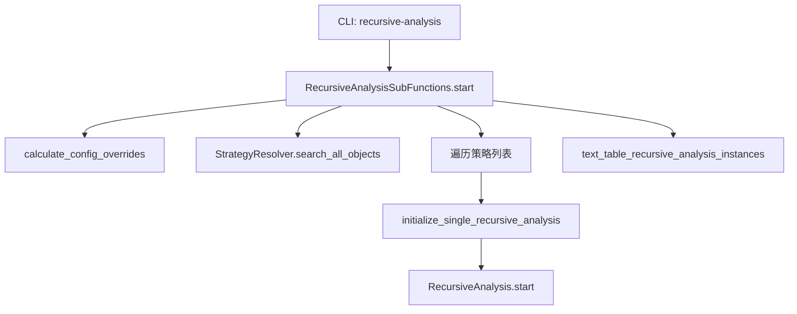

# recursive_helpers.py

## 概述

`recursive_helpers.py` 提供递归偏差分析的辅助功能和入口点。`RecursiveAnalysisSubFunctions` 类封装了分析的配置处理、策略发现、结果表格展示等功能，是 CLI 命令 `freqtrade recursive-analysis` 的核心实现。

## 架构图

## 核心类/函数

### RecursiveAnalysisSubFunctions

静态方法集合类。

#### text_table_recursive_analysis_instances(recursive_instances) -> list | None

生成并打印递归分析结果表格。

- **参数**：`recursive_instances` — `RecursiveAnalysis` 实例列表
- **表格结构**：
  - 行：每个存在偏差的指标
  - 列：每个 startup candle 值（策略原始值会标注 `(from strategy)`）
  - 单元格：百分比差异值或 `-`
- 使用 `print_rich_table` 输出格式化表格
- 返回表格数据列表

#### calculate_config_overrides(config) -> Config

为递归分析覆盖配置项。

- 强制要求配置 `timerange`（建议 5000 根 K 线）
- 强制 `backtest_cache = 'none'`（禁用缓存以确保结果准确）

#### initialize_single_recursive_analysis(config, strategy_obj) -> RecursiveAnalysis

初始化并执行单个策略的递归分析。

- 创建 `RecursiveAnalysis` 实例
- 调用 `start()` 执行分析
- 记录并输出耗时

#### start(config)

主入口方法。

1. 覆盖配置
2. 搜索所有策略对象
3. 统一 `--strategy` 和 `--strategy-list` 参数
4. 逐个执行策略的递归分析
5. 展示结果表格

## 依赖关系

### 内部依赖（本项目模块）
- `freqtrade.optimize.analysis.recursive.RecursiveAnalysis` — 核心分析类
- `freqtrade.resolvers.StrategyResolver` — 策略搜索
- `freqtrade.constants.Config` — 配置类型
- `freqtrade.exceptions.OperationalException` — 异常处理
- `freqtrade.util.print_rich_table` — 格式化表格输出

### 外部依赖（第三方库）
- `time` — 性能计时
- `pathlib.Path` — 文件路径

### 被依赖（谁引用了本文件）
- `freqtrade.commands.optimize_commands` — CLI 命令入口调用 `RecursiveAnalysisSubFunctions.start()`
