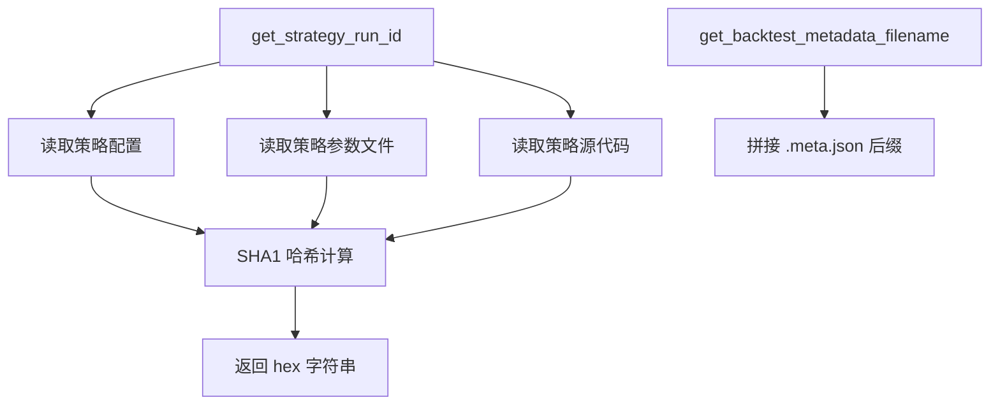

# backtest_caching.py

## 概述

`backtest_caching.py` 提供回测结果缓存相关的工具函数。主要功能包括：

1. 为每次回测运行生成唯一的策略标识哈希值（基于配置和策略文件内容），用于判断是否可以复用之前的回测结果。
2. 生成回测元数据文件名（`.meta.json`），用于存储/加载回测结果的元信息。

## 架构图

## 核心类/函数

### get_strategy_run_id(strategy) -> str

为一次回测运行生成唯一标识哈希值。相同的配置和策略文件始终返回相同的哈希。

- **参数**：`strategy` — 策略对象，需包含 `config`、`_ft_params_from_file`、`__file__` 属性
- **返回值**：SHA1 哈希的十六进制小写字符串
- **关键逻辑**：
  1. 深拷贝策略配置，移除不影响回测结果的键（`strategy_list`、`original_config`、`telegram`、`api_server`）
  2. 使用 `rapidjson` 序列化配置（允许 NaN 值），更新到 SHA1 摘要
  3. 序列化 `_ft_params_from_file`（参数文件内容）到摘要，确保参数文件变更也会导致缓存失效
  4. 读取策略源文件的二进制内容到摘要
  5. 返回摘要的十六进制表示

### get_backtest_metadata_filename(filename: Path | str) -> Path

返回指定回测结果文件对应的元数据文件路径。

- **参数**：`filename` — 回测结果文件的路径
- **返回值**：同目录下的 `{stem}.meta.json` 文件路径
- **示例**：`backtest-result-2023.json` -> `backtest-result-2023.meta.json`

## 依赖关系

### 内部依赖（本项目模块）
- 无

### 外部依赖（第三方库）
- `hashlib` — SHA1 哈希计算
- `copy.deepcopy` — 深拷贝配置，避免修改原对象
- `pathlib.Path` — 文件路径操作
- `rapidjson` — 高性能 JSON 序列化，支持 NaN

### 被依赖（谁引用了本文件）
- `freqtrade.optimize.backtesting` — 使用 `get_strategy_run_id` 生成策略运行 ID 用于缓存判断
- `freqtrade.optimize.optimize_reports.bt_storage` — 使用 `get_backtest_metadata_filename` 确定元数据文件路径
- `freqtrade.data.btanalysis.bt_fileutils` — 使用 `get_backtest_metadata_filename` 读取回测元数据
