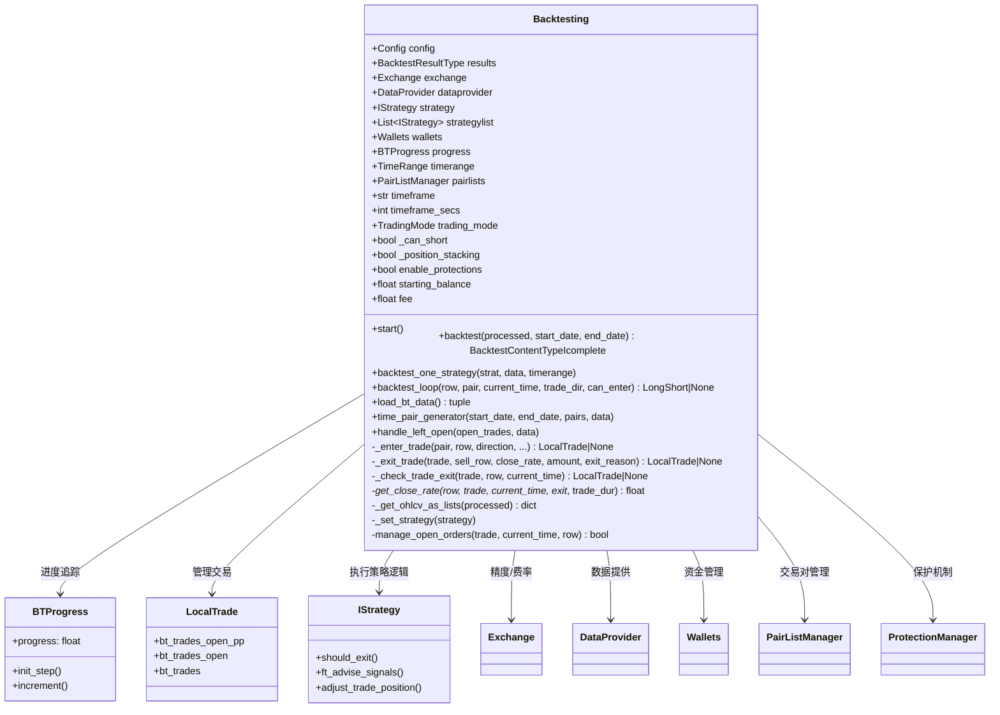

# backtesting.py

## 概述

`backtesting.py` 是 freqtrade 回测引擎的核心模块，包含 `Backtesting` 类，实现了完整的回测逻辑。该模块模拟真实交易环境，在历史数据上运行策略并生成交易记录。支持的功能包括：

- 多策略回测（`--strategy-list`）
- 多时间周期回测（`timeframe_detail` 细粒度时间框架）
- 做多/做空（Spot、Futures、Margin 交易模式）
- 仓位调整（`adjust_trade_position`）
- 订单管理（超时取消、价格调整、限价/市价单）
- 止损/追踪止损/ROI 退出
- 资金费率计算（Futures 模式）
- 动态 PairList 支持
- 回测结果缓存与增量更新
- 信号/拒绝信号导出用于后续分析

## 架构图

## 核心常量

- `DATE_IDX` 到 `EXIT_TAG_IDX` (0-10) — 回测数据元组的列索引
- `HEADERS` — 回测数据 DataFrame 的列名列表：`date, open, high, low, close, enter_long, exit_long, enter_short, exit_short, enter_tag, exit_tag`

## 核心类/函数

### Backtesting

回测引擎主类。

#### \_\_init\_\_(config, exchange=None)

初始化回测引擎。

- **参数**：
  - `config: Config` — 回测配置
  - `exchange: Exchange | None` — 可选的交易所实例（用于递归分析等场景复用）
- **关键流程**：
  1. 设置 `dry_run = True`
  2. 解析并加载策略（支持 `strategy_list`）
  3. 验证配置一致性
  4. 初始化交易所、数据提供器、PairList 管理器
  5. 设置交易费率、精度模式
  6. 解析时间范围，计算所需的 startup candle 数量
  7. 设置交易模式（Spot/Futures/Margin）
  8. 执行数据迁移

#### start()

回测主入口。

- **流程**：
  1. 调用 `load_bt_data()` 加载历史数据
  2. 调用 `load_prior_backtest()` 加载缓存的历史回测结果
  3. 遍历策略列表，跳过有缓存的策略，对其余策略调用 `backtest_one_strategy()`
  4. 调用 `generate_backtest_stats()` 生成统计信息
  5. 调用 `store_backtest_results()` 存储结果
  6. 调用 `show_backtest_results()` 展示结果

#### backtest(processed, start_date, end_date) -> BacktestContentTypeIcomplete

核心回测方法（也被 Hyperopt 调用，需保持高性能）。

- **参数**：
  - `processed` — `{pair: DataFrame}` 格式的已处理数据
  - `start_date/end_date` — 回测时间范围
- **返回值**：包含 `results`(DataFrame)、`config`、`locks`、`rejected_signals` 等的字典
- **关键流程**：
  1. `reset_backtest()` 重置回测状态
  2. `_get_ohlcv_as_lists()` 将 DataFrame 转为 list（性能优化）
  3. `time_pair_generator()` 按时间+交易对迭代
  4. 对每个 candle 调用 `backtest_loop()` 处理
  5. `handle_left_open()` 处理未平仓交易
  6. 返回结果

#### backtest_loop(row, pair, current_time, trade_dir, can_enter) -> LongShort | None

单根 K 线的回测处理逻辑（Hyperopt 核心路径）。

- **处理步骤**：
  1. 管理现有订单（超时/替换）
  2. 处理新的入场信号
  3. 处理入场订单成交
  4. 创建出场订单（止损/ROI/信号退出等）
  5. 处理出场订单成交
- **返回值**：如果有仓位关闭，返回关闭的方向，否则返回 None

#### time_pair_generator(start_date, end_date, pairs, data)

回测时间和交易对的生成器。

- 外层按主时间框架迭代
- 内层按 detail 时间框架迭代（如果配置了 `timeframe_detail`）
- 支持动态 PairList 刷新
- 优先处理有持仓的交易对

#### _enter_trade(pair, row, direction, ...)

处理入场逻辑。

- 调用 `custom_entry_price` 获取自定义入场价
- 调用 `custom_stake_amount` 获取自定义仓位大小
- 调用 `leverage` 获取杠杆倍数
- 调用 `confirm_trade_entry` 确认入场
- 创建 `LocalTrade` 和 `Order` 对象

#### _get_close_rate(row, trade, current_time, exit_, trade_dur) -> float

根据退出类型计算精确的退出价格。

- **止损/追踪止损/清算**：调用 `_get_close_rate_for_stoploss`
- **ROI**：调用 `_get_close_rate_for_roi`
- **其他**：使用开盘价

#### manage_open_orders(trade, current_time, row) -> bool

管理交易的未成交订单。检查订单是否超时（`check_order_cancel`）或需要替换价格（`check_order_replace`）。

#### handle_left_open(open_trades, data)

回测结束时处理仍然开启的交易，以 `force_exit` 方式平仓。

## 依赖关系

### 内部依赖（本项目模块）
- `freqtrade.constants` — 常量定义
- `freqtrade.configuration` — `TimeRange`、配置验证
- `freqtrade.data.history` — 加载历史数据
- `freqtrade.data.btanalysis` — 查找已有回测结果、tick size
- `freqtrade.data.converter` — 数据裁剪
- `freqtrade.data.dataprovider` — 数据提供器
- `freqtrade.data.metrics` — 计算组合 DataFrame
- `freqtrade.enums` — 回测状态、K 线类型、退出类型等枚举
- `freqtrade.exceptions` — 异常类
- `freqtrade.exchange` — 精度处理、时间框架转换
- `freqtrade.ft_types` — 回测结果类型定义
- `freqtrade.leverage` — 清算价格更新
- `freqtrade.mixins.LoggingMixin` — 日志混入
- `freqtrade.optimize.backtest_caching` — 策略运行 ID
- `freqtrade.optimize.bt_progress` — 进度追踪
- `freqtrade.optimize.optimize_reports` — 结果生成/存储/展示
- `freqtrade.persistence` — `LocalTrade`、`Order`、`PairLocks` 等
- `freqtrade.plugins` — PairList 管理器、Protection 管理器
- `freqtrade.resolvers` — Exchange/Strategy 解析器
- `freqtrade.strategy` — 策略接口和安全包装器
- `freqtrade.util` — 精确计算、时间工具
- `freqtrade.wallets` — 钱包管理

### 外部依赖（第三方库）
- `numpy` — `isnan`、`nan` 处理
- `pandas` — `DataFrame`、`Series` 数据处理

### 被依赖（谁引用了本文件）
- `freqtrade.optimize.hyperopt.hyperopt_optimizer` — Hyperopt 优化器在每次迭代中调用 `backtest()` 方法
- `freqtrade.optimize.analysis.lookahead` — Lookahead 分析使用 `Backtesting` 进行偏差检测
- `freqtrade.optimize.analysis.recursive` — 递归分析使用 `Backtesting` 进行指标偏差检测
- `freqtrade.rpc.api_server.api_backtest` — API 服务器通过回测接口运行回测
- `freqtrade.commands.optimize_commands` — CLI 命令入口
