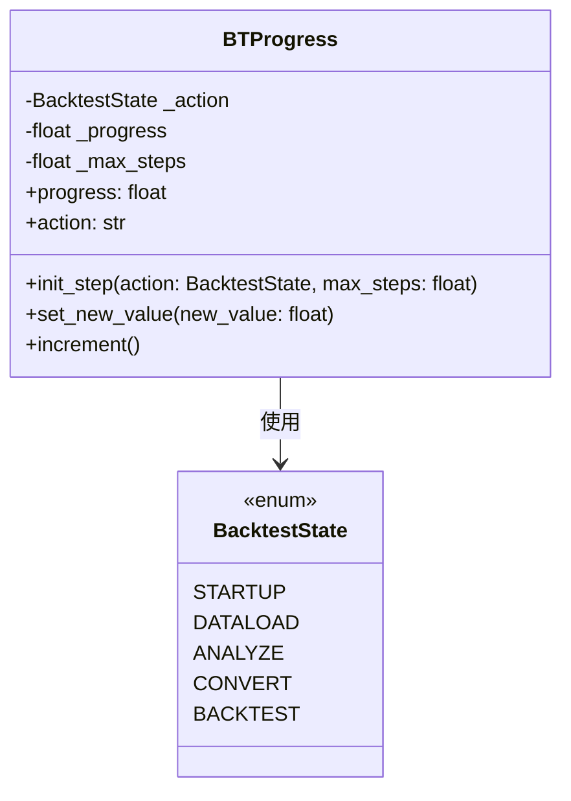

# bt_progress.py

## 概述

`bt_progress.py` 定义了 `BTProgress` 类，用于在回测过程中跟踪和报告进度。该类为回测的各个阶段（数据加载、指标转换、回测执行等）提供统一的进度追踪接口，支持初始化步骤、设置/递增进度值，并以比率形式报告当前进度。

## 架构图

## 核心类/函数

### BTProgress

回测进度跟踪器。

**属性**：
- `_action: BacktestState` — 当前回测阶段，默认 `STARTUP`
- `_progress: float` — 当前进度计数器
- `_max_steps: float` — 当前阶段的最大步数

**方法**：

- `init_step(action: BacktestState, max_steps: float)` — 初始化新的回测阶段，重置进度为 0
- `set_new_value(new_value: float)` — 直接设置进度值
- `increment()` — 进度加 1
- `progress` (property) — 返回进度比率（0 到 1 之间），使用 `min/max` 限制范围，保留 5 位小数
- `action` (property) — 返回当前阶段的字符串表示

## 依赖关系

### 内部依赖（本项目模块）
- `freqtrade.enums.BacktestState` — 回测状态枚举

### 外部依赖（第三方库）
- 无

### 被依赖（谁引用了本文件）
- `freqtrade.optimize.backtesting.Backtesting` — 在 `init_backtest()` 中创建 `BTProgress` 实例，在数据加载、数据转换、回测执行等阶段调用进度追踪方法
