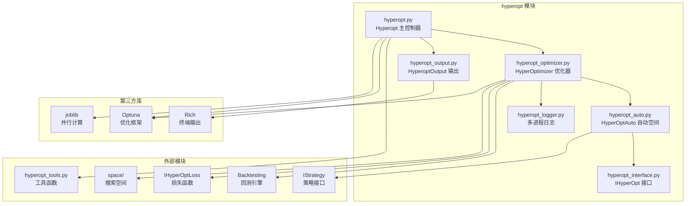
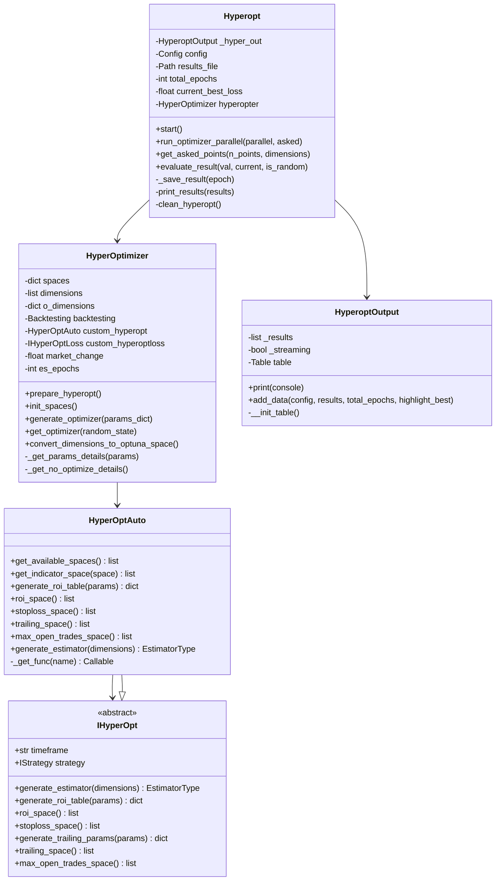
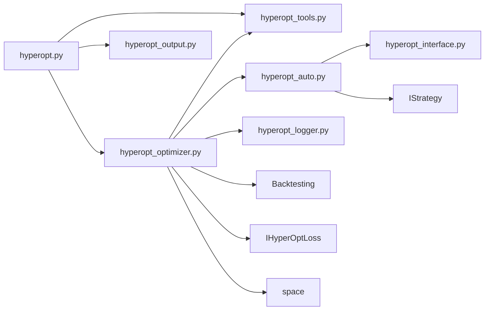
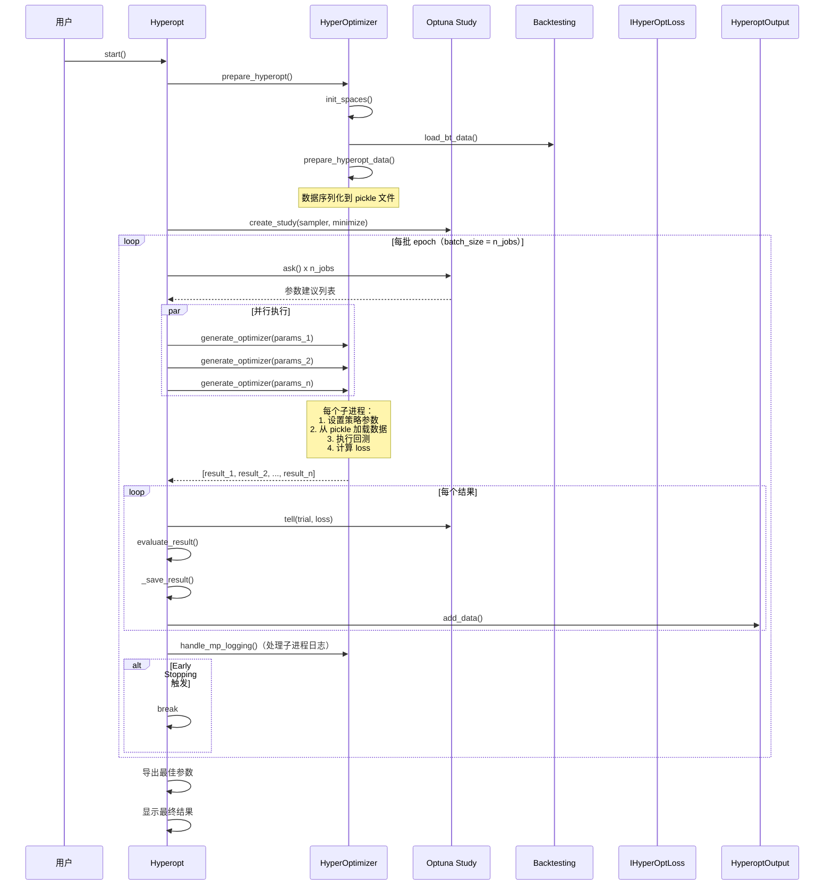
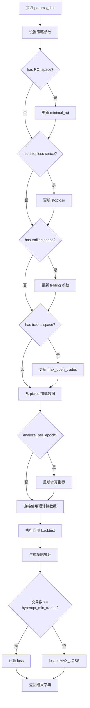

# Freqtrade 超参数优化模块 (`freqtrade/optimize/hyperopt/`)

## 1. 模块概述

`freqtrade/optimize/hyperopt/` 模块实现了 Freqtrade 的超参数优化（Hyperopt）功能。它基于 **Optuna** 框架，通过自动化搜索策略参数的最优组合来提升策略的回测表现。

Hyperopt 的核心工作流程是：
1. 定义参数搜索空间（buy/sell 参数、ROI、stoploss、trailing stop 等）
2. 使用采样器（Sampler）从搜索空间中生成参数组合
3. 对每组参数执行回测
4. 通过损失函数（Loss Function）评估回测结果
5. 根据评估结果指导下一轮参数采样
6. 重复以上过程直到达到指定的 epoch 数或触发 early stopping

该模块支持 **并行执行**（通过 joblib），支持多种 Optuna 采样器（TPE、GP、CMA-ES、NSGA-II、NSGA-III、QMC），并提供了实时的进度表格输出。

## 2. 目录结构

```
freqtrade/optimize/hyperopt/
├── __init__.py              # 模块初始化，导出 Hyperopt 和 IHyperOptLoss
├── hyperopt.py              # Hyperopt 主控制器，管理优化流程和并行执行
├── hyperopt_auto.py         # HyperOptAuto 类，自动从策略参数生成搜索空间
├── hyperopt_interface.py    # IHyperOpt 接口定义，提供默认的 ROI/stoploss/trailing 空间
├── hyperopt_optimizer.py    # HyperOptimizer 类，核心优化逻辑（可 pickle 序列化）
├── hyperopt_output.py       # HyperoptOutput 类，Rich 表格实时输出
└── hyperopt_logger.py       # 多进程日志处理工具
```

## 3. 架构图





## 4. 核心类/函数说明

### 4.1 `Hyperopt` 类 (`hyperopt.py`)

Hyperopt 的主控制器，负责整个优化流程的编排和并行执行管理。

**主要属性：**

| 属性 | 类型 | 说明 |
|------|------|------|
| `config` | `Config` | 全局配置 |
| `results_file` | `Path` | 结果文件路径（`.fthypt` 格式） |
| `total_epochs` | `int` | 总 epoch 数 |
| `current_best_loss` | `float` | 当前最佳 loss 值 |
| `current_best_epoch` | `dict` | 当前最佳 epoch 详情 |
| `hyperopter` | `HyperOptimizer` | 优化器实例 |
| `_hyper_out` | `HyperoptOutput` | 输出格式化器 |
| `print_all` | `bool` | 是否打印所有 epoch（而非仅最佳） |

**关键方法：**

| 方法 | 说明 |
|------|------|
| `start()` | 主入口。初始化 Optuna Study -> 启动并行循环 -> 保存结果 -> 导出最佳参数 |
| `run_optimizer_parallel(parallel, asked)` | 通过 joblib.Parallel 并行执行多组参数的回测 |
| `get_asked_points(n_points, dimensions)` | 从 Optuna 获取参数建议，自动去重 |
| `get_optuna_asked_points(n_points, dimensions)` | 直接调用 `study.ask()` 获取 trial |
| `duplicate_optuna_asked_points(trial, asked_trials)` | 检测参数是否重复 |
| `evaluate_result(val, current, is_random)` | 评估单个 epoch 结果，更新最佳记录 |
| `_save_result(epoch)` | 将 epoch 结果追加写入 `.fthypt` 文件（一行一个 JSON） |
| `print_results(results)` | 向 HyperoptOutput 输出结果 |
| `clean_hyperopt()` | 清理上一次运行的临时文件 |

**并行执行流程：**
```
1. 获取 CPU 核心数
2. 创建 joblib.Parallel 上下文
3. 循环：
   a. 从 Optuna Study 获取 N 个参数建议（N = 并行 job 数）
   b. 并行执行 N 次回测
   c. 将结果反馈给 Optuna Study (tell)
   d. 评估和保存结果
   e. 检查 early stopping 条件
```

### 4.2 `HyperOptimizer` 类 (`hyperopt_optimizer.py`)

Hyperopt 的核心优化逻辑，被序列化后发送到子进程执行。

**主要属性：**

| 属性 | 类型 | 说明 |
|------|------|------|
| `spaces` | `dict[str, list]` | 各搜索空间的维度定义 |
| `dimensions` | `list` | 所有维度的扁平列表 |
| `o_dimensions` | `dict` | Optuna 格式的搜索空间 |
| `backtesting` | `Backtesting` | 回测引擎实例 |
| `custom_hyperopt` | `HyperOptAuto` | 空间生成器 |
| `custom_hyperoptloss` | `IHyperOptLoss` | 损失函数 |
| `market_change` | `float` | 市场变化率 |
| `es_epochs` | `int` | Early stopping 的 epoch 数 |

**关键方法：**

| 方法 | 说明 |
|------|------|
| `prepare_hyperopt()` | 初始化：加载空间 -> 准备数据 -> 清理 exchange 资源 |
| `init_spaces()` | 初始化所有搜索空间（buy, sell, protection, roi, stoploss, trailing, trades + 自定义空间） |
| `generate_optimizer(params_dict)` | **核心方法**：接收参数 -> 设置策略参数 -> 执行回测 -> 计算 loss -> 返回结果 |
| `generate_optimizer_wrapped(params_dict)` | `generate_optimizer` 的包装，添加多进程日志支持 |
| `_get_params_details(params)` | 从参数字典中提取每个空间的详细参数 |
| `_get_no_optimize_details()` | 获取未参与优化的参数（如未选中的 ROI、stoploss 等） |
| `get_optimizer(random_state)` | 创建 Optuna Study 和 Sampler |
| `convert_dimensions_to_optuna_space()` | 将内部空间定义转换为 Optuna 分布 |
| `hyperopt_pickle_magic(bases)` | 处理策略类的跨文件继承在 pickle 时的问题 |
| `advise_and_trim(data)` | `analyze_per_epoch` 模式下的数据预处理 |
| `prepare_hyperopt_data()` | 加载数据、计算指标、序列化到磁盘 |

**Optuna Sampler 支持：**

| Sampler 名称 | 说明 |
|-------------|------|
| `TPESampler` | Tree-structured Parzen Estimator，基于贝叶斯优化 |
| `GPSampler` | Gaussian Process，高斯过程 |
| `CmaEsSampler` | CMA-ES 进化策略 |
| `NSGAIISampler` | NSGA-II 多目标遗传算法 |
| `NSGAIIISampler` | NSGA-III 多目标遗传算法（**默认**） |
| `QMCSampler` | Quasi-Monte Carlo 拟蒙特卡洛 |

**常量：**
- `INITIAL_POINTS = 30`：初始随机探索点数
- `MAX_LOSS = 100000`：当交易数不足时使用的惩罚 loss 值

### 4.3 `IHyperOpt` 接口 (`hyperopt_interface.py`)

Hyperopt 空间定义的抽象接口，提供默认的空间实现。

**默认空间定义：**

| 空间 | 方法 | 默认范围 |
|------|------|----------|
| ROI | `roi_space()` | 根据 timeframe 自适应调整，包含 roi_t1~t3（时间步）和 roi_p1~p3（利润步） |
| Stoploss | `stoploss_space()` | [-0.35, -0.02]，步长 0.001 |
| Trailing | `trailing_space()` | trailing_stop_positive: [0.01, 0.35]，offset_p1: [0.001, 0.1] |
| Max Open Trades | `max_open_trades_space()` | [-1, 10] 整数 |

**ROI 空间自适应：**
ROI 空间的时间和利润参数会根据 timeframe 自动缩放：
- 时间参数 (`roi_t`) 线性缩放
- 利润参数 (`roi_p`) 对数缩放
- 基准 timeframe 为 5m

**类型别名：**
```python
EstimatorType: TypeAlias = BaseSampler | str
```

### 4.4 `HyperOptAuto` 类 (`hyperopt_auto.py`)

自动化的 Hyperopt 空间生成器，从策略的 `IHyperStrategy` 参数定义中自动提取搜索空间。

**工作原理：**
1. 通过 `strategy.enumerate_parameters(space)` 遍历策略中定义的参数
2. 对每个标记为 `optimize=True` 的参数调用 `attr.get_space(attr_name)` 获取空间维度
3. 如果空间为空且 `hyperopt_ignore_missing_space=False`，抛出异常

**委托机制：**
`HyperOptAuto` 会检查策略中是否定义了内部 `HyperOpt` 类。如果有，优先使用该类的方法；否则使用 `IHyperOpt` 的默认实现。

| 方法 | 说明 |
|------|------|
| `get_available_spaces()` | 获取策略中定义的所有可用空间名称 |
| `_get_func(name)` | 获取函数：优先策略的 HyperOpt 类 -> 父类默认 |
| `get_indicator_space(space)` | 获取指定空间（buy/sell/protection/自定义）的指标维度 |

### 4.5 `HyperoptOutput` 类 (`hyperopt_output.py`)

基于 Rich 的实时表格输出组件，在 Hyperopt 运行过程中动态显示各 epoch 的结果。

**表格列：**
| 列名 | 说明 |
|------|------|
| Best | 是否为最佳结果（含 `*` 表示初始随机点） |
| Epoch | 当前/总 epoch |
| Trades | 交易数 |
| Win Draw Loss Win% | 胜负统计 |
| Avg profit | 平均利润率 |
| Profit | 总利润（绝对值 + 百分比） |
| Avg duration | 平均持仓时间 |
| Objective | 损失函数值 |
| Max Drawdown (Acct) | 最大回撤 |

**Streaming 模式：**
启用 streaming 时，输出会根据终端大小自动调整显示的行数，确保表格不超出终端窗口。

### 4.6 多进程日志 (`hyperopt_logger.py`)

| 函数 | 说明 |
|------|------|
| `logging_mp_setup(log_queue, verbosity)` | 在子进程中设置日志，通过 QueueHandler 将日志发送到主进程 |
| `logging_mp_handle(q)` | 在主进程中处理子进程发送的日志消息 |

**设计要点：**
- 子进程通过 `multiprocessing.Queue` 将日志发送到主进程
- `log_queue` 必须通过全局变量继承传递给子进程（joblib 的要求）
- 默认情况下，子进程中 `freqtrade.*` 的日志级别被提升到 WARNING，仅保留策略自身的日志

## 5. 依赖关系

### 5.1 模块间依赖



### 5.2 外部依赖

| 库 | 模块 | 用途 |
|----|------|------|
| `optuna` | `hyperopt.py`, `hyperopt_optimizer.py` | 优化框架核心（Study, Trial, Sampler） |
| `optuna.terminator` | `hyperopt_optimizer.py` | Early stopping 支持 |
| `joblib` | `hyperopt.py`, `hyperopt_optimizer.py` | 并行执行、数据序列化 |
| `joblib.externals.cloudpickle` | `hyperopt_optimizer.py` | 跨文件策略继承的 pickle 支持 |
| `rich` | `hyperopt_output.py` | 终端表格格式化 |
| `rapidjson` | `hyperopt.py` | 高性能 JSON 序列化 |

## 6. 数据流

### 6.1 Hyperopt 主流程



### 6.2 单次 generate_optimizer 执行流程



## 7. 关键设计点

### 7.1 数据共享优化
- 回测数据通过 `joblib.dump` 序列化到磁盘，子进程通过 `joblib.load(mmap_mode='r')` 以内存映射方式读取
- 这避免了每个子进程都复制一份完整数据，大幅节省内存

### 7.2 策略继承的 Pickle 处理
`hyperopt_pickle_magic()` 方法解决了策略跨文件继承时的 pickle 问题。它递归遍历策略的基类，将每个基类的模块注册为 cloudpickle 的按值序列化对象。

### 7.3 Early Stopping
通过 Optuna 的 `Terminator` 和 `BestValueStagnationEvaluator` 实现。当最佳 loss 在指定的 epoch 数内没有改善时自动停止。如果 early stop epochs 小于总 epochs 的 20%，会输出警告。

### 7.4 重复参数检测
`get_asked_points()` 方法会检测并过滤已评估过的重复参数，避免浪费计算资源。最多重试 `2 * n_points` 次来获取足够的非重复参数。

### 7.5 结果文件格式
`.fthypt` 文件采用 JSON Lines 格式（每行一个 JSON 对象），这种格式支持追加写入，不需要将整个文件加载到内存中。

### 7.6 Exchange 资源释放
`prepare_hyperopt()` 完成后，Exchange 实例的 API 连接、事件循环和锁对象会被显式设为 None，因为 Hyperopt 运行期间不再需要网络连接，这些对象也无法被 pickle 序列化。
