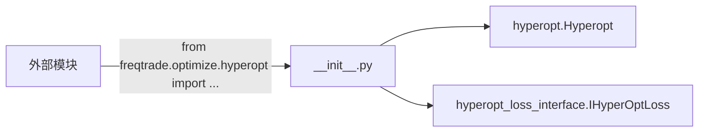

# __init__.py

## 概述

Hyperopt 包的初始化文件。负责从子模块中导出核心类，为外部模块提供统一的导入入口。

该文件导出了两个核心类：
- `Hyperopt` — 超参数优化主类
- `IHyperOptLoss` — 损失函数接口基类

## 架构图

## 导出内容

### `Hyperopt`
从 `freqtrade.optimize.hyperopt.hyperopt` 模块导入的超参数优化主控类。

### `IHyperOptLoss`
从 `freqtrade.optimize.hyperopt_loss.hyperopt_loss_interface` 模块导入的损失函数抽象接口。

## 依赖关系

### 内部依赖（本项目模块）
- `freqtrade.optimize.hyperopt.hyperopt` — 导入 `Hyperopt` 类
- `freqtrade.optimize.hyperopt_loss.hyperopt_loss_interface` — 导入 `IHyperOptLoss` 类

### 外部依赖（第三方库）
无

### 被依赖（谁引用了本文件）
- `freqtrade.optimize.hyperopt_loss.*` — 所有损失函数实现均通过此入口导入 `IHyperOptLoss`
- `freqtrade.commands.optimize_commands` — 命令行入口导入 Hyperopt 相关类
- `tests/optimize/test_hyperopt.py` — 测试文件
- `tests/optimize/conftest.py` — 测试配置文件
