# hyperopt.py

## 概述

Hyperopt 主控类模块，包含超参数优化的核心调度逻辑。该文件是 hyperopt 功能的入口点和协调中心，负责：

1. **初始化**：配置结果文件路径、加载优化器（`HyperOptimizer`）、设置输出格式
2. **并行调度**：利用 `joblib.Parallel` 在多核 CPU 上并行运行回测优化
3. **去重机制**：通过 Optuna 的 Trial 系统避免重复评估已尝试过的参数组合
4. **结果管理**：保存每个 epoch 的结果到 `.fthypt` 文件，追踪最佳结果
5. **早停支持**：支持 `--early-stop` 参数，在优化停滞时提前终止
6. **进度展示**：使用 Rich 进度条和 `HyperoptOutput` 实时展示优化进度

## 架构图

```mermaid
classDiagram
    class Hyperopt {
        -HyperoptOutput _hyper_out
        -Config config
        -Path results_file
        -Path data_pickle_file
        -int total_epochs
        -float current_best_loss
        -int num_epochs_saved
        -dict current_best_epoch
        -HyperOptimizer hyperopter
        -int count_skipped_epochs
        +__init__(config: Config)
        +get_lock_filename(config: Config) str
        +clean_hyperopt()
        +start()
        +print_results(results: dict)
        +run_optimizer_parallel(parallel, asked)
        +get_asked_points(n_points, dimensions)
        +get_optuna_asked_points(n_points, dimensions)
        +duplicate_optuna_asked_points(trial, asked_trials) bool
        +evaluate_result(val, current, is_random)
        -_save_result(epoch: dict)
        -_set_random_state(random_state) int
    }

    Hyperopt --> HyperOptimizer : 使用
    Hyperopt --> HyperoptOutput : 输出结果
    Hyperopt --> HyperoptTools : 工具方法
    Hyperopt --> Parallel : 并行执行

    class HyperOptimizer {
        +prepare_hyperopt()
        +get_optimizer(random_state)
        +generate_optimizer_wrapped(v)
    }

    class HyperoptOutput {
        +add_data(config, results, total_epochs, highlight_best)
    }
```

## 核心类/函数

### Hyperopt

超参数优化的主控类，编排整个优化流程。

#### `__init__(self, config: Config) -> None`
- **参数**: `config` — 全局配置字典
- **职责**:
  - 初始化 `HyperoptOutput` 用于实时流式输出
  - 设置结果文件路径（格式: `strategy_{策略名}_{时间戳}.fthypt`）
  - 创建 `HyperOptimizer` 实例
  - 如果优化 sell 空间，自动启用 `use_exit_signal`
  - 清理旧的 hyperopt 文件

#### `clean_hyperopt(self) -> None`
- 删除历史的 pickle 数据文件和结果文件，确保每次运行从干净状态开始

#### `start(self) -> None`
- **核心方法**：启动整个超参数优化流程
- **关键逻辑**:
  1. 设置随机种子
  2. 调用 `hyperopter.prepare_hyperopt()` 准备数据和搜索空间
  3. 创建 Optuna Study 优化器
  4. 使用 `joblib.Parallel` 创建并行工作池
  5. 按 epoch 批次循环：获取参数点 -> 并行回测 -> 将损失值反馈给优化器 -> 评估并保存结果
  6. 支持 `analyze_per_epoch` 模式（每个 epoch 重新计算指标）
  7. 支持早停（`es_epochs`）
  8. 结束时导出最佳参数和结果摘要

#### `get_asked_points(self, n_points: int, dimensions: dict) -> tuple[list, list[bool]]`
- **参数**: `n_points` — 请求的参数点数量；`dimensions` — Optuna 搜索空间
- **返回**: `(非重复参数点列表, 随机标记列表)`
- **职责**: 从优化器获取参数点并过滤重复项。如果搜索空间耗尽，会记录跳过的 epoch 数量

#### `duplicate_optuna_asked_points(self, trial: Trial, asked_trials: list[FrozenTrial]) -> bool`
- 检查当前 trial 的参数是否已在历史完成的 trial 或同批次中出现过
- **返回**: `True` 表示存在重复

#### `evaluate_result(self, val: dict, current: int, is_random: bool)`
- 评估单个 epoch 的结果
- 标记是否为最佳结果（`is_best`）
- 更新 `current_best_loss` 和 `current_best_epoch`
- 调用 `_save_result()` 持久化结果

#### `run_optimizer_parallel(self, parallel: Parallel, asked: list[list]) -> list[dict]`
- 通过 `joblib.Parallel` 并行执行优化回测
- 内部调用 `hyperopter.generate_optimizer_wrapped(v)`

#### `_save_result(self, epoch: dict) -> None`
- 将单个 epoch 结果以 JSON 格式追加到 `.fthypt` 文件
- 使用 `rapidjson` 序列化（支持 NaN）
- 同时更新 `latest_hyperopt` 指针文件

## 依赖关系

### 内部依赖（本项目模块）
- `freqtrade.constants` — `FTHYPT_FILEVERSION`, `LAST_BT_RESULT_FN`, `Config` 类型
- `freqtrade.enums.HyperoptState` — Hyperopt 状态枚举
- `freqtrade.misc` — `file_dump_json`, `plural` 工具函数
- `freqtrade.optimize.hyperopt.hyperopt_optimizer` — `HyperOptimizer` 和 `INITIAL_POINTS` 常量
- `freqtrade.optimize.hyperopt.hyperopt_output` — `HyperoptOutput` 输出格式化
- `freqtrade.optimize.hyperopt_tools` — `HyperoptStateContainer`, `HyperoptTools`, `hyperopt_serializer`
- `freqtrade.util` — `get_progress_tracker` 进度条工具

### 外部依赖（第三方库）
- `rapidjson` — 高性能 JSON 序列化
- `joblib` — `Parallel`, `cpu_count` 并行计算
- `optuna` — `FrozenTrial`, `Trial`, `TrialState` 优化框架

### 被依赖（谁引用了本文件）
- `freqtrade.optimize.hyperopt.__init__` — 包入口导出 `Hyperopt` 类
- `freqtrade.commands.optimize_commands` — CLI 命令调用入口
- `tests/optimize/test_hyperopt.py` — 单元测试
