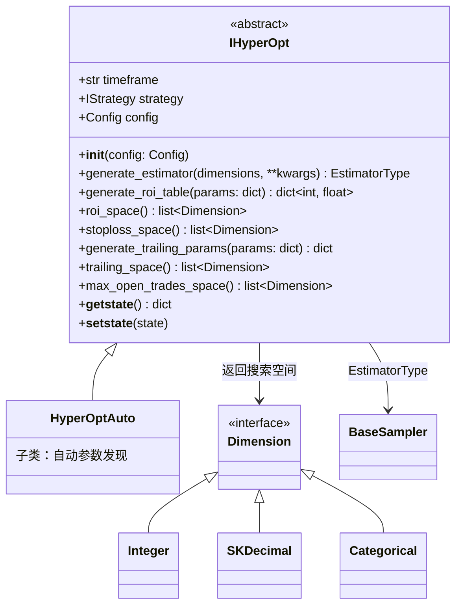

# hyperopt_interface.py

## 概述

`IHyperOpt` 抽象接口模块，定义了 hyperopt 系统中搜索空间和参数生成的标准接口。这是所有自定义 HyperOpt 类的基类，提供了 ROI（收益率表）、Stoploss（止损）、Trailing Stop（追踪止损）和 Max Open Trades（最大同时开仓数）等搜索空间的默认实现。

关键特性：
- ROI 空间会根据策略的 timeframe 自动缩放（线性缩放时间参数、对数缩放收益参数）
- 支持通过 `generate_estimator()` 自定义 Optuna 采样器
- 定义了 `EstimatorType` 类型别名，支持字符串名称或 `BaseSampler` 实例

## 架构图



## 核心类/函数

### EstimatorType (TypeAlias)

```python
EstimatorType: TypeAlias = BaseSampler | str
```
Optuna 采样器类型别名。可以是 `BaseSampler` 的实例，也可以是字符串名称（如 `"TPESampler"`, `"NSGAIIISampler"` 等）。

### IHyperOpt

抽象基类，定义 hyperopt 搜索空间和参数生成的接口。

#### `__init__(self, config: Config) -> None`
- **参数**: `config` — 全局配置字典
- **职责**: 保存配置并设置 `timeframe` 类属性

#### `generate_estimator(self, dimensions: list[Dimension], **kwargs) -> EstimatorType`
- **返回**: 默认返回 `"NSGAIIISampler"` 字符串
- **说明**: 可选的采样器包括 `"TPESampler"`, `"GPSampler"`, `"CmaEsSampler"`, `"NSGAIISampler"`, `"NSGAIIISampler"`, `"QMCSampler"`，或继承自 `BaseSampler` 的实例

#### `generate_roi_table(self, params: dict) -> dict[int, float]`
- **参数**: `params` — 包含 `roi_t1/t2/t3` 和 `roi_p1/p2/p3` 的参数字典
- **返回**: ROI 表字典，键为分钟数，值为收益率
- **逻辑**: 构建 4 级递减 ROI 表：
  - `0` 分钟 -> `p1 + p2 + p3`（最高收益目标）
  - `t3` 分钟 -> `p1 + p2`
  - `t3 + t2` 分钟 -> `p1`
  - `t3 + t2 + t1` 分钟 -> `0`（持仓到期退出）

#### `roi_space(self) -> list[Dimension]`
- **返回**: 6 个搜索维度（3 个时间维度 + 3 个收益维度）
- **关键逻辑**: 自适应缩放机制
  - 时间参数（`roi_t`）按 timeframe 线性缩放：`roi_t_scale = timeframe_min / 5`
  - 收益参数（`roi_p`）按 timeframe 对数缩放：`roi_p_scale = log1p(timeframe_min) / log1p(5)`
  - 以 5 分钟 timeframe 为基准进行缩放
  - 支持通过 `roi_t_alpha` 和 `roi_p_alpha` 系数调整范围宽度

#### `stoploss_space(self) -> list[Dimension]`
- **返回**: 1 个 `SKDecimal` 维度，范围 [-0.35, -0.02]，精度 3 位小数

#### `generate_trailing_params(self, params: dict) -> dict`
- **参数**: `params` — 包含追踪止损相关参数的字典
- **返回**: 包含 `trailing_stop`, `trailing_stop_positive`, `trailing_stop_positive_offset`, `trailing_only_offset_is_reached` 的字典
- **注意**: `trailing_stop_positive_offset` = `trailing_stop_positive` + `trailing_stop_positive_offset_p1`（确保 offset 大于 positive）

#### `trailing_space(self) -> list[Dimension]`
- **返回**: 4 个维度
  - `trailing_stop` — 固定 `[True]`（始终启用）
  - `trailing_stop_positive` — SKDecimal [0.01, 0.35]
  - `trailing_stop_positive_offset_p1` — SKDecimal [0.001, 0.1]（差值参数）
  - `trailing_only_offset_is_reached` — Categorical [True, False]

#### `max_open_trades_space(self) -> list[Dimension]`
- **返回**: 1 个 `Integer` 维度，范围 [-1, 10]（-1 表示无限制）

#### `__getstate__` / `__setstate__`
- 自定义 pickle 序列化/反序列化，确保类属性 `timeframe` 在跨进程传输时正确保留

## 依赖关系

### 内部依赖（本项目模块）
- `freqtrade.constants` — `Config` 类型
- `freqtrade.exchange` — `timeframe_to_minutes` 时间帧转换
- `freqtrade.misc` — `round_dict` 字典值四舍五入工具
- `freqtrade.optimize.space` — `Categorical`, `Dimension`, `Integer`, `SKDecimal` 搜索空间类型
- `freqtrade.strategy` — `IStrategy` 策略接口

### 外部依赖（第三方库）
- `optuna.samplers` — `BaseSampler` 采样器基类

### 被依赖（谁引用了本文件）
- `freqtrade.optimize.hyperopt.hyperopt_auto` — `HyperOptAuto` 继承 `IHyperOpt` 并导入 `EstimatorType`
