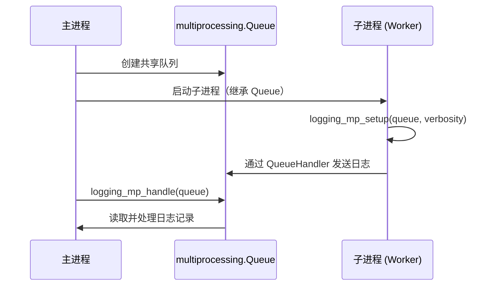

# hyperopt_logger.py

## 概述

Hyperopt 多进程日志处理模块。由于 hyperopt 使用 `joblib.Parallel` 在多个子进程中并行执行回测，而 Python 的标准 logging 在多进程环境下不是线程安全的，因此需要特殊的日志传递机制。

该模块实现了基于 `multiprocessing.Queue` 的日志传递方案：
1. 子进程通过 `QueueHandler` 将日志消息发送到共享队列
2. 主进程定期从队列中读取并处理这些日志消息

## 架构图

## 核心类/函数

### `logging_mp_setup(log_queue: Queue, verbosity: int)`
- **参数**:
  - `log_queue` — 多进程共享的日志队列，**必须**通过进程继承（inheritance）传递给子进程（即在同一文件中作为全局变量创建）
  - `verbosity` — 日志级别（`logging.INFO` 或 `logging.DEBUG` 等）
- **职责**: 在子进程中配置日志系统
- **关键逻辑**:
  1. 检查当前进程是否为子进程（`current_process().name != "MainProcess"`）
  2. 为根 logger 添加 `QueueHandler`，将所有日志消息转发到队列
  3. 如果 verbosity 高于 DEBUG，将 `freqtrade` 命名空间的日志级别设为 WARNING，仅允许策略自身的日志和第三方库日志通过

### `logging_mp_handle(q: Queue)`
- **参数**: `q` — 日志消息队列
- **职责**: 在主进程中处理子进程发送的日志消息
- **关键逻辑**:
  1. 以非阻塞方式（`block=False`）循环读取队列中的所有日志记录
  2. 将每条记录传递给当前模块的 logger 处理
  3. 队列为空时（`Empty` 异常）安全退出

## 依赖关系

### 内部依赖（本项目模块）
无

### 外部依赖（第三方库）
- `logging` — Python 标准日志库
- `logging.handlers.QueueHandler` — 基于队列的日志处理器
- `multiprocessing` — `Queue` 跨进程队列, `current_process` 进程信息

### 被依赖（谁引用了本文件）
- `freqtrade.optimize.hyperopt.hyperopt_optimizer` — 导入 `logging_mp_setup` 和 `logging_mp_handle`，分别在子进程初始化和主进程日志处理中使用
