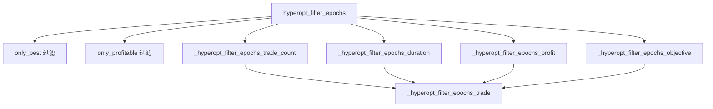

# hyperopt_epoch_filters.py

## 概述

`hyperopt_epoch_filters.py` 提供 Hyperopt（超参数优化）结果过滤功能。用户可以通过多种条件（最佳结果、盈利结果、交易次数范围、平均持仓时间范围、平均利润范围、总利润范围、目标函数值范围）来筛选 Hyperopt 的 epoch 结果，从而快速定位感兴趣的优化轮次。

## 架构图

## 核心类/函数

### hyperopt_filter_epochs(epochs: list, filteroptions: dict, log: bool = True) -> list

主过滤函数，依次应用所有过滤条件。

- **参数**：
  - `epochs` — Hyperopt epoch 结果列表，每个 epoch 是包含 `is_best`、`results_metrics`、`loss` 等键的字典
  - `filteroptions` — 过滤选项字典，包含所有过滤参数
  - `log` — 是否输出日志
- **返回值**：过滤后的 epoch 列表
- **过滤顺序**：`only_best` -> `only_profitable` -> 交易次数 -> 持仓时间 -> 利润 -> 目标函数值

### _hyperopt_filter_epochs_trade(epochs: list, trade_count: int)

基础过滤：仅保留交易次数大于 `trade_count` 的 epoch。

### _hyperopt_filter_epochs_trade_count(epochs: list, filteroptions: dict) -> list

按最小/最大交易次数过滤。支持 `filter_min_trades` 和 `filter_max_trades`。

### _hyperopt_filter_epochs_duration(epochs: list, filteroptions: dict) -> list

按平均持仓时间过滤。从 `holding_avg_s`（秒）转换为分钟进行比较。支持 `filter_min_avg_time` 和 `filter_max_avg_time`。如果数据中不包含 `holding_avg_s`，抛出 `OperationalException`。

### _hyperopt_filter_epochs_profit(epochs: list, filteroptions: dict) -> list

按利润过滤，支持四个维度：
- `filter_min_avg_profit` / `filter_max_avg_profit` — 平均利润百分比
- `filter_min_total_profit` / `filter_max_total_profit` — 总利润绝对值

### _hyperopt_filter_epochs_objective(epochs: list, filteroptions: dict) -> list

按目标函数值（loss）过滤。支持 `filter_min_objective` 和 `filter_max_objective`。

## 依赖关系

### 内部依赖（本项目模块）
- `freqtrade.exceptions.OperationalException` — 当缺少必要数据时抛出异常

### 外部依赖（第三方库）
- `logging` — 日志记录

### 被依赖（谁引用了本文件）
- `freqtrade.optimize.hyperopt_tools.HyperoptTools` — 在 `load_filtered_results` 中调用 `hyperopt_filter_epochs` 对加载的结果进行过滤
