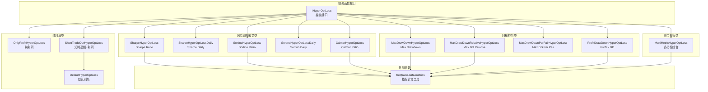
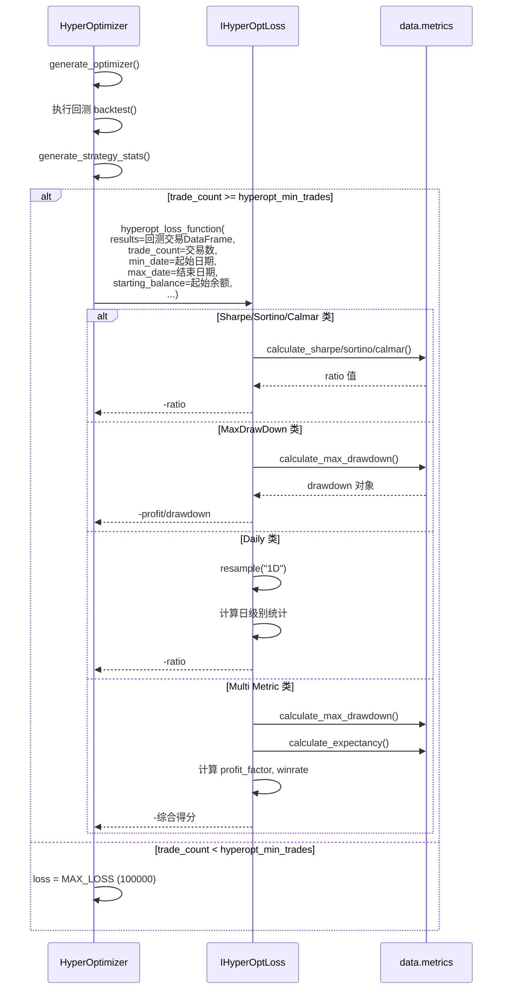

# Freqtrade 超参数优化损失函数模块 (`freqtrade/optimize/hyperopt_loss/`)

## 1. 模块概述

`freqtrade/optimize/hyperopt_loss/` 模块定义了 Hyperopt 超参数优化过程中使用的**损失函数（Loss Function）**集合。损失函数是 Hyperopt 的核心组件之一，它决定了优化器如何评估每组参数的回测结果——返回值越小，表示该参数组合的表现越好。

不同的损失函数侧重于不同的优化目标：
- **纯利润优化**：最大化总利润
- **风险调整收益**：在追求利润的同时控制风险（Sharpe、Sortino、Calmar 比率）
- **回撤控制**：在优化利润的同时最小化最大回撤
- **综合指标**：同时考虑多个维度（利润因子、期望值、胜率、回撤等）
- **交易效率**：偏好短期高频交易策略

用户可以通过 `--hyperopt-loss` 参数选择合适的损失函数，也可以继承 `IHyperOptLoss` 接口实现自定义损失函数。

## 2. 目录结构

```
freqtrade/optimize/hyperopt_loss/
├── hyperopt_loss_interface.py              # IHyperOptLoss 抽象接口定义
├── hyperopt_loss_short_trade_dur.py        # 默认损失函数：偏好短时高频 + 高利润
├── hyperopt_loss_onlyprofit.py             # 纯利润优化：仅关注绝对利润
├── hyperopt_loss_sharpe.py                 # Sharpe Ratio：风险调整收益（逐笔交易计算）
├── hyperopt_loss_sharpe_daily.py           # Sharpe Ratio Daily：按日聚合计算 Sharpe
├── hyperopt_loss_sortino.py                # Sortino Ratio：仅惩罚下行风险（逐笔交易）
├── hyperopt_loss_sortino_daily.py          # Sortino Ratio Daily：按日聚合计算 Sortino
├── hyperopt_loss_calmar.py                 # Calmar Ratio：年化收益/最大回撤
├── hyperopt_loss_max_drawdown.py           # Max Drawdown：利润/最大回撤比
├── hyperopt_loss_max_drawdown_relative.py  # Max Drawdown Relative：利润/绝对回撤/相对回撤
├── hyperopt_loss_max_drawdown_per_pair.py  # Max Drawdown Per Pair：最差交易对利润/回撤比
├── hyperopt_loss_profit_drawdown.py        # Profit Drawdown：利润减去回撤惩罚
└── hyperopt_loss_multi_metric.py           # 多指标综合：利润×利润因子×期望值×胜率×回撤
```

## 3. 架构图

```mermaid
classDiagram
    class IHyperOptLoss {
        <<abstract>>
        +str timeframe
        +hyperopt_loss_function(results, trade_count, min_date, max_date, config, processed, backtest_stats, starting_balance) float*
    }

    class ShortTradeDurHyperOptLoss {
        +hyperopt_loss_function(results, trade_count) float
    }
    class DefaultHyperOptLoss {
    }
    class OnlyProfitHyperOptLoss {
        +hyperopt_loss_function(results, trade_count) float
    }
    class SharpeHyperOptLoss {
        +hyperopt_loss_function(results, min_date, max_date, starting_balance) float
    }
    class SharpeHyperOptLossDaily {
        +hyperopt_loss_function(results, trade_count, min_date, max_date) float
    }
    class SortinoHyperOptLoss {
        +hyperopt_loss_function(results, min_date, max_date, starting_balance) float
    }
    class SortinoHyperOptLossDaily {
        +hyperopt_loss_function(results, trade_count, min_date, max_date) float
    }
    class CalmarHyperOptLoss {
        +hyperopt_loss_function(results, min_date, max_date, starting_balance) float
    }
    class MaxDrawDownHyperOptLoss {
        +hyperopt_loss_function(results, trade_count, min_date, max_date) float
    }
    class MaxDrawDownRelativeHyperOptLoss {
        +hyperopt_loss_function(results, starting_balance) float
    }
    class MaxDrawDownPerPairHyperOptLoss {
        +hyperopt_loss_function(backtest_stats) float
    }
    class ProfitDrawDownHyperOptLoss {
        +hyperopt_loss_function(results, starting_balance) float
    }
    class MultiMetricHyperOptLoss {
        +hyperopt_loss_function(results, trade_count, starting_balance) float
    }

    IHyperOptLoss <|-- ShortTradeDurHyperOptLoss
    ShortTradeDurHyperOptLoss <|-- DefaultHyperOptLoss
    IHyperOptLoss <|-- OnlyProfitHyperOptLoss
    IHyperOptLoss <|-- SharpeHyperOptLoss
    IHyperOptLoss <|-- SharpeHyperOptLossDaily
    IHyperOptLoss <|-- SortinoHyperOptLoss
    IHyperOptLoss <|-- SortinoHyperOptLossDaily
    IHyperOptLoss <|-- CalmarHyperOptLoss
    IHyperOptLoss <|-- MaxDrawDownHyperOptLoss
    IHyperOptLoss <|-- MaxDrawDownRelativeHyperOptLoss
    IHyperOptLoss <|-- MaxDrawDownPerPairHyperOptLoss
    IHyperOptLoss <|-- ProfitDrawDownHyperOptLoss
    IHyperOptLoss <|-- MultiMetricHyperOptLoss
```





## 4. 核心类/函数说明

### 4.1 `IHyperOptLoss` 接口 (`hyperopt_loss_interface.py`)

所有损失函数的抽象基类。

```python
class IHyperOptLoss(ABC):
    timeframe: str

    @staticmethod
    @abstractmethod
    def hyperopt_loss_function(
        *,
        results: DataFrame,          # 交易结果 DataFrame
        trade_count: int,             # 交易总数
        min_date: datetime,           # 回测起始日期
        max_date: datetime,           # 回测结束日期
        config: Config,               # 配置字典
        processed: dict[str, DataFrame],  # 处理后的数据
        backtest_stats: dict[str, Any],   # 回测统计信息
        starting_balance: float,      # 起始余额
        **kwargs,
    ) -> float:
        """返回值越小表示结果越好"""
```

**注意：** 接口定义使用关键字参数（keyword-only），但各实现类可以选择性地使用需要的参数。

### 4.2 `ShortTradeDurHyperOptLoss` / `DefaultHyperOptLoss`

**默认损失函数**，综合考虑交易频率、利润和持仓时间。

**公式：**
```
loss = trade_loss + profit_loss + duration_loss
```

| 组成部分 | 权重 | 计算方式 |
|---------|------|----------|
| `trade_loss` | 0.25 | `1 - 0.25 * exp(-(trade_count - 600)^2 / 10^5.8)` |
| `profit_loss` | 1.0 | `max(0, 1 - total_profit / 3.0)` |
| `duration_loss` | 0.4 | `0.4 * min(avg_duration / 300, 1)` |

**可调常量：**
- `TARGET_TRADES = 600`：目标交易数
- `EXPECTED_MAX_PROFIT = 3.0`：期望最大利润比率
- `MAX_ACCEPTED_TRADE_DURATION = 300`：最大可接受平均持仓时间（分钟）

`DefaultHyperOptLoss` 是 `ShortTradeDurHyperOptLoss` 的别名，保持向后兼容。

### 4.3 `OnlyProfitHyperOptLoss`

**最简单的损失函数**，仅关注绝对利润。

```python
loss = -1 * results["profit_abs"].sum()
```

适用场景：当用户只关心利润最大化，不考虑风险因素时使用。

### 4.4 `SharpeHyperOptLoss`

基于 **Sharpe Ratio（夏普比率）** 的损失函数，逐笔交易计算。

Sharpe Ratio = (平均收益 - 无风险收益) / 收益标准差

```python
loss = -calculate_sharpe(results, min_date, max_date, starting_balance)
```

调用 `freqtrade.data.metrics.calculate_sharpe` 进行计算。

### 4.5 `SharpeHyperOptLossDaily`

**按日聚合**计算的 Sharpe Ratio，更符合传统金融的计算方式。

**计算步骤：**
1. 对每笔交易扣除滑点（slippage = 0.05%）
2. 按日聚合利润比率
3. 在完整日期索引上 reindex（补零）
4. 计算年化 Sharpe Ratio = mean / std * sqrt(365)

**可调参数：**
- `slippage_per_trade_ratio = 0.0005`
- `days_in_year = 365`
- `annual_risk_free_rate = 0.0`

### 4.6 `SortinoHyperOptLoss`

基于 **Sortino Ratio（索提诺比率）** 的损失函数。与 Sharpe 不同，Sortino 仅惩罚下行波动（亏损），不惩罚上行波动（盈利）。

```python
loss = -calculate_sortino(results, min_date, max_date, starting_balance)
```

### 4.7 `SortinoHyperOptLossDaily`

按日聚合计算的 Sortino Ratio。

**计算步骤：**
1. 对每笔交易扣除滑点
2. 按日聚合
3. 仅计算负收益的标准差（下行标准差）
4. 年化 Sortino = mean / downside_std * sqrt(365)

**下行标准差公式：**
```
down_stdev = sqrt(sum(min(0, P - MAR)^2) / N)
```
其中 MAR = Minimum Acceptable Return = 0

### 4.8 `CalmarHyperOptLoss`

基于 **Calmar Ratio（卡玛比率）** 的损失函数。

Calmar Ratio = 年化收益率 / 最大回撤

```python
loss = -calculate_calmar(results, min_date, max_date, starting_balance)
```

适用场景：重视最大回撤控制的策略优化。

### 4.9 `MaxDrawDownHyperOptLoss`

**利润/最大回撤比** 的损失函数。

```python
loss = -total_profit / max_drawdown_abs
```

如果没有亏损交易（无回撤），则直接返回 `-total_profit`。

### 4.10 `MaxDrawDownRelativeHyperOptLoss`

在 `MaxDrawDownHyperOptLoss` 的基础上增加了**相对回撤**维度。

```python
loss = -total_profit / max_drawdown / relative_drawdown
```

其中 `relative_drawdown` 是回撤的 underwater 曲线的最大值，反映了账户从峰值到谷值的相对跌幅。

### 4.11 `MaxDrawDownPerPairHyperOptLoss`

**最差交易对优化**：计算每个交易对的利润/回撤比，以最差的交易对作为优化目标。

**设计动机：** 防止个别高收益交易对掩盖其他交易对的糟糕表现，强制优化器对所有交易对都找到合理的参数。

```python
# 对每个交易对计算 profit_dd = profit / drawdown
# 如果 profit_dd < min_acceptable_profit_dd (1.0)，施加惩罚
# 返回所有交易对中最差的 score
loss = -min(score_per_pair)
```

**可调参数：**
- `min_acceptable_profit_dd = 1.0`：最低可接受的利润/回撤比
- `penalty = 20`：不满足最低要求时的惩罚值

### 4.12 `ProfitDrawDownHyperOptLoss`

**利润减回撤惩罚**的损失函数。

```python
loss = -1 * (total_profit - (relative_account_drawdown * total_profit) * (1 - DRAWDOWN_MULT))
```

`DRAWDOWN_MULT = 0.075`：值越小，对回撤的惩罚越严格。

### 4.13 `MultiMetricHyperOptLoss`

**多指标综合**损失函数，是最全面的损失函数实现。

**综合指标：**
```python
loss = -1 * (
    profit_draw_function      # 利润 - 回撤惩罚
    * log_profit_factor       # log(利润因子 + PF_CONST)
    * log_expectancy_ratio    # log(min(10, 期望值比率) + EXPECTANCY_CONST)
    * log_winrate_coef        # log(WINRATE_CONST + 胜率)
    * trade_count_penalty     # 交易数不足时的惩罚
)
```

**可调常量：**

| 常量 | 默认值 | 说明 |
|------|--------|------|
| `DRAWDOWN_MULT` | 0.055 | 回撤惩罚系数（越小惩罚越严格） |
| `TARGET_TRADE_AMOUNT` | 50 | 目标交易数量 |
| `EXPECTANCY_CONST` | 2.0 | 期望值影响系数（越大影响越小） |
| `PF_CONST` | 1.0 | 利润因子影响系数 |
| `WINRATE_CONST` | 1.2 | 胜率影响系数（越大影响越小） |

## 5. 依赖关系

### 5.1 内部依赖

| 被依赖模块 | 依赖来源 | 说明 |
|------------|----------|------|
| `freqtrade.data.metrics.calculate_sharpe` | `SharpeHyperOptLoss` | Sharpe Ratio 计算 |
| `freqtrade.data.metrics.calculate_sortino` | `SortinoHyperOptLoss` | Sortino Ratio 计算 |
| `freqtrade.data.metrics.calculate_calmar` | `CalmarHyperOptLoss` | Calmar Ratio 计算 |
| `freqtrade.data.metrics.calculate_max_drawdown` | 多个 | 最大回撤计算 |
| `freqtrade.data.metrics.calculate_underwater` | `MaxDrawDownRelativeHyperOptLoss` | Underwater 曲线计算 |
| `freqtrade.data.metrics.calculate_expectancy` | `MultiMetricHyperOptLoss` | 期望值计算 |

### 5.2 外部库依赖

| 库 | 用途 |
|----|------|
| `pandas` | DataFrame 操作（交易结果处理、按日重采样） |
| `numpy` | 数值计算（log、整数类型处理） |
| `math` | 数学函数（sqrt、exp） |

## 6. 数据流

### 6.1 损失函数调用流程



### 6.2 results DataFrame 结构

损失函数接收的 `results` DataFrame 包含以下关键列：

| 列名 | 类型 | 说明 |
|------|------|------|
| `profit_ratio` | float | 利润比率（百分比形式） |
| `profit_abs` | float | 绝对利润（stake_currency 单位） |
| `trade_duration` | int | 交易持续时间（分钟） |
| `close_date` | datetime | 平仓日期 |
| `pair` | str | 交易对 |
| `is_short` | bool | 是否做空 |
| `exit_reason` | str | 退出原因 |

## 7. 损失函数对比与选择指南

| 损失函数 | 优化目标 | 风险控制 | 适用场景 |
|---------|---------|---------|---------|
| `ShortTradeDurHyperOptLoss` | 利润+频率+速度 | 低 | 快速入门，偏好高频短线 |
| `OnlyProfitHyperOptLoss` | 纯利润 | 无 | 简单粗暴，不关心风险 |
| `SharpeHyperOptLoss` | 风险调整收益 | 中 | 追求稳定收益 |
| `SharpeHyperOptLossDaily` | 日级风险调整收益 | 中 | 追求日间收益稳定性 |
| `SortinoHyperOptLoss` | 下行风险调整收益 | 中高 | 更关注亏损控制 |
| `SortinoHyperOptLossDaily` | 日级下行风险收益 | 中高 | 日间亏损控制 |
| `CalmarHyperOptLoss` | 年化收益/最大回撤 | 高 | 极度厌恶回撤 |
| `MaxDrawDownHyperOptLoss` | 利润/回撤比 | 高 | 控制绝对回撤 |
| `MaxDrawDownRelativeHyperOptLoss` | 利润/绝对回撤/相对回撤 | 极高 | 同时控制绝对和相对回撤 |
| `MaxDrawDownPerPairHyperOptLoss` | 最差交易对表现 | 高 | 确保所有交易对表现均衡 |
| `ProfitDrawDownHyperOptLoss` | 利润 - 回撤惩罚 | 中高 | 平衡利润和回撤 |
| `MultiMetricHyperOptLoss` | 综合多维指标 | 高 | 全面优化，推荐用于生产 |

## 8. 自定义损失函数

用户可以创建自定义损失函数，只需继承 `IHyperOptLoss` 并实现 `hyperopt_loss_function`：

```python
from freqtrade.optimize.hyperopt import IHyperOptLoss
from pandas import DataFrame
from datetime import datetime

class MyCustomLoss(IHyperOptLoss):
    @staticmethod
    def hyperopt_loss_function(
        results: DataFrame,
        trade_count: int,
        min_date: datetime,
        max_date: datetime,
        *args, **kwargs
    ) -> float:
        # 自定义逻辑
        total_profit = results["profit_abs"].sum()
        winrate = len(results[results["profit_abs"] > 0]) / len(results)
        return -(total_profit * winrate)
```

然后通过 `--hyperopt-loss MyCustomLoss` 参数使用。
