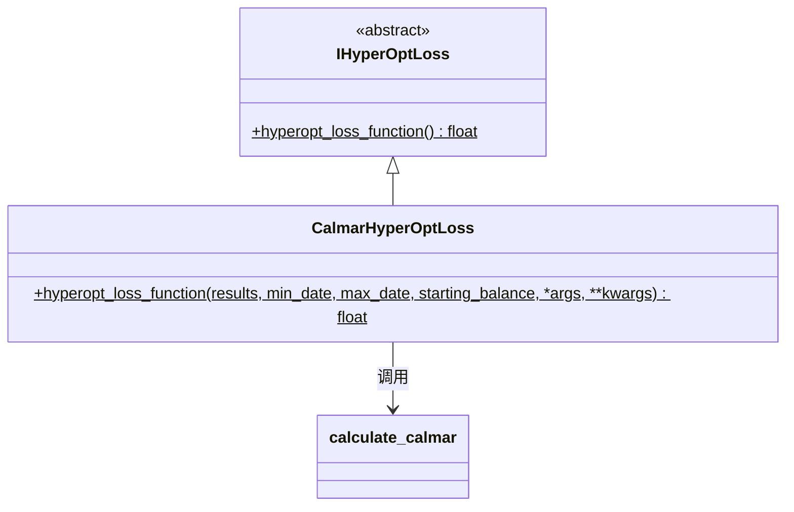

# hyperopt_loss_calmar.py

## 概述

基于 **Calmar Ratio**（卡尔玛比率）的损失函数实现。Calmar Ratio 是年化收益率与最大回撤的比值，是衡量风险调整后收益的指标。

**公式**: `Calmar Ratio = 年化收益率 / 最大回撤`

该损失函数返回 Calmar Ratio 的负值（因为优化器最小化目标值，取负值则等效于最大化 Calmar Ratio）。

**优化目标**: 在控制最大回撤的前提下，最大化年化收益率。

## 架构图

## 核心类/函数

### CalmarHyperOptLoss

#### `hyperopt_loss_function(results, min_date, max_date, starting_balance, *args, **kwargs) -> float`
- **参数**:
  - `results: DataFrame` — 回测交易结果
  - `min_date: datetime` — 回测起始日期
  - `max_date: datetime` — 回测结束日期
  - `starting_balance: float` — 起始资金
- **返回**: `-calmar_ratio`（Calmar Ratio 的负值）
- **实现**: 直接调用 `calculate_calmar()` 计算 Calmar Ratio 后取负

## 依赖关系

### 内部依赖（本项目模块）
- `freqtrade.data.metrics` — `calculate_calmar` Calmar Ratio 计算函数
- `freqtrade.optimize.hyperopt` — `IHyperOptLoss` 接口基类

### 外部依赖（第三方库）
- `pandas` — `DataFrame`
- `datetime` — `datetime`

### 被依赖（谁引用了本文件）
- `freqtrade.resolvers.hyperopt_resolver` — 通过名称动态加载
- 用户配置 `--hyperopt-loss CalmarHyperOptLoss` 时使用
