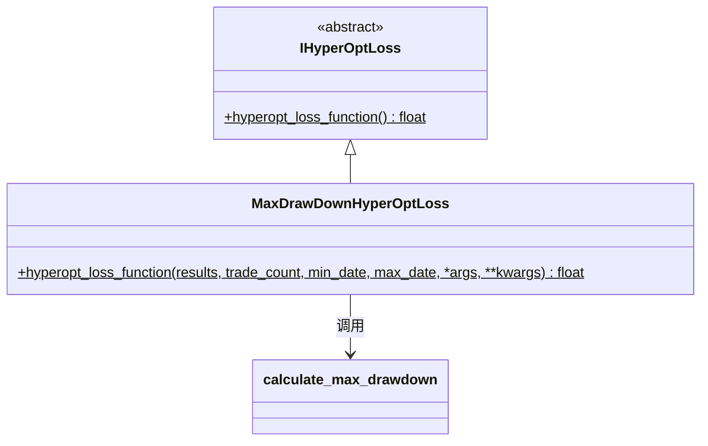

# hyperopt_loss_max_drawdown.py

## 概述

基于 **最大回撤**（Max Drawdown）的损失函数实现。该函数优化总利润与最大回撤的比值，目标是在控制回撤的同时最大化利润。

**公式**: `loss = -(total_profit / max_drawdown_abs)`

当没有亏损交易（即无回撤）时，直接优化总利润。

## 架构图

## 核心类/函数

### MaxDrawDownHyperOptLoss

#### `hyperopt_loss_function(results, trade_count, min_date, max_date, *args, **kwargs) -> float`
- **参数**:
  - `results: DataFrame` — 回测交易结果
  - `trade_count: int` — 交易次数
  - `min_date/max_date: datetime` — 时间范围
- **返回**: `-(total_profit / max_drawdown_abs)`
- **关键逻辑**:
  1. 计算总利润（`profit_abs` 列之和）
  2. 调用 `calculate_max_drawdown` 计算最大绝对回撤
  3. 如果 `ValueError`（没有亏损交易），返回 `-total_profit`
  4. 否则返回利润与回撤的比值的负值

## 依赖关系

### 内部依赖（本项目模块）
- `freqtrade.data.metrics` — `calculate_max_drawdown` 最大回撤计算
- `freqtrade.optimize.hyperopt` — `IHyperOptLoss` 接口基类

### 外部依赖（第三方库）
- `pandas` — `DataFrame`

### 被依赖（谁引用了本文件）
- `freqtrade.resolvers.hyperopt_resolver` — 通过名称动态加载
- 用户配置 `--hyperopt-loss MaxDrawDownHyperOptLoss` 时使用
