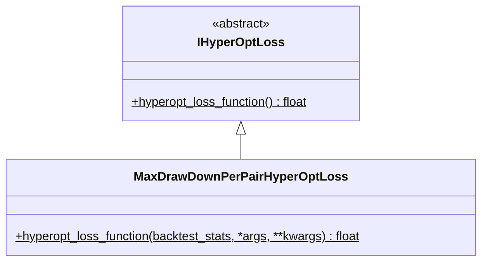

# hyperopt_loss_max_drawdown_per_pair.py

## 概述

基于 **逐交易对最大回撤** 的损失函数实现。该函数的设计思想是：防止少数表现优异的交易对掩盖其他表现不佳的交易对，强制 hyperopt 优化所有交易对的表现。

**核心逻辑**：
1. 为每个交易对计算 `profit / drawdown` 比率
2. 取所有交易对中**最差**的比率作为目标值
3. 如果某个交易对的比率低于可接受阈值，施加额外惩罚

这种"短板效应"策略确保参数优化不会偏向某几个交易对。

## 架构图

## 核心类/函数

### MaxDrawDownPerPairHyperOptLoss

#### `hyperopt_loss_function(backtest_stats, *args, **kwargs) -> float`
- **参数**:
  - `backtest_stats: dict[str, Any]` — 回测统计数据（包含 `results_per_pair` 列表）
- **返回**: `-min(score_per_pair)`（最差交易对分数的负值）
- **可配置常量**:
  - `min_acceptable_profit_dd = 1.0` — 最低可接受的 profit/drawdown 比率
  - `penalty = 20` — 未达标时的惩罚值
- **关键逻辑**:
  1. 遍历 `backtest_stats["results_per_pair"]`（跳过 `TOTAL` 汇总行）
  2. 对每个交易对计算 `profit_dd = profit / drawdown`
  3. 如果 `profit_dd < min_acceptable_profit_dd`，分数 = `profit_dd - penalty`（施加惩罚）
  4. 否则分数 = `profit_dd`
  5. 返回所有交易对中最低分数的负值

## 依赖关系

### 内部依赖（本项目模块）
- `freqtrade.optimize.hyperopt` — `IHyperOptLoss` 接口基类

### 外部依赖（第三方库）
无（不需要额外计算库）

### 被依赖（谁引用了本文件）
- `freqtrade.resolvers.hyperopt_resolver` — 通过名称动态加载
- 用户配置 `--hyperopt-loss MaxDrawDownPerPairHyperOptLoss` 时使用
