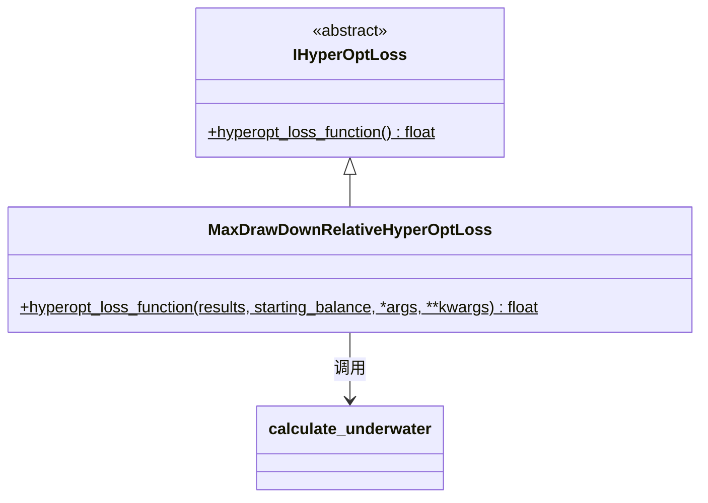

# hyperopt_loss_max_drawdown_relative.py

## 概述

基于 **相对最大回撤** 的损失函数实现。与 `MaxDrawDownHyperOptLoss` 不同，该函数同时考虑了绝对最大回撤和相对回撤（占账户比例），提供更全面的风险衡量。

**公式**: `loss = -(total_profit / max_drawdown / relative_drawdown)`

通过同时除以绝对回撤和相对回撤，对高回撤策略施加双重惩罚。

## 架构图

## 核心类/函数

### MaxDrawDownRelativeHyperOptLoss

#### `hyperopt_loss_function(results, starting_balance, *args, **kwargs) -> float`
- **参数**:
  - `results: DataFrame` — 回测交易结果
  - `starting_balance: float` — 起始资金
- **返回**: `-(total_profit / max_drawdown / relative_drawdown)`
- **关键逻辑**:
  1. 计算总利润
  2. 调用 `calculate_underwater()` 获取水下曲线（drawdown DataFrame）
  3. `max_drawdown` = 绝对最大回撤（`drawdown` 列最小值的绝对值）
  4. `relative_drawdown` = 相对最大回撤（`drawdown_relative` 列最大值）
  5. 如果 `max_drawdown == 0`（无回撤），返回 `-total_profit`
  6. 任何异常情况也返回 `-total_profit`

## 依赖关系

### 内部依赖（本项目模块）
- `freqtrade.data.metrics` — `calculate_underwater` 水下曲线计算
- `freqtrade.optimize.hyperopt` — `IHyperOptLoss` 接口基类

### 外部依赖（第三方库）
- `pandas` — `DataFrame`

### 被依赖（谁引用了本文件）
- `freqtrade.resolvers.hyperopt_resolver` — 通过名称动态加载
- 用户配置 `--hyperopt-loss MaxDrawDownRelativeHyperOptLoss` 时使用
