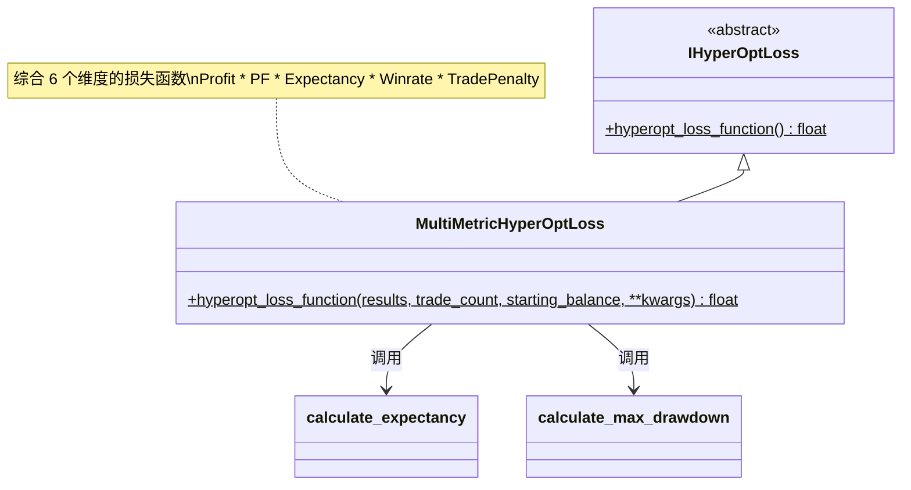

# hyperopt_loss_multi_metric.py

## 概述

基于 **多指标综合** 的损失函数实现。这是最复杂的损失函数之一，综合考虑了六个维度：

1. **Profit**（利润）— 总利润
2. **Drawdown**（回撤）— 相对账户回撤
3. **Profit Factor**（盈利因子）— 盈利交易利润 / 亏损交易利润
4. **Expectancy Ratio**（期望比率）— 期望收益比
5. **Winrate**（胜率）— 盈利交易占比
6. **Trade Count**（交易次数）— 低于目标数量时施加惩罚

各指标通过对数变换和乘法组合成最终损失值，确保每个指标都对结果产生影响。

## 架构图

## 核心类/函数

### 模块级常量

| 常量 | 默认值 | 说明 |
|---|---|---|
| `DRAWDOWN_MULT` | 0.055 | 回撤惩罚系数，越小对回撤惩罚越严格 |
| `LARGE_NUMBER` | 1e6 | 替代无穷大的大数 |
| `TARGET_TRADE_AMOUNT` | 50 | 目标交易次数，低于此值会受到惩罚 |
| `EXPECTANCY_CONST` | 2.0 | 期望比率调整系数，越大期望比率影响越小 |
| `PF_CONST` | 1.0 | 盈利因子调整系数，越大盈利因子影响越小 |
| `WINRATE_CONST` | 1.2 | 胜率调整系数，越大胜率影响越小 |

### MultiMetricHyperOptLoss

#### `hyperopt_loss_function(results, trade_count, starting_balance, **kwargs) -> float`
- **参数**:
  - `results: DataFrame` — 回测交易结果
  - `trade_count: int` — 交易次数
  - `starting_balance: float` — 起始资金
- **返回**: 综合损失值（负值表示更好的结果）
- **计算步骤**:
  1. **利润因子**: `profit_factor = winning_profit / (|losing_profit| + 1e-6)`，取对数 `log(PF + PF_CONST)`
  2. **期望比率**: 调用 `calculate_expectancy()`，取对数 `log(min(10, ER) + EXPECTANCY_CONST)`
  3. **胜率系数**: `log(WINRATE_CONST + winrate)`
  4. **回撤**: 调用 `calculate_max_drawdown()` 获取 `relative_account_drawdown`
  5. **交易次数惩罚**: 低于 `TARGET_TRADE_AMOUNT` 时按比例降低（最低 0.1）
  6. **利润-回撤函数**: `profit_draw = total_profit - (relative_drawdown * total_profit) * (1 - DRAWDOWN_MULT)`
  7. **最终损失**: `-1 * (profit_draw * log_PF * log_ER * log_winrate * trade_penalty)`

## 依赖关系

### 内部依赖（本项目模块）
- `freqtrade.data.metrics` — `calculate_expectancy`, `calculate_max_drawdown`
- `freqtrade.optimize.hyperopt` — `IHyperOptLoss` 接口基类

### 外部依赖（第三方库）
- `numpy` — `np.log` 对数运算
- `pandas` — `DataFrame`

### 被依赖（谁引用了本文件）
- `freqtrade.resolvers.hyperopt_resolver` — 通过名称动态加载
- 用户配置 `--hyperopt-loss MultiMetricHyperOptLoss` 时使用
