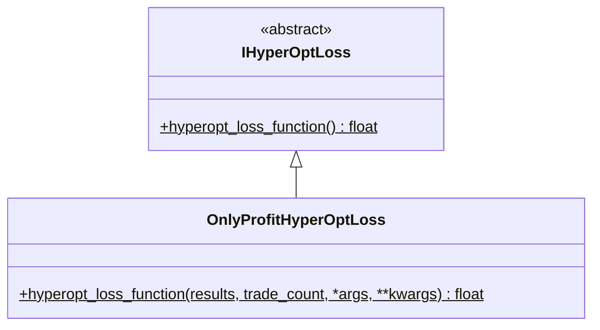

# hyperopt_loss_onlyprofit.py

## 概述

最简单的损失函数实现，**仅考虑绝对利润**。不考虑回撤、交易次数、持仓时间等任何其他指标。

**公式**: `loss = -total_profit`

适用场景：当用户只关心最终利润最大化，不关心风险控制和交易行为质量时使用。

## 架构图

## 核心类/函数

### OnlyProfitHyperOptLoss

#### `hyperopt_loss_function(results, trade_count, *args, **kwargs) -> float`
- **参数**:
  - `results: DataFrame` — 回测交易结果
  - `trade_count: int` — 交易次数（未使用）
- **返回**: `-total_profit`（总绝对利润的负值）
- **实现**: 简单地对 `results["profit_abs"]` 列求和后取负

## 依赖关系

### 内部依赖（本项目模块）
- `freqtrade.optimize.hyperopt` — `IHyperOptLoss` 接口基类

### 外部依赖（第三方库）
- `pandas` — `DataFrame`

### 被依赖（谁引用了本文件）
- `freqtrade.resolvers.hyperopt_resolver` — 通过名称动态加载
- 用户配置 `--hyperopt-loss OnlyProfitHyperOptLoss` 时使用
