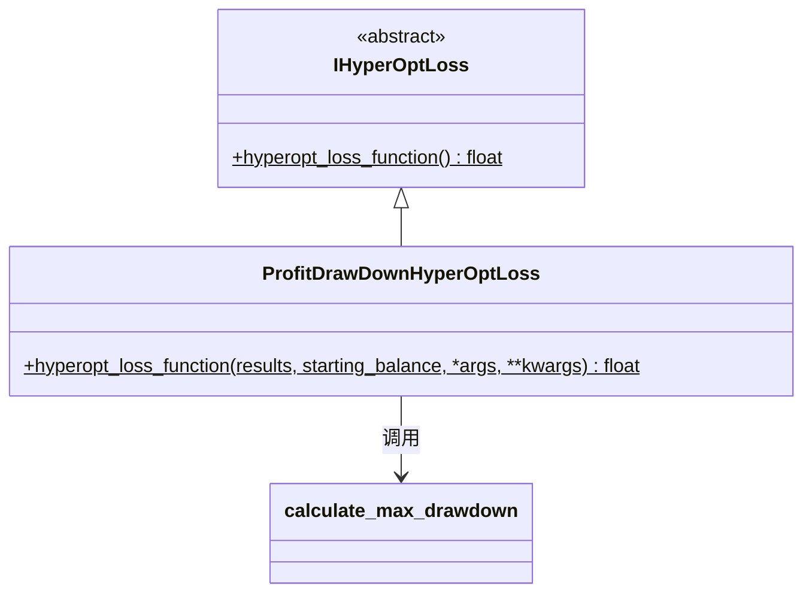

# hyperopt_loss_profit_drawdown.py

## 概述

基于 **利润与回撤加权** 的损失函数实现。该函数通过可配置的 `DRAWDOWN_MULT` 系数来平衡利润追求和回撤控制。

**公式**: `loss = -(total_profit - (relative_drawdown * total_profit) * (1 - DRAWDOWN_MULT))`

当 `DRAWDOWN_MULT` 较小时，回撤的惩罚更严格；当 `DRAWDOWN_MULT` 接近 1 时，回撤几乎不被惩罚。

默认 `DRAWDOWN_MULT = 0.075`，表示对回撤施加较强惩罚。

## 架构图

## 核心类/函数

### 模块级常量

| 常量 | 默认值 | 说明 |
|---|---|---|
| `DRAWDOWN_MULT` | 0.075 | 回撤惩罚系数，越小对回撤惩罚越严格 |

### ProfitDrawDownHyperOptLoss

#### `hyperopt_loss_function(results, starting_balance, *args, **kwargs) -> float`
- **参数**:
  - `results: DataFrame` — 回测交易结果
  - `starting_balance: float` — 起始资金
- **返回**: 利润减去回撤惩罚的负值
- **关键逻辑**:
  1. 计算总利润（`profit_abs` 列之和）
  2. 调用 `calculate_max_drawdown()` 获取 `relative_account_drawdown`
  3. 如果 `ValueError`（无回撤），`relative_account_drawdown = 0`
  4. 计算 `-(total_profit - relative_drawdown * total_profit * (1 - DRAWDOWN_MULT))`

## 依赖关系

### 内部依赖（本项目模块）
- `freqtrade.data.metrics` — `calculate_max_drawdown` 最大回撤计算
- `freqtrade.optimize.hyperopt` — `IHyperOptLoss` 接口基类

### 外部依赖（第三方库）
- `pandas` — `DataFrame`

### 被依赖（谁引用了本文件）
- `freqtrade.resolvers.hyperopt_resolver` — 通过名称动态加载
- 用户配置 `--hyperopt-loss ProfitDrawDownHyperOptLoss` 时使用
