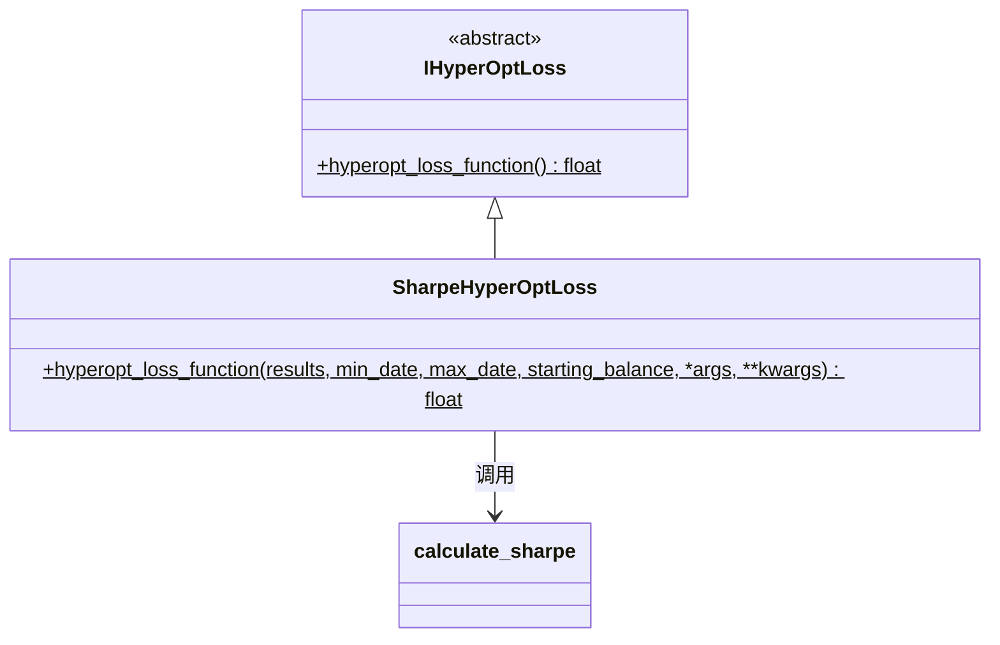

# hyperopt_loss_sharpe.py

## 概述

基于 **Sharpe Ratio**（夏普比率）的损失函数实现。Sharpe Ratio 是金融领域最经典的风险调整后收益指标，衡量单位风险（标准差）所获得的超额收益。

**公式**: `Sharpe Ratio = (平均收益率 - 无风险利率) / 收益率标准差`

该损失函数使用 `calculate_sharpe` 工具函数进行计算，返回 Sharpe Ratio 的负值。

## 架构图

## 核心类/函数

### SharpeHyperOptLoss

#### `hyperopt_loss_function(results, min_date, max_date, starting_balance, *args, **kwargs) -> float`
- **参数**:
  - `results: DataFrame` — 回测交易结果
  - `min_date: datetime` — 回测起始日期
  - `max_date: datetime` — 回测结束日期
  - `starting_balance: float` — 起始资金
- **返回**: `-sharpe_ratio`（Sharpe Ratio 的负值）
- **实现**: 直接调用 `calculate_sharpe()` 计算后取负

## 依赖关系

### 内部依赖（本项目模块）
- `freqtrade.data.metrics` — `calculate_sharpe` Sharpe Ratio 计算函数
- `freqtrade.optimize.hyperopt` — `IHyperOptLoss` 接口基类

### 外部依赖（第三方库）
- `pandas` — `DataFrame`
- `datetime` — `datetime`

### 被依赖（谁引用了本文件）
- `freqtrade.resolvers.hyperopt_resolver` — 通过名称动态加载
- 用户配置 `--hyperopt-loss SharpeHyperOptLoss` 时使用
