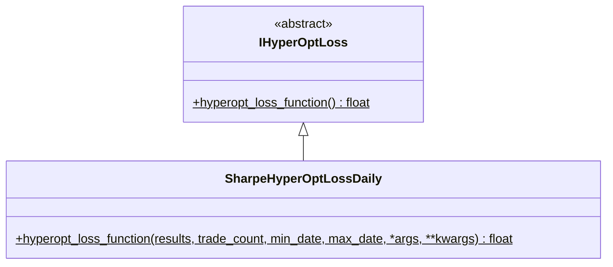

# hyperopt_loss_sharpe_daily.py

## 概述

基于 **每日 Sharpe Ratio** 的损失函数实现。与 `SharpeHyperOptLoss` 不同，该版本先将交易结果按日聚合，然后基于每日收益率序列计算 Sharpe Ratio。这种方式更符合传统金融中的风险评估方法。

**关键特点**:
- 按日（1D）重采样交易结果
- 考虑了每笔交易的滑点（slippage）
- 使用年化因子（sqrt(365)）将日度 Sharpe 转换为年化 Sharpe
- 包含日无风险利率的扣除

## 架构图

## 核心类/函数

### SharpeHyperOptLossDaily

#### `hyperopt_loss_function(results, trade_count, min_date, max_date, *args, **kwargs) -> float`
- **参数**:
  - `results: DataFrame` — 回测交易结果
  - `trade_count: int` — 交易次数（未使用）
  - `min_date/max_date: datetime` — 时间范围
- **返回**: `-sharpe_ratio`（年化日 Sharpe Ratio 的负值）
- **内部常量**:
  - `resample_freq = "1D"` — 每日重采样
  - `slippage_per_trade_ratio = 0.0005` — 每笔交易滑点（0.05%）
  - `days_in_year = 365` — 年天数
  - `annual_risk_free_rate = 0.0` — 年化无风险利率
- **计算步骤**:
  1. 将 `profit_ratio` 减去滑点得到 `profit_ratio_after_slippage`
  2. 创建完整的日期索引（`min_date` 到 `max_date`）
  3. 按 `close_date` 列进行每日重采样并求和
  4. 对缺失日期填充 0（表示当天无交易）
  5. 减去日无风险利率
  6. 计算均值和标准差
  7. `sharpe_ratio = mean / std * sqrt(365)`
  8. 如果标准差为 0（所有日收益相同），返回 `-(-20.0) = 20.0`（不理想的高损失值）

## 依赖关系

### 内部依赖（本项目模块）
- `freqtrade.optimize.hyperopt` — `IHyperOptLoss` 接口基类

### 外部依赖（第三方库）
- `pandas` — `DataFrame`, `date_range` 日期索引生成
- `math` — `sqrt` 平方根
- `datetime` — `datetime`

### 被依赖（谁引用了本文件）
- `freqtrade.resolvers.hyperopt_resolver` — 通过名称动态加载
- 用户配置 `--hyperopt-loss SharpeHyperOptLossDaily` 时使用
