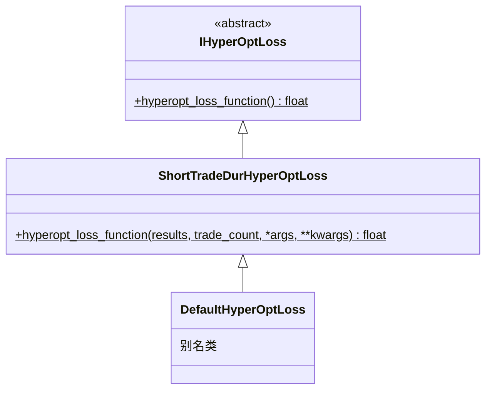

# hyperopt_loss_short_trade_dur.py

## 概述

Freqtrade 的 **默认损失函数**，优化目标是：短持仓时间 + 高利润 + 合理交易频率。该函数综合考虑三个维度，通过加权求和计算最终损失值。

同时定义了 `DefaultHyperOptLoss` 作为别名，保持向后兼容。

**公式**: `loss = trade_loss + profit_loss + duration_loss`

## 架构图

## 核心类/函数

### 模块级常量

| 常量 | 默认值 | 说明 |
|---|---|---|
| `TARGET_TRADES` | 600 | 目标交易次数，偏离该值会增加损失 |
| `EXPECTED_MAX_PROFIT` | 3.0 | 预期最大利润比率（3.0 = 300%） |
| `MAX_ACCEPTED_TRADE_DURATION` | 300 | 最大可接受的平均交易持续时间（分钟） |

### ShortTradeDurHyperOptLoss

#### `hyperopt_loss_function(results, trade_count, *args, **kwargs) -> float`
- **参数**:
  - `results: DataFrame` — 回测交易结果
  - `trade_count: int` — 交易次数
- **返回**: 三部分损失之和
- **权重分配**:
  - **交易次数损失** (权重 ~0.25): `trade_loss = 1 - 0.25 * exp(-((trade_count - TARGET_TRADES)^2) / 10^5.8)`
    - 使用高斯函数，交易次数越接近 `TARGET_TRADES` 损失越小
  - **利润损失** (权重 1.0): `profit_loss = max(0, 1 - total_profit / EXPECTED_MAX_PROFIT)`
    - 当利润达到预期最大值时损失为 0
  - **持续时间损失** (权重 0.4): `duration_loss = 0.4 * min(trade_duration / MAX_ACCEPTED_TRADE_DURATION, 1)`
    - 平均持续时间越短损失越小，超过上限后不再增加

### DefaultHyperOptLoss

`ShortTradeDurHyperOptLoss` 的别名类，保持向后兼容性。

## 依赖关系

### 内部依赖（本项目模块）
- `freqtrade.optimize.hyperopt` — `IHyperOptLoss` 接口基类

### 外部依赖（第三方库）
- `math` — `exp` 指数函数
- `pandas` — `DataFrame`

### 被依赖（谁引用了本文件）
- `freqtrade.resolvers.hyperopt_resolver` — 通过名称动态加载
- 用户配置 `--hyperopt-loss ShortTradeDurHyperOptLoss` 或 `--hyperopt-loss DefaultHyperOptLoss` 时使用
- 作为 Freqtrade 的默认损失函数被广泛使用
