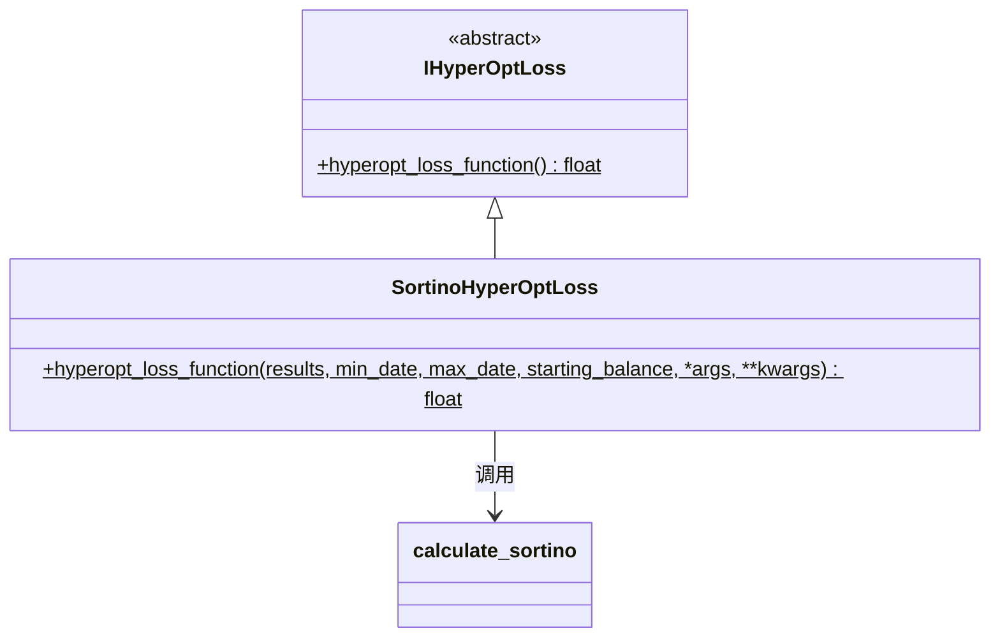

# hyperopt_loss_sortino.py

## 概述

基于 **Sortino Ratio**（索提诺比率）的损失函数实现。Sortino Ratio 是 Sharpe Ratio 的改进版本，只使用下行波动率（downside deviation）代替总波动率，因此不会惩罚正向收益的波动。

**公式**: `Sortino Ratio = (平均收益率 - 无风险利率) / 下行标准差`

Sortino Ratio 比 Sharpe Ratio 更适合评估偏态分布的策略收益，因为上行波动（赚更多钱）不应被视为风险。

## 架构图

## 核心类/函数

### SortinoHyperOptLoss

#### `hyperopt_loss_function(results, min_date, max_date, starting_balance, *args, **kwargs) -> float`
- **参数**:
  - `results: DataFrame` — 回测交易结果
  - `min_date: datetime` — 回测起始日期
  - `max_date: datetime` — 回测结束日期
  - `starting_balance: float` — 起始资金
- **返回**: `-sortino_ratio`（Sortino Ratio 的负值）
- **实现**: 直接调用 `calculate_sortino()` 计算后取负

## 依赖关系

### 内部依赖（本项目模块）
- `freqtrade.data.metrics` — `calculate_sortino` Sortino Ratio 计算函数
- `freqtrade.optimize.hyperopt` — `IHyperOptLoss` 接口基类

### 外部依赖（第三方库）
- `pandas` — `DataFrame`
- `datetime` — `datetime`

### 被依赖（谁引用了本文件）
- `freqtrade.resolvers.hyperopt_resolver` — 通过名称动态加载
- 用户配置 `--hyperopt-loss SortinoHyperOptLoss` 时使用
