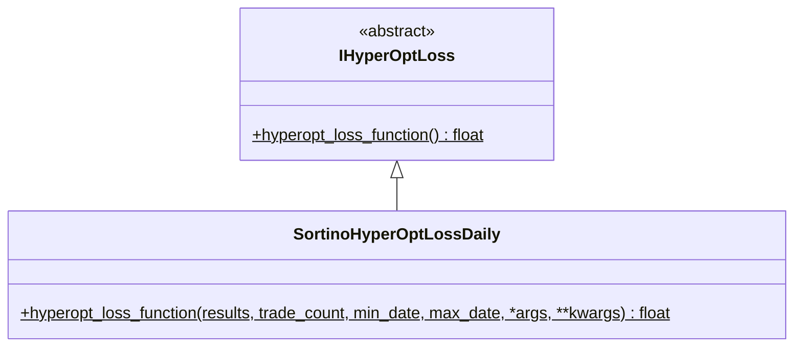

# hyperopt_loss_sortino_daily.py

## 概述

基于 **每日 Sortino Ratio** 的损失函数实现。与 `SortinoHyperOptLoss` 不同，该版本先将交易结果按日聚合，然后基于每日收益率序列计算 Sortino Ratio。实现参考了 Red Rock Capital 的论文。

**关键特点**:
- 按日（1D）重采样交易结果
- 考虑每笔交易的滑点
- 只使用下行偏差（负收益的标准差），不惩罚正向波动
- 使用年化因子（sqrt(365)）转换为年化 Sortino

**参考文献**: [Sortino: A 'Sharper' Ratio (Red Rock Capital)](http://www.redrockcapital.com/Sortino__A__Sharper__Ratio_Red_Rock_Capital.pdf)

## 架构图

## 核心类/函数

### SortinoHyperOptLossDaily

#### `hyperopt_loss_function(results, trade_count, min_date, max_date, *args, **kwargs) -> float`
- **参数**:
  - `results: DataFrame` — 回测交易结果
  - `trade_count: int` — 交易次数（未使用）
  - `min_date/max_date: datetime` — 时间范围
- **返回**: `-sortino_ratio`（年化日 Sortino Ratio 的负值）
- **内部常量**:
  - `resample_freq = "1D"` — 每日重采样
  - `slippage_per_trade_ratio = 0.0005` — 每笔交易滑点（0.05%）
  - `days_in_year = 365` — 年天数
  - `minimum_acceptable_return = 0.0` — 最低可接受收益率（MAR）
- **计算步骤**:
  1. 将 `profit_ratio` 减去滑点
  2. 创建完整日期索引，重采样并求和
  3. 减去 MAR（最低可接受收益率）
  4. 计算均值 `expected_returns_mean`
  5. 提取下行收益（低于 MAR 的部分）：`downside_returns = min(0, P - MAR)`
  6. 计算下行标准差：`down_stdev = sqrt(sum(downside^2) / N)`
  7. `sortino_ratio = mean / down_stdev * sqrt(365)`
  8. 如果下行标准差为 0（无亏损日），返回 `-(-20.0) = 20.0`（不理想的结果）

**与 Sharpe Daily 的区别**: Sharpe 使用所有收益的标准差，而 Sortino 仅使用下行收益的标准差（`downside_returns`），因此正向大幅波动不会被视为风险。

## 依赖关系

### 内部依赖（本项目模块）
- `freqtrade.optimize.hyperopt` — `IHyperOptLoss` 接口基类

### 外部依赖（第三方库）
- `pandas` — `DataFrame`, `date_range`
- `math` — `sqrt` 平方根
- `datetime` — `datetime`

### 被依赖（谁引用了本文件）
- `freqtrade.resolvers.hyperopt_resolver` — 通过名称动态加载
- 用户配置 `--hyperopt-loss SortinoHyperOptLossDaily` 时使用
