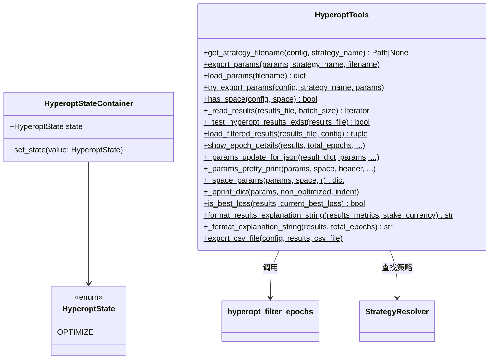

# hyperopt_tools.py

## 概述

`hyperopt_tools.py` 是 Hyperopt（超参数优化）的工具模块，提供 Hyperopt 结果的加载、过滤、导出、格式化显示等核心功能。包含两个类和一个辅助函数：

1. `HyperoptStateContainer` — 单例类，跟踪 Hyperopt 的运行状态
2. `HyperoptTools` — 静态工具类，封装所有 Hyperopt 结果处理方法
3. `hyperopt_serializer` — numpy 类型序列化辅助函数

## 架构图

## 核心类/函数

### hyperopt_serializer(x)

numpy 类型序列化函数。将 `np.integer` 转为 `int`，`np.bool_` 转为 `bool`，其他转为 `str`。用于 `rapidjson.dump` 的 `default` 参数。

### HyperoptStateContainer

Hyperopt 状态追踪单例类。

- **属性**：`state: HyperoptState` — 默认 `HyperoptState.OPTIMIZE`
- **方法**：`set_state(cls, value)` — 类方法，设置状态值

### HyperoptTools

静态工具类，封装 Hyperopt 的所有工具方法。

**关键方法**：

- **`get_strategy_filename(config, strategy_name) -> Path | None`**
  通过 `StrategyResolver` 搜索策略对象，返回策略文件路径

- **`export_params(params, strategy_name, filename)`**
  将优化后的参数（包括优化和非优化参数）导出到 JSON 文件。添加策略名、参数版本号和导出时间戳

- **`load_params(filename) -> dict`**
  从 JSON 文件加载参数

- **`try_export_params(config, strategy_name, params)`**
  尝试导出参数，仅在文件版本 >= 2 且未禁用参数导出时执行

- **`has_space(config, space) -> bool`**
  判断指定优化空间是否在配置的 `spaces` 中。`trailing`/`protection`/`trades` 空间不包含在 `default` 集合中

- **`_read_results(results_file, batch_size=10) -> Iterator`**
  流式读取 Hyperopt 结果文件（逐行 JSON），按批次 yield

- **`load_filtered_results(results_file, config) -> tuple[list, int]`**
  加载并过滤 Hyperopt 结果。构建 `filteroptions` 字典，调用 `hyperopt_filter_epochs` 进行两轮过滤（批次过滤 + 最终过滤）

- **`show_epoch_details(results, total_epochs, print_json, ...)`**
  显示 Hyperopt 结果详情，支持 JSON 格式和人类可读格式输出

- **`export_csv_file(config, results, csv_file)`**
  将结果导出为 CSV 文件，包含基础指标和参数列

- **`is_best_loss(results, current_best_loss) -> bool`**
  判断当前结果是否优于历史最佳

- **`format_results_explanation_string(results_metrics, stake_currency) -> str`**
  格式化结果说明字符串，包含交易次数、胜/平/负、利润等信息

## 依赖关系

### 内部依赖（本项目模块）
- `freqtrade.constants` — `FTHYPT_FILEVERSION`、`HYPEROPT_BUILTIN_SPACES`、`Config` 类型
- `freqtrade.enums.HyperoptState` — Hyperopt 状态枚举
- `freqtrade.exceptions.OperationalException` — 异常处理
- `freqtrade.misc` — `deep_merge_dicts`、`round_dict`、`safe_value_fallback2` 工具函数
- `freqtrade.optimize.hyperopt_epoch_filters` — `hyperopt_filter_epochs` 过滤函数
- `freqtrade.resolvers.strategy_resolver.StrategyResolver` — 延迟导入，用于查找策略文件

### 外部依赖（第三方库）
- `numpy` — numpy 类型判断（`np.integer`、`np.bool_`）
- `rapidjson` — 高性能 JSON 序列化/反序列化
- `pandas` — `isna`、`json_normalize` 用于 CSV 导出

### 被依赖（谁引用了本文件）
- `freqtrade.optimize.hyperopt.hyperopt` — 主 Hyperopt 类使用工具方法
- `freqtrade.optimize.hyperopt.hyperopt_optimizer` — Hyperopt 优化器使用
- `freqtrade.strategy.hyper` — 策略超参数加载
- `freqtrade.strategy.parameters` — 参数处理
- `freqtrade.commands.hyperopt_commands` — CLI 命令调用展示/导出功能
