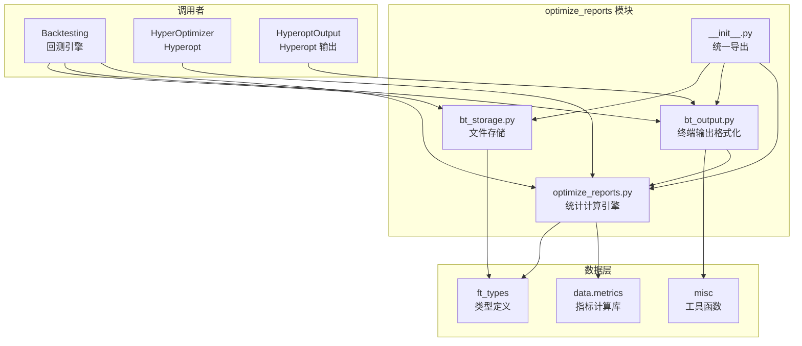
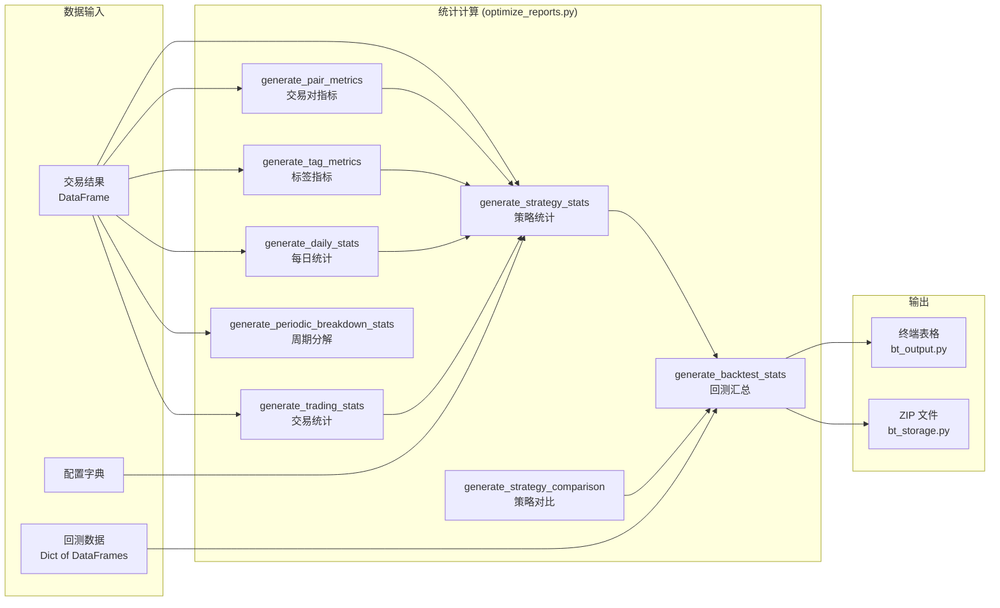
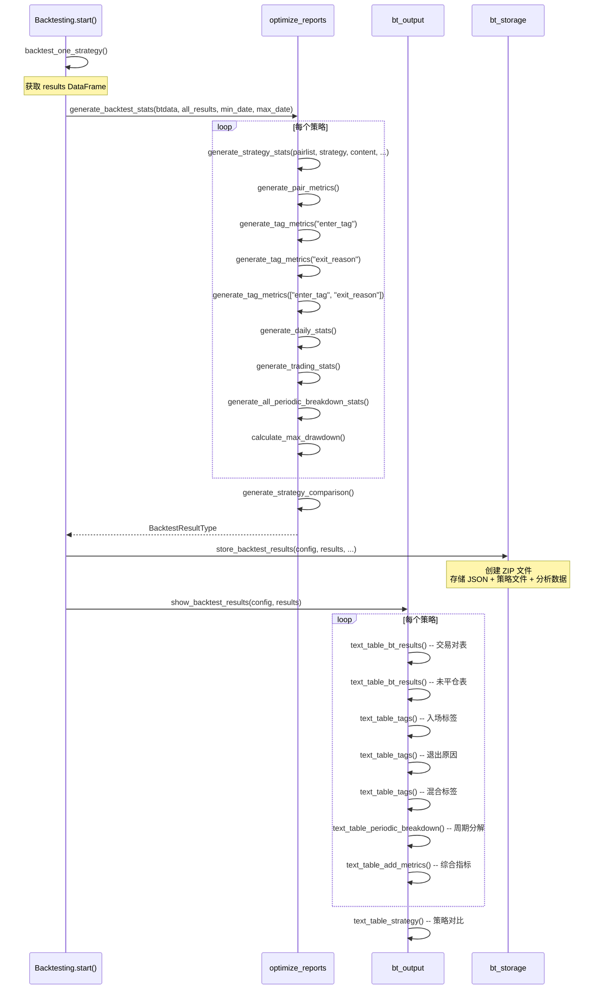
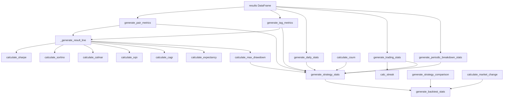

# Freqtrade 优化报告生成模块 (`freqtrade/optimize/optimize_reports/`)

## 1. 模块概述

`freqtrade/optimize/optimize_reports/` 模块负责生成、格式化和存储回测（Backtesting）及超参数优化（Hyperopt）的结果报告。它是优化流程的最后一个环节——将回测引擎产出的原始交易数据转化为可读的统计信息、表格和文件。

该模块提供三个核心能力：
1. **统计计算** (`optimize_reports.py`)：从交易结果 DataFrame 计算各种性能指标（利润、回撤、Sharpe、Sortino、Calmar、胜率、连胜/连败等）
2. **终端输出** (`bt_output.py`)：将统计结果格式化为 Rich 表格并输出到终端
3. **文件存储** (`bt_storage.py`)：将回测结果、配置、策略文件、分析数据打包存储为 ZIP 文件

## 2. 目录结构

```
freqtrade/optimize/optimize_reports/
├── __init__.py              # 模块初始化，统一导出所有公共函数
├── optimize_reports.py      # 核心统计计算：生成策略统计、交易对指标、标签指标、周期分解等
├── bt_output.py             # 终端输出：Rich 表格格式化和打印
└── bt_storage.py            # 文件存储：ZIP 打包、元数据存储
```

## 3. 架构图





## 4. 核心类/函数说明

### 4.1 统计计算引擎 (`optimize_reports.py`)

#### 4.1.1 `generate_backtest_stats()`

**最顶层的统计生成函数**，将所有策略的回测结果汇总。

```python
def generate_backtest_stats(
    btdata: dict[str, DataFrame],      # 回测原始数据 {pair: DataFrame}
    all_results: dict[str, BacktestContentType],  # 各策略回测结果
    min_date: datetime,
    max_date: datetime,
    notes: str | None = None,
) -> BacktestResultType
```

**返回结构：**
```python
{
    "metadata": {strategy_name: {run_id, timeframe, ...}},
    "strategy": {strategy_name: strat_stats_dict},
    "strategy_comparison": [comparison_dicts]
}
```

#### 4.1.2 `generate_strategy_stats()`

**生成单个策略的完整统计信息**，这是最核心的统计函数。

```python
def generate_strategy_stats(
    pairlist: list[str],
    strategy: str,
    content: BacktestContentType,
    min_date: datetime,
    max_date: datetime,
    market_change: float,
    is_hyperopt: bool = False,
) -> dict[str, Any]
```

**返回的统计字典包含以下类别：**

| 类别 | 关键字段 | 说明 |
|------|---------|------|
| **交易列表** | `trades` | 所有交易的详细信息 |
| **交易对指标** | `results_per_pair` | 每个交易对的指标 + TOTAL |
| **标签统计** | `results_per_enter_tag`, `exit_reason_summary`, `mix_tag_stats` | 按入场标签/退出原因/混合标签的统计 |
| **未平仓** | `left_open_trades` | 回测结束时未平仓的交易统计 |
| **基本指标** | `total_trades`, `profit_total`, `profit_mean`, `profit_median` | 基础盈利指标 |
| **多空分析** | `trade_count_long`, `trade_count_short`, `profit_total_long`, `profit_total_short` | 多空分别统计 |
| **风险指标** | `cagr`, `sharpe`, `sortino`, `calmar`, `sqn`, `profit_factor`, `expectancy`, `expectancy_ratio` | 风险调整收益指标 |
| **回撤指标** | `max_drawdown_account`, `max_relative_drawdown`, `max_drawdown_abs`, 回撤时间区间 | 回撤相关指标 |
| **每日统计** | `backtest_best_day`, `backtest_worst_day`, `winning_days`, `losing_days` | 日级统计 |
| **交易统计** | `wins`, `losses`, `draws`, `winrate`, `holding_avg`, 连胜/连败 | 交易效率统计 |
| **周期分解** | `periodic_breakdown` (day/week/month/year/weekday) | 按不同周期的统计分解 |
| **配置参数** | `stoploss`, `trailing_stop`, `minimal_roi`, `use_exit_signal` 等 | 记录回测使用的配置 |
| **元数据** | `backtest_start`, `backtest_end`, `backtest_days`, `market_change` | 回测时间范围和市场环境 |

#### 4.1.3 `generate_pair_metrics()`

为每个交易对生成指标，加上一个 TOTAL 汇总行。

```python
def generate_pair_metrics(
    pairlist, stake_currency, starting_balance, results, min_date, max_date, skip_nan
) -> list[dict]
```

每行包含：`key`, `trades`, `profit_mean`, `profit_total_abs`, `profit_total`, `duration_avg`, `wins`, `draws`, `losses`, `winrate`, `cagr`, `expectancy`, `sortino`, `sharpe`, `calmar`, `sqn`, `profit_factor`, `max_drawdown_account`, `max_drawdown_abs`

#### 4.1.4 `generate_tag_metrics()`

按标签（`enter_tag`、`exit_reason` 或二者的组合）分组生成统计指标。

```python
def generate_tag_metrics(
    tag_type: Literal["enter_tag", "exit_reason"] | list,
    starting_balance, results, min_date, max_date, skip_nan
) -> list[dict]
```

#### 4.1.5 `generate_periodic_breakdown_stats()`

按时间周期（日/周/月/年/星期几）对交易结果进行分解统计。

支持的周期：
| 周期 | resample 频率 | 说明 |
|------|--------------|------|
| `day` | `1d` | 按日 |
| `week` | `1W-MON` | 按周（从周一开始） |
| `month` | `1ME` | 按月 |
| `year` | `1YE` | 按年 |
| `weekday` | 特殊处理 | 按星期几（周一~周日） |

每个周期返回：`date`, `profit_abs`, `wins`, `draws`, `losses`, `trades`, `profit_factor`

#### 4.1.6 `generate_trading_stats()`

生成交易统计信息，包括：
- 胜/负/平交易数和胜率
- 平均/最小/最大持仓时间（分赢家和输家）
- 最大连胜和连败次数

**连胜/连败计算 (`calc_streak`)：**
使用 Pandas 的分组累计技巧：对盈亏交易标记为 "win"/"loss"，检测连续相同标记的最长序列。

#### 4.1.7 `generate_daily_stats()`

生成每日级别的统计：最好的一天、最差的一天、盈利天数、亏损天数、每日利润列表。

#### 4.1.8 `generate_strategy_comparison()`

生成多策略对比摘要，取每个策略的 TOTAL 行并添加回撤信息。

#### 4.1.9 辅助函数

| 函数 | 说明 |
|------|------|
| `_generate_result_line()` | 生成单行指标（被 pair_metrics 和 tag_metrics 复用） |
| `calculate_trade_volume()` | 从 orders 嵌套结构中计算总交易量 |
| `generate_trade_signal_candles()` | 提取交易信号对应的 K 线数据（用于信号导出） |
| `generate_rejected_signals()` | 提取被拒绝的信号对应的 K 线数据 |

### 4.2 终端输出 (`bt_output.py`)

#### 4.2.1 `show_backtest_results()`

**总入口**：遍历所有策略，调用 `show_backtest_result()` 显示每个策略的结果，最后显示策略对比表。

#### 4.2.2 `show_backtest_result()`

显示单个策略的完整结果，依次输出：
1. 交易对结果表 (`text_table_bt_results`)
2. 未平仓交易表 (`text_table_bt_results`)
3. 入场标签统计 (`text_table_tags`)
4. 退出原因统计 (`text_table_tags`)
5. 混合标签统计 (`text_table_tags`)
6. 周期分解表 (`text_table_periodic_breakdown`)
7. 综合指标表 (`text_table_add_metrics`)

#### 4.2.3 输出函数详解

| 函数 | 输出内容 |
|------|---------|
| `text_table_bt_results()` | 交易对/未平仓交易的表格（Pair, Trades, Avg Profit%, Tot Profit, Win/Draw/Loss） |
| `text_table_tags()` | 标签统计表（Enter Tag / Exit Reason / Mixed Tag） |
| `text_table_periodic_breakdown()` | 周期分解表（Day/Week/Month, Trades, Profit, Profit Factor, Win/Draw/Loss） |
| `text_table_strategy()` | 多策略对比表（Strategy, Trades, Profit, Drawdown） |
| `text_table_add_metrics()` | 综合指标键值对表（包含 50+ 项指标） |
| `generate_wins_draws_losses()` | 格式化 Win/Draw/Loss/Win% 字符串 |
| `show_sorted_pairlist()` | 按利润排序的交易对列表 |

#### 4.2.4 `text_table_add_metrics()` 详细指标列表

该函数输出的 SUMMARY METRICS 表包含以下指标：

| 指标类别 | 包含的指标 |
|---------|-----------|
| 时间信息 | Backtesting from/to, Trading Mode, Max open trades |
| 交易统计 | Total/Daily Avg Trades, Starting/Final balance, Absolute profit, Total profit % |
| 风险指标 | CAGR, Sortino, Sharpe, Calmar, SQN, Profit factor, Expectancy |
| 每日统计 | Avg daily profit, Avg stake amount, Total trade volume |
| 多空分析 | Long/Short trades, Long/Short profit %/abs（仅有做空交易时显示） |
| 极值统计 | Best/Worst Pair, Best/Worst trade, Best/Worst day |
| 时间统计 | Days win/draw/lose, Min/Max/Avg Duration Winners/Losers, Max Consecutive Wins/Loss |
| 订单统计 | Rejected Entry signals, Entry/Exit Timeouts, Canceled/Replaced Entry Orders |
| 回撤信息 | Min/Max balance, Max % underwater, Absolute drawdown, Drawdown duration/start/end |
| 市场环境 | Market change |

### 4.3 文件存储 (`bt_storage.py`)

#### 4.3.1 `store_backtest_results()`

将回测结果打包存储为 ZIP 文件。

```python
def store_backtest_results(
    config: dict,
    stats: BacktestResultType,
    dtappendix: str,
    *,
    market_change_data: DataFrame | None = None,
    analysis_results: dict[str, dict[str, DataFrame]] | None = None,
    strategy_files: dict[str, str] | None = None,
) -> Path
```

**ZIP 文件内容：**

| 文件 | 格式 | 说明 |
|------|------|------|
| `backtest-result-{datetime}.json` | JSON | 策略统计和策略对比数据 |
| `backtest-result-{datetime}_config.json` | JSON | 脱敏后的配置文件 |
| `backtest-result-{datetime}_{strategy}.py` | Python | 策略源文件副本 |
| `backtest-result-{datetime}_{strategy}.json` | JSON | 策略参数文件副本 |
| `backtest-result-{datetime}_market_change.feather` | Feather (LZ4) | 市场变化数据 |
| `backtest-result-{datetime}_signals.pkl` | Pickle (joblib) | 信号分析数据 |
| `backtest-result-{datetime}_rejected.pkl` | Pickle (joblib) | 被拒信号数据 |
| `backtest-result-{datetime}_exited.pkl` | Pickle (joblib) | 退出信号数据 |

**ZIP 之外的文件：**
- `backtest-result-{datetime}.meta.json`：元数据（run_id, timeframe, 时间范围等）
- `.last_result.json`：指向最新结果文件的快捷方式

#### 4.3.2 辅助函数

| 函数 | 说明 |
|------|------|
| `_generate_filename()` | 根据目录/文件名 + 后缀生成完整路径 |
| `file_dump_joblib()` | 使用 joblib 序列化对象到文件对象 |

## 5. 依赖关系

### 5.1 内部依赖

| 被依赖模块 | 使用者 | 说明 |
|------------|--------|------|
| `freqtrade.data.metrics` | `optimize_reports.py` | 计算各种风险指标（Sharpe, Sortino, Calmar, SQN, CAGR, 回撤, 期望值等） |
| `freqtrade.ft_types` | `optimize_reports.py`, `bt_storage.py` | 类型定义（BacktestContentType, BacktestResultType） |
| `freqtrade.util` | `bt_output.py`, `optimize_reports.py` | 工具函数（fmt_coin, decimals_per_coin, print_rich_table, format_duration） |
| `freqtrade.configuration.sanitize_config` | `bt_storage.py` | 配置脱敏 |
| `freqtrade.misc` | `bt_storage.py` | 文件操作（dump_json_to_file, file_dump_json） |
| `freqtrade.optimize.backtest_caching` | `bt_storage.py` | 元数据文件名生成 |

### 5.2 外部库依赖

| 库 | 用途 |
|----|------|
| `pandas` | DataFrame 操作（分组、重采样、统计） |
| `numpy` | 数值计算 |
| `rich` | 终端表格输出（通过 `freqtrade.util.print_rich_table`） |
| `zipfile` | ZIP 文件打包 |
| `joblib` | Pickle 序列化 |

## 6. 数据流

### 6.1 回测报告生成流程



### 6.2 统计指标计算依赖关系



## 7. 关键设计点

### 7.1 ZIP 打包存储
从传统的单 JSON 文件改为 ZIP 打包，好处包括：
- 压缩存储，减少磁盘占用
- 可以同时存储多种格式的数据（JSON, Feather, Pickle, Python 源文件）
- 策略文件和参数文件的备份，便于复现

### 7.2 分层统计架构
统计计算采用分层设计：
- `_generate_result_line()` 是最基础的计算单元
- `generate_pair_metrics()` 和 `generate_tag_metrics()` 在其上构建分组统计
- `generate_strategy_stats()` 汇总所有维度
- `generate_backtest_stats()` 汇总所有策略

### 7.3 Hyperopt 兼容
`generate_strategy_stats()` 接受 `is_hyperopt` 参数，在 Hyperopt 模式下跳过周期分解统计（`periodic_breakdown`），因为 Hyperopt 每个 epoch 都会调用此函数，周期分解计算开销较大且在优化过程中不需要。

### 7.4 向后兼容
`text_table_add_metrics()` 中大量使用 `strat_results.get(key, 'N/A')` 模式，确保新版本可以展示旧版本生成的结果文件（新字段缺失时显示 N/A）。
