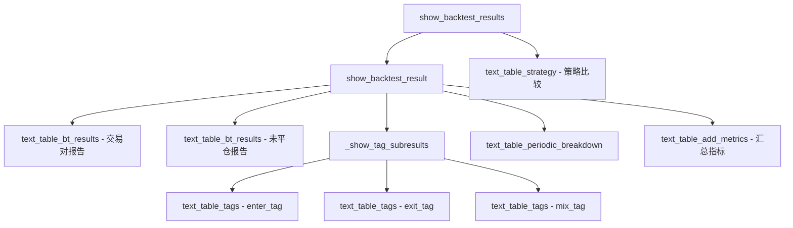

# bt_output.py

## 概述

`bt_output.py` 负责回测结果的终端格式化输出。提供了一系列函数将回测统计数据转换为人类可读的表格，包括：按交易对的回测报告、按入场/出场标签的统计、按时间周期（日/周/月/年）的分解、策略比较汇总、以及详细的指标面板。所有表格均通过 `print_rich_table` 输出到终端。

## 架构图

## 核心类/函数

### _get_line_floatfmt(stake_currency) -> list[str]

生成表格列的浮点格式字符串列表。根据 `stake_currency` 动态确定利润列的小数位数。

### _get_line_header(first_column, stake_currency, direction="Trades") -> list[str]

生成表格头行。标准列：首列、方向（Trades/Entries/Exits）、Avg Profit %、Tot Profit {currency}、Tot Profit %、Avg Duration、Win/Draw/Loss/Win%。

### generate_wins_draws_losses(wins, draws, losses) -> str

格式化胜/平/负统计和胜率。返回格式如 `"  10     2     3  66.7"`。

### text_table_bt_results(pair_results, stake_currency, title)

生成并打印按交易对的回测结果表格。

- **参数**：
  - `pair_results` — 交易对结果列表（含最终 TOTAL 行）
  - `stake_currency` — 基础币种
  - `title` — 表格标题

### text_table_tags(tag_type, tag_results, stake_currency)

生成并打印按标签的统计表格。

- **参数**：
  - `tag_type` — `"enter_tag"` | `"exit_tag"` | `"mix_tag"`
  - `tag_results` — 标签统计结果列表
  - `stake_currency` — 基础币种
- **特殊处理**：`mix_tag` 类型会有两列标签（Enter Tag + Exit Reason）

### text_table_periodic_breakdown(days_breakdown_stats, stake_currency, period)

生成并打印按时间周期分解的统计表格。列：周期、交易数、总利润、利润因子、胜负统计。

### text_table_strategy(strategy_results, stake_currency, title)

生成并打印策略比较汇总表格。在标准列基础上额外显示最大回撤（绝对值 + 百分比）。

### text_table_add_metrics(strat_results)

生成并打印详细的汇总指标面板。内容极其丰富，包括：

- 回测时间范围、交易模式、最大持仓数
- 总交易数/日均交易数
- 起始/最终余额、绝对/百分比利润
- CAGR、Sortino、Sharpe、Calmar、SQN
- 利润因子、期望值（Expectancy）
- 最佳/最差交易对、最佳/最差交易
- 最佳/最差日收益
- 持仓时间统计（赢家/输家的最小/最大/平均）
- 最大连胜/连负
- 拒绝信号数、超时订单数
- 最小/最大余额、最大回撤详情
- 市场变化率

### show_backtest_result(strategy, results, stake_currency, backtest_breakdown)

打印单个策略的完整回测报告。

### show_backtest_results(config, backtest_stats)

打印所有策略的回测报告和策略比较汇总。

### show_sorted_pairlist(config, backtest_stats)

按利润排序打印交易对列表（当 `backtest_show_pair_list` 为 True 时）。

## 依赖关系

### 内部依赖（本项目模块）
- `freqtrade.constants` — `UNLIMITED_STAKE_AMOUNT`、`Config`
- `freqtrade.ft_types.BacktestResultType` — 回测结果类型
- `freqtrade.optimize.optimize_reports.optimize_reports.generate_periodic_breakdown_stats` — 按需生成周期分解数据
- `freqtrade.util` — `decimals_per_coin`、`fmt_coin`、`print_rich_table`

### 外部依赖（第三方库）
- `logging` — 日志

### 被依赖（谁引用了本文件）
- `freqtrade.optimize.optimize_reports.__init__` — 统一导出
- `freqtrade.optimize.hyperopt.hyperopt_output` — Hyperopt 结果输出引用部分函数
