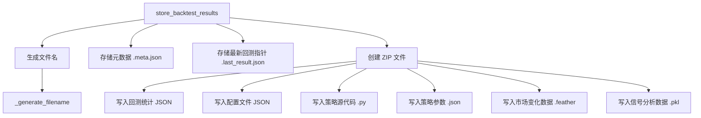

# bt_storage.py

## 概述

`bt_storage.py` 负责回测结果的持久化存储。主要功能是将回测统计数据、配置文件、策略源代码、市场变化数据和信号分析结果打包存储到一个 ZIP 压缩文件中，同时在 ZIP 外部保存元数据文件和最新回测指针文件以便快速查找。

## 架构图

## 核心类/函数

### file_dump_joblib(file_obj, data, log=True)

使用 joblib 将对象序列化到 BytesIO 对象。

- **参数**：
  - `file_obj: BytesIO` — 目标缓冲区
  - `data: Any` — 待序列化的数据
- **用途**：序列化信号分析数据（signals、rejected、exited）

### _generate_filename(recordfilename, appendix, suffix) -> Path

根据参数生成文件路径。

- 如果 `recordfilename` 是目录：返回 `{dir}/backtest-result-{appendix}{suffix}`
- 如果是文件：返回 `{parent}/{stem}-{appendix}{suffix}`

### store_backtest_results(config, stats, dtappendix, *, market_change_data, analysis_results, strategy_files) -> Path

主存储函数。将所有回测产出物打包存储。

- **参数**：
  - `config: dict` — 配置字典，需包含 `exportdirectory`
  - `stats: BacktestResultType` — 回测统计数据
  - `dtappendix: str` — 日期时间后缀（如 `2023-10-01_12-00-00`）
  - `market_change_data: DataFrame | None` — 市场变化数据
  - `analysis_results: dict | None` — 信号分析结果
  - `strategy_files: dict[str, str] | None` — 策略名到策略文件路径的映射

- **存储内容**：
  1. **元数据文件**（ZIP 外部）：`{stem}.meta.json`，包含 `stats["metadata"]`
  2. **最新回测指针**（ZIP 外部）：`.last_result.json`，指向最新的 ZIP 文件名
  3. **ZIP 文件内容**：
     - 回测统计 JSON（`strategy` + `strategy_comparison`）
     - 配置文件 JSON（经过 `sanitize_config` 清理的原始配置）
     - 策略源代码 `.py` 文件和对应的参数 `.json` 文件
     - 市场变化数据 `.feather`（使用 LZ4 压缩）
     - 信号分析数据 `.pkl`（仅在 `export=signals` 且 `RunMode.BACKTEST` 时），包含 signals、rejected、exited 三类

- **返回值**：ZIP 文件路径

## 依赖关系

### 内部依赖（本项目模块）
- `freqtrade.configuration.sanitize_config` — 清理配置中的敏感信息
- `freqtrade.constants.LAST_BT_RESULT_FN` — 最新回测结果文件名常量
- `freqtrade.enums.runmode.RunMode` — 运行模式枚举
- `freqtrade.ft_types.BacktestResultType` — 回测结果类型
- `freqtrade.misc` — `dump_json_to_file`、`file_dump_json` JSON 写入工具
- `freqtrade.optimize.backtest_caching.get_backtest_metadata_filename` — 元数据文件名生成

### 外部依赖（第三方库）
- `io.BytesIO` / `io.StringIO` — 内存缓冲区
- `zipfile.ZipFile` — ZIP 压缩
- `pandas.DataFrame` — 数据类型
- `joblib`（延迟导入）— 序列化分析结果
- `pathlib.Path` — 文件路径

### 被依赖（谁引用了本文件）
- `freqtrade.optimize.optimize_reports.__init__` — 统一导出 `store_backtest_results`
- `freqtrade.optimize.backtesting.Backtesting.start()` — 回测完成后调用存储
