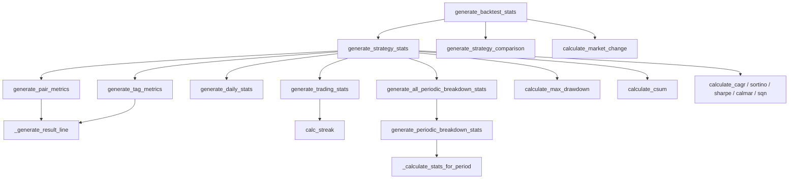

# optimize_reports.py

## 概述

`optimize_reports.py` 是回测报告数据生成的核心模块，负责将原始回测结果（交易列表 DataFrame）转换为结构化的统计数据。生成的数据供终端显示（`bt_output.py`）和持久化存储（`bt_storage.py`）使用。涵盖的统计维度包括：交易对指标、标签指标、策略比较、每日统计、周期性分解、交易统计（胜率/持仓时间/连胜连负等）、以及完整的策略级统计。

## 架构图

## 核心类/函数

### generate_trade_signal_candles(preprocessed_df, bt_results, date_col) -> dict[str, DataFrame]

提取交易信号对应的 K 线数据。

- 遍历每个交易对，找到信号时间点之前的最后一根 K 线
- 用于后续的信号分析（可视化策略在下单前看到的数据）
- `date_col` 可以是 `"open_date"` 或 `"close_date"`

### generate_rejected_signals(preprocessed_df, rejected_dict) -> dict[str, DataFrame]

提取被拒绝信号对应的 K 线数据。将 `rejected_dict` 中记录的时间戳和标签映射到原始 K 线数据。

### _generate_result_line(result, min_date, max_date, starting_balance, first_column) -> dict

为单个分组（交易对/标签/TOTAL）生成一行统计数据。

- **计算内容**：交易数、平均/总利润、持仓时间、胜/平/负、胜率、CAGR、期望值、Sortino/Sharpe/Calmar/SQN、利润因子、最大回撤
- 使用 `freqtrade.data.metrics` 中的各种计算函数

### calculate_trade_volume(trades_dict) -> float

计算总交易量。遍历所有交易的订单，累加 `order.cost`。

### generate_pair_metrics(pairlist, stake_currency, starting_balance, results, min_date, max_date, skip_nan=False) -> list[dict]

生成按交易对分组的指标列表。

- 遍历每个交易对，调用 `_generate_result_line`
- 按总利润降序排序
- 追加 TOTAL 汇总行

### generate_tag_metrics(tag_type, starting_balance, results, min_date, max_date, skip_nan=False) -> list[dict]

生成按标签分组的指标列表。

- `tag_type` 可以是 `"enter_tag"`、`"exit_reason"` 或两者的列表 `["enter_tag", "exit_reason"]`（mix_tag）
- 使用 `DataFrame.groupby(tag_type)` 进行分组

### generate_strategy_comparison(bt_stats) -> list[dict]

生成策略比较数据。从每个策略的 `results_per_pair` 最后一行（TOTAL）复制，添加最大回撤信息。

### generate_periodic_breakdown_stats(trade_list, period) -> list[dict]

生成按时间周期分解的统计。

- **支持的周期**：`day`、`week`、`month`、`year`、`weekday`
- `weekday` 使用 `dayofweek` 属性按星期几分组
- 其他周期使用 `resample` 进行时间重采样
- 每个周期计算：利润、胜/平/负、交易数、利润因子

### _get_resample_from_period(period) -> str

将周期名转换为 pandas resample 频率字符串。如 `"day" -> "1d"`、`"week" -> "1W-MON"`、`"month" -> "1ME"`。

### _calculate_stats_for_period(data) -> dict

为单个周期计算统计数据。包含：profit_abs、wins、draws、losses、trades、profit_factor。

### generate_all_periodic_breakdown_stats(trade_list) -> dict[str, list]

为所有预定义的分解周期（来自 `BACKTEST_BREAKDOWNS` 常量）生成统计。

### calc_streak(dataframe) -> tuple[int, int]

计算最大连胜和最大连负。

- 使用 `np.where` 将每笔交易标记为 "win" 或 "loss"
- 通过 `ne().cumsum()` 识别连续序列
- 使用 `groupby` 计算每个序列的长度
- 返回 `(最大连胜, 最大连负)` 元组

### generate_trading_stats(results) -> dict[str, Any]

生成整体交易统计。

- 胜/负/平数量和胜率
- 平均持仓时间
- 赢家的最小/最大/平均持仓时间
- 输家的最小/最大/平均持仓时间
- 最大连胜/连负
- 所有持仓时间以秒为单位也存储一份（`*_s` 后缀）

### generate_daily_stats(results) -> dict[str, Any]

生成每日统计。

- 按日重采样，计算每日利润
- 最佳/最差日（相对和绝对）
- 盈利/持平/亏损天数
- 每日利润列表

### generate_strategy_stats(pairlist, strategy, content, min_date, max_date, market_change, is_hyperopt=False) -> dict[str, Any]

生成单个策略的完整统计（核心函数）。整合调用以上所有生成函数，产出包含 80+ 个键的统计字典。

- 调用 `generate_pair_metrics`、`generate_tag_metrics`（enter/exit/mix）、`generate_daily_stats`、`generate_trading_stats`、`generate_all_periodic_breakdown_stats`
- 计算最佳/最差交易对、利润因子、期望值
- 计算 CAGR、Sortino、Sharpe、Calmar、SQN
- 计算最大回撤（绝对和相对）、cumulative sum 的最小/最大值
- 包含策略配置信息（止损、ROI、追踪止损等）

### generate_backtest_stats(btdata, all_results, min_date, max_date, notes=None) -> BacktestResultType

顶层统计生成函数。

- 遍历所有策略结果，调用 `generate_strategy_stats`
- 计算市场变化率
- 生成策略比较数据
- 组装最终结果：`{"metadata": ..., "strategy": ..., "strategy_comparison": ...}`

## 依赖关系

### 内部依赖（本项目模块）
- `freqtrade.constants` — `BACKTEST_BREAKDOWNS`、`DATETIME_PRINT_FORMAT`
- `freqtrade.data.metrics` — 所有计算函数（CAGR、Calmar、Sharpe、Sortino、SQN、drawdown、csum、market change、expectancy）
- `freqtrade.ft_types` — `BacktestContentType`、`BacktestResultType`、`get_BacktestResultType_default`
- `freqtrade.util` — `decimals_per_coin`、`fmt_coin`、`format_duration`、`get_dry_run_wallet`

### 外部依赖（第三方库）
- `numpy` — `np.where` 用于连胜连负计算
- `pandas` — `DataFrame`、`Series`、`concat`、`to_datetime`、`resample`、`groupby`
- `copy.deepcopy` — 深拷贝策略比较数据
- `datetime` — 时间计算

### 被依赖（谁引用了本文件）
- `freqtrade.optimize.optimize_reports.__init__` — 统一导出所有生成函数
- `freqtrade.optimize.optimize_reports.bt_output` — 引用 `generate_periodic_breakdown_stats` 用于按需生成
- `freqtrade.optimize.backtesting` — 通过 `__init__` 导入 `generate_backtest_stats`、`generate_trade_signal_candles` 等
- `freqtrade.optimize.hyperopt.hyperopt_optimizer` — 通过 `__init__` 导入 `generate_strategy_stats`
- `freqtrade.rpc.api_server.api_backtest` — API 回测结果处理
