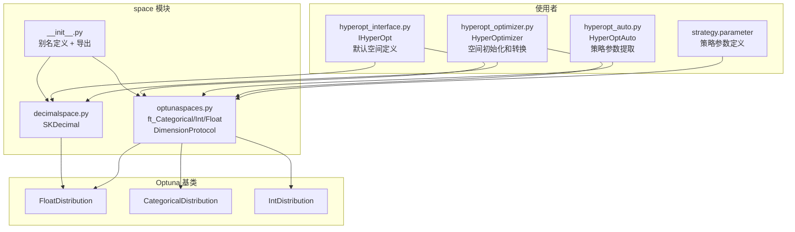
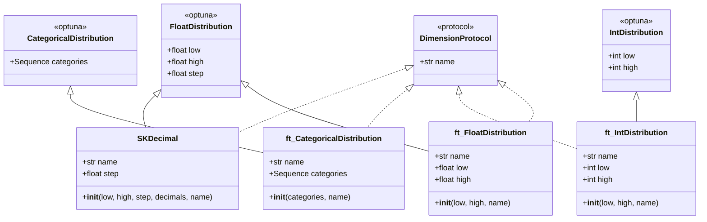
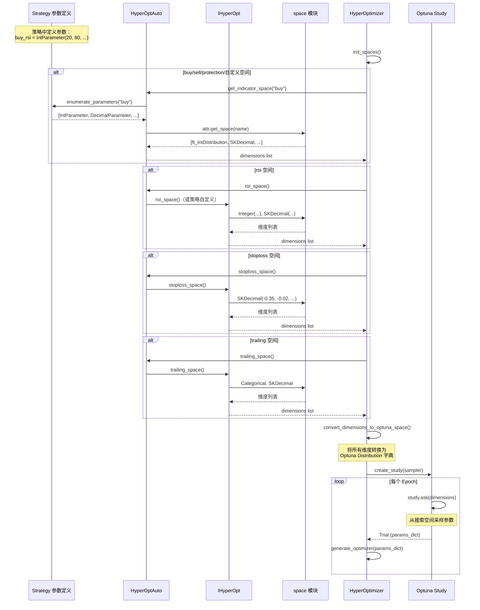
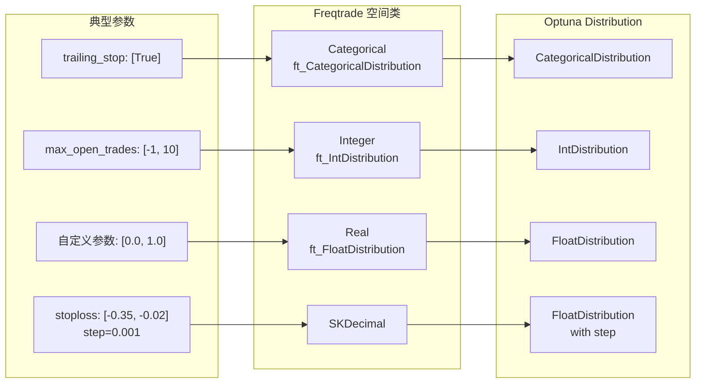

# Freqtrade 参数搜索空间定义模块 (`freqtrade/optimize/space/`)

## 1. 模块概述

`freqtrade/optimize/space/` 模块定义了 Hyperopt 超参数优化过程中使用的**参数搜索空间（Search Space）**。搜索空间决定了优化器在哪些范围内搜索最优参数。

该模块基于 **Optuna** 的分布（Distribution）系统构建，提供了以下核心抽象：
- **Categorical**：分类变量（如 True/False、策略选项等）
- **Integer**：整数变量（如 max_open_trades、ROI 时间步等）
- **Real/Float**：浮点数变量（如 stoploss 值等）
- **SKDecimal**：定步长浮点数变量（如 ROI 利润步，步长 0.001）

这些空间定义被 `HyperOptimizer` 使用，用于构建 Optuna Study 的搜索维度，并在每个 epoch 中从这些空间采样参数组合。

> **历史演变**：Freqtrade 最初使用 scikit-optimize (skopt) 作为优化后端，后来迁移到 Optuna。`SKDecimal` 类名中的 "SK" 前缀就是 scikit-optimize 时代的遗留命名。

## 2. 目录结构

```
freqtrade/optimize/space/
├── __init__.py          # 模块初始化，定义别名并统一导出
├── decimalspace.py      # SKDecimal 定步长浮点数空间（继承 FloatDistribution）
└── optunaspaces.py      # Optuna 原生分布的封装（Categorical, Integer, Float）+ Protocol
```

## 3. 架构图





## 4. 核心类/函数说明

### 4.1 `DimensionProtocol` (`optunaspaces.py`)

定义搜索空间维度的最小接口协议（Protocol），所有维度类都必须具有 `name` 属性。

```python
class DimensionProtocol(Protocol):
    name: str
```

这是一个结构化子类型（structural subtyping），任何具有 `name: str` 属性的对象都满足该协议，无需显式继承。

### 4.2 `ft_CategoricalDistribution` (`optunaspaces.py`)

分类变量空间，继承自 Optuna 的 `CategoricalDistribution`。

```python
class ft_CategoricalDistribution(CategoricalDistribution):
    def __init__(self, categories: Sequence[Any], name: str, **kwargs):
        self.name = name
        self.categories = categories
        super().__init__(categories)
```

**参数说明：**

| 参数 | 类型 | 说明 |
|------|------|------|
| `categories` | `Sequence[Any]` | 可选值列表，如 `[True, False]`、`["buy", "sell"]` |
| `name` | `str` | 维度名称，如 `"trailing_stop"` |

**使用示例：**
```python
Categorical([True, False], name="trailing_only_offset_is_reached")
Categorical([True], name="trailing_stop")  # 固定为 True
```

**`__repr__` 方法：**
返回 `CategoricalDistribution({categories})` 格式，便于调试。

### 4.3 `ft_IntDistribution` (`optunaspaces.py`)

整数变量空间，继承自 Optuna 的 `IntDistribution`。

```python
class ft_IntDistribution(IntDistribution):
    def __init__(self, low: int | float, high: int | float, name: str, **kwargs):
        self.name = name
        self.low = int(low)
        self.high = int(high)
        super().__init__(self.low, self.high, **kwargs)
```

**参数说明：**

| 参数 | 类型 | 说明 |
|------|------|------|
| `low` | `int \| float` | 最小值（会被转换为 int） |
| `high` | `int \| float` | 最大值（会被转换为 int） |
| `name` | `str` | 维度名称 |

**注意：** `low` 和 `high` 接受 float 类型输入，但会自动转换为 int。这是为了兼容某些场景下传入浮点数的情况。

**使用示例：**
```python
Integer(-1, 10, name="max_open_trades")
Integer(10, 120, name="roi_t1")
```

### 4.4 `ft_FloatDistribution` (`optunaspaces.py`)

连续浮点数变量空间，继承自 Optuna 的 `FloatDistribution`。

```python
class ft_FloatDistribution(FloatDistribution):
    def __init__(self, low: float, high: float, name: str, **kwargs):
        self.name = name
        self.low = low
        self.high = high
        super().__init__(low, high, **kwargs)
```

**参数说明：**

| 参数 | 类型 | 说明 |
|------|------|------|
| `low` | `float` | 最小值 |
| `high` | `float` | 最大值 |
| `name` | `str` | 维度名称 |
| `**kwargs` | | 传递给 Optuna，如 `step` 等 |

**使用示例：**
```python
Real(0.01, 0.35, name="trailing_stop_positive")
```

### 4.5 `SKDecimal` (`decimalspace.py`)

**定步长浮点数空间**，用于需要固定精度的参数（如 stoploss、ROI 利润步等）。

```python
class SKDecimal(FloatDistribution):
    def __init__(
        self,
        low: float,
        high: float,
        *,
        step: float | None = None,
        decimals: int | None = None,
        name=None,
    ):
```

**参数说明：**

| 参数 | 类型 | 说明 |
|------|------|------|
| `low` | `float` | 最小值 |
| `high` | `float` | 最大值 |
| `step` | `float \| None` | 步长（与 `decimals` 互斥） |
| `decimals` | `int \| None` | 小数位数（与 `step` 互斥） |
| `name` | `str` | 维度名称 |

**步长转换逻辑：**
- `decimals=3` -> `step=0.001`
- `decimals=2` -> `step=0.01`
- 直接指定 `step=0.005` 也可以

**约束：** `step` 和 `decimals` 必须且只能设置一个，否则抛出 `ValueError`。

**使用示例：**
```python
SKDecimal(-0.35, -0.02, decimals=3, name="stoploss")
# 等价于：step=0.001, 范围 [-0.350, -0.020]

SKDecimal(0.01, 0.04, decimals=3, name="roi_p1")
# 等价于：step=0.001, 范围 [0.010, 0.040]
```

### 4.6 模块别名 (`__init__.py`)

`__init__.py` 定义了更直观的别名，对外暴露简洁的 API：

```python
Dimension = DimensionProtocol    # 维度协议
Categorical = ft_CategoricalDistribution  # 分类变量
Integer = ft_IntDistribution     # 整数变量
Real = ft_FloatDistribution      # 浮点变量
# SKDecimal 保持原名

__all__ = ["Categorical", "Dimension", "Integer", "Real", "SKDecimal"]
```

## 5. 依赖关系

### 5.1 内部依赖

无内部模块依赖（该模块是纯基础设施层）。

### 5.2 外部库依赖

| 库 | 模块 | 用途 |
|----|------|------|
| `optuna.distributions.FloatDistribution` | `decimalspace.py`, `optunaspaces.py` | 浮点数分布基类 |
| `optuna.distributions.CategoricalDistribution` | `optunaspaces.py` | 分类分布基类 |
| `optuna.distributions.IntDistribution` | `optunaspaces.py` | 整数分布基类 |

### 5.3 被依赖关系

| 使用者 | 用途 |
|--------|------|
| `hyperopt_interface.py (IHyperOpt)` | 定义默认的 ROI / stoploss / trailing / max_open_trades 搜索空间 |
| `hyperopt_auto.py (HyperOptAuto)` | 引用 `Dimension` 类型 |
| `hyperopt_optimizer.py (HyperOptimizer)` | 转换维度为 Optuna 分布、类型检查 |
| `freqtrade.strategy.parameter` | 策略参数定义中使用 Categorical / Integer / Real |

## 6. 数据流

### 6.1 搜索空间从定义到使用的流程



### 6.2 空间类型映射



## 7. 关键设计点

### 7.1 `name` 属性扩展
Optuna 原生的 Distribution 类没有 `name` 属性，但 Freqtrade 的 Hyperopt 系统需要通过名称来关联参数和搜索空间维度。因此所有封装类都添加了 `name` 属性，并通过 `DimensionProtocol` 协议进行类型约束。

### 7.2 SKDecimal 的 decimals/step 双模式
`SKDecimal` 支持两种指定精度的方式：
- `decimals=3`：指定小数位数，内部自动计算 step
- `step=0.001`：直接指定步长

这种设计让用户可以根据直觉选择更方便的方式。大多数内置空间使用 `decimals` 参数，因为它更直观。

### 7.3 低值/高值的精度对齐
`SKDecimal` 在传入 `decimals` 参数时，会对 `low` 和 `high` 进行 round 处理，确保边界值与步长对齐：

```python
super().__init__(
    low=round(low, decimals) if decimals else low,
    high=round(high, decimals) if decimals else high,
    step=self.step,
)
```

### 7.4 类型兼容性
`ft_IntDistribution` 的 `low` 和 `high` 参数接受 `int | float` 类型，这是因为在某些动态计算场景中（如 ROI 空间的自适应缩放），计算结果可能是 float。构造函数内部通过 `int()` 转换确保最终类型正确。

### 7.5 别名设计的目的
`__init__.py` 中的别名（`Categorical`, `Integer`, `Real`）不仅是为了简洁，也是为了：
- 与 scikit-optimize 时代的 API 保持一致，减少迁移成本
- 提供与参数空间概念更匹配的命名（"Categorical" 比 "ft_CategoricalDistribution" 更直观）

## 8. 各内置搜索空间汇总

以下是 `IHyperOpt` 中定义的所有默认搜索空间：

### ROI 空间（6 个维度）

| 维度 | 类型 | 范围（5m timeframe 基准） | 说明 |
|------|------|--------------------------|------|
| `roi_t1` | Integer | [10, 120] | ROI 时间步 1 |
| `roi_t2` | Integer | [10, 60] | ROI 时间步 2 |
| `roi_t3` | Integer | [10, 40] | ROI 时间步 3 |
| `roi_p1` | SKDecimal(3) | [0.01, 0.04] | ROI 利润步 1 |
| `roi_p2` | SKDecimal(3) | [0.01, 0.07] | ROI 利润步 2 |
| `roi_p3` | SKDecimal(3) | [0.01, 0.20] | ROI 利润步 3 |

> 以上范围会根据 timeframe 自适应缩放。

### Stoploss 空间（1 个维度）

| 维度 | 类型 | 范围 | 说明 |
|------|------|------|------|
| `stoploss` | SKDecimal(3) | [-0.35, -0.02] | 止损值 |

### Trailing 空间（4 个维度）

| 维度 | 类型 | 范围 | 说明 |
|------|------|------|------|
| `trailing_stop` | Categorical | [True] | 是否启用追踪止损（固定为 True） |
| `trailing_stop_positive` | SKDecimal(3) | [0.01, 0.35] | 正向追踪止损值 |
| `trailing_stop_positive_offset_p1` | SKDecimal(3) | [0.001, 0.1] | 正向偏移增量 |
| `trailing_only_offset_is_reached` | Categorical | [True, False] | 是否仅在达到偏移后追踪 |

### Max Open Trades 空间（1 个维度）

| 维度 | 类型 | 范围 | 说明 |
|------|------|------|------|
| `max_open_trades` | Integer | [-1, 10] | 最大持仓数（-1 = 无限） |
