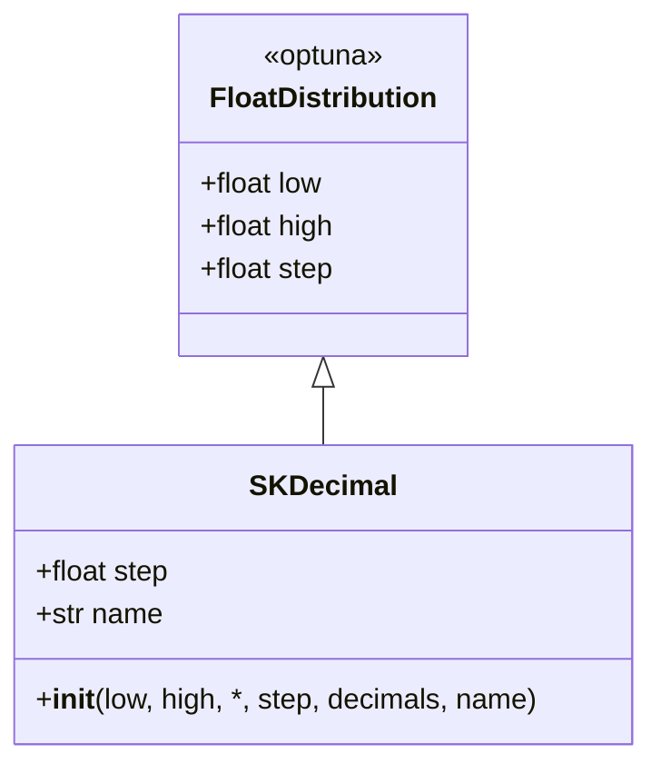

# decimalspace.py

## 概述

`decimalspace.py` 定义了 `SKDecimal` 类，继承自 Optuna 的 `FloatDistribution`，提供固定步长的浮点分布。该类允许用户通过指定小数位数（`decimals`）或步长（`step`）来控制搜索空间的精度，适用于需要精确控制浮点参数粒度的 Hyperopt 优化场景。

## 架构图

## 核心类/函数

### SKDecimal

带固定步长的浮点分布类。

#### \_\_init\_\_(low, high, *, step=None, decimals=None, name=None)

- **参数**：
  - `low: float` — 下界
  - `high: float` — 上界
  - `step: float | None` — 步长（如 0.001），与 `decimals` 互斥
  - `decimals: int | None` — 小数位数（如 3 表示精度到 0.001），与 `step` 互斥
  - `name` — 分布名称
- **约束**：`step` 和 `decimals` 必须且只能设置一个
- **转换逻辑**：
  - 如果指定 `decimals`，自动转换为 `step = 1 / 10^decimals`
  - `low` 和 `high` 会按 `decimals` 进行四舍五入
- **示例**：`SKDecimal(0.0, 1.0, decimals=3)` 等效于 `FloatDistribution(0.0, 1.0, step=0.001)`

## 依赖关系

### 内部依赖（本项目模块）
- 无

### 外部依赖（第三方库）
- `optuna.distributions.FloatDistribution` — 父类

### 被依赖（谁引用了本文件）
- `freqtrade.optimize.space.__init__` — 导出 `SKDecimal`
- `freqtrade.strategy.parameters` — 策略参数中使用 `SKDecimal` 定义浮点参数空间
