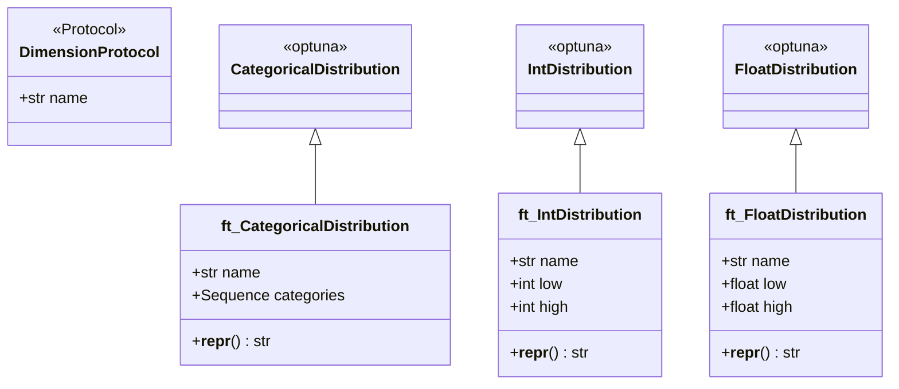

# optunaspaces.py

## 概述

`optunaspaces.py` 定义了 freqtrade 对 Optuna 分布类的封装。这些封装类在 Optuna 原生分布的基础上添加了 `name` 属性，使得 Hyperopt 系统可以通过名称追踪和管理各个超参数。还定义了 `DimensionProtocol` 协议类作为所有维度的类型接口。

## 架构图

## 核心类/函数

### DimensionProtocol

Protocol 类，定义了维度的最小接口：`name: str`。用于类型提示，表示任何具有 `name` 属性的对象都可以作为维度使用。

### ft_CategoricalDistribution

分类分布，继承自 Optuna 的 `CategoricalDistribution`。

- **\_\_init\_\_(categories, name, \*\*kwargs)**
  - `categories: Sequence[Any]` — 可选值列表
  - `name: str` — 参数名称
- **\_\_repr\_\_()** — 返回 `CategoricalDistribution({categories})` 格式的字符串

### ft_IntDistribution

整数分布，继承自 Optuna 的 `IntDistribution`。

- **\_\_init\_\_(low, high, name, \*\*kwargs)**
  - `low: int | float` — 下界（自动转为 int）
  - `high: int | float` — 上界（自动转为 int）
  - `name: str` — 参数名称
  - `**kwargs` — 传递给父类的额外参数（如 `step`）
- **\_\_repr\_\_()** — 返回 `IntDistribution(low=..., high=...)` 格式的字符串

### ft_FloatDistribution

浮点分布，继承自 Optuna 的 `FloatDistribution`。

- **\_\_init\_\_(low, high, name, \*\*kwargs)**
  - `low: float` — 下界
  - `high: float` — 上界
  - `name: str` — 参数名称
  - `**kwargs` — 传递给父类的额外参数（如 `step`、`log`）
- **\_\_repr\_\_()** — 返回 `FloatDistribution(low=..., high=..., step=...)` 格式的字符串

## 依赖关系

### 内部依赖（本项目模块）
- 无

### 外部依赖（第三方库）
- `optuna.distributions.CategoricalDistribution` — 分类分布父类
- `optuna.distributions.FloatDistribution` — 浮点分布父类
- `optuna.distributions.IntDistribution` — 整数分布父类
- `typing.Protocol` — Protocol 类型提示
- `collections.abc.Sequence` — 序列类型

### 被依赖（谁引用了本文件）
- `freqtrade.optimize.space.__init__` — 导出所有分布类
- `freqtrade.strategy.parameters` — 策略参数定义中使用这些分布类
