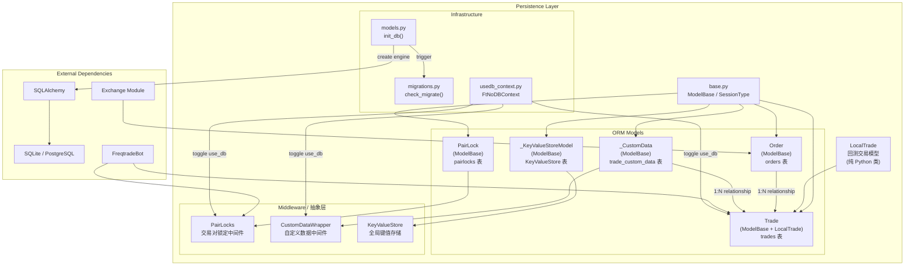
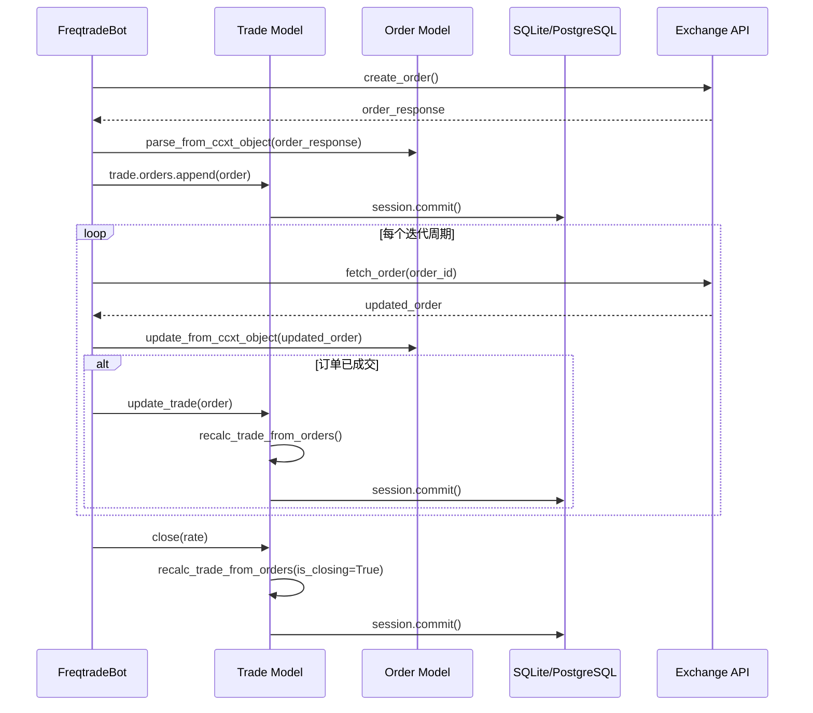
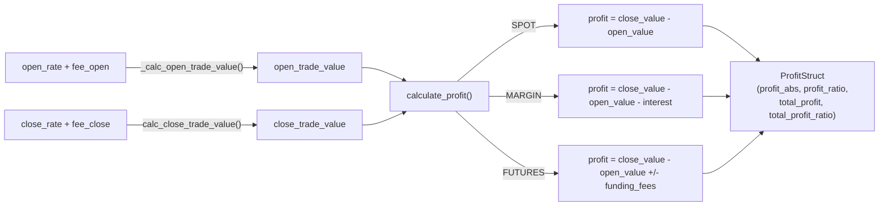
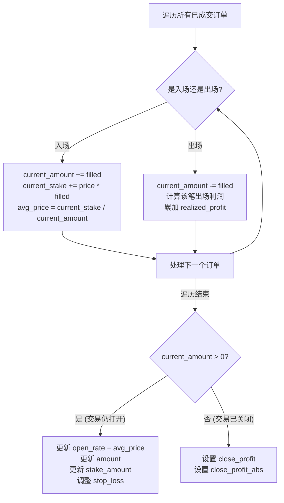

# Persistence -- 数据库持久化层

## 1. 模块概述

`freqtrade.persistence` 模块是 Freqtrade 的数据库持久化层，负责所有交易数据、订单数据、交易对锁定、键值存储及自定义数据的持久化管理。该模块基于 **SQLAlchemy ORM** 构建，支持 SQLite 和 PostgreSQL 两种数据库后端，并提供了一套完整的抽象层以同时支持实盘交易（Live/Dry-run）和回测（Backtesting）两种运行模式。

核心设计理念：
- **双模式支持**：通过 `use_db` 标志位，所有中间件类（如 `PairLocks`、`CustomDataWrapper`）可在数据库模式和内存列表模式之间无缝切换
- **线程安全**：使用 SQLAlchemy 的 `scoped_session` 配合 thread-local 和 FastAPI 的 request context 实现线程安全
- **向后兼容**：内置数据库迁移系统，支持从旧版本数据库平滑升级
- **精度计算**：大量使用 `FtPrecise` 进行高精度金融计算，避免浮点误差

## 2. 目录结构

| 文件 | 行数约 | 功能说明 |
|---|---|---|
| `__init__.py` | ~13 | 模块入口，导出核心类：`Trade`、`Order`、`LocalTrade`、`PairLocks`、`CustomDataWrapper`、`KeyValueStore`、`init_db` 等 |
| `base.py` | ~9 | 定义 SQLAlchemy 基类 `ModelBase`（`DeclarativeBase`）及 `SessionType` 类型别名 |
| `trade_model.py` | ~2100 | **核心文件**。定义 `Order`、`LocalTrade`、`Trade` 三大模型类，包含交易生命周期管理、利润计算、止损调整、DCA 重算等全部业务逻辑 |
| `models.py` | ~117 | 数据库初始化入口 `init_db()`，创建 engine、配置 scoped_session、触发 migration |
| `pairlock.py` | ~79 | 交易对锁定数据库模型 `PairLock`，支持按方向（long/short/*）锁定 |
| `pairlock_middleware.py` | ~191 | 交易对锁定中间件 `PairLocks`，抽象数据库层以兼容回测模式 |
| `custom_data.py` | ~183 | 自定义键值数据模型 `_CustomData` 及中间件 `CustomDataWrapper`，支持为每笔交易关联任意 JSON 数据 |
| `key_value_store.py` | ~212 | 全局键值存储 `KeyValueStore`，支持 `str`/`datetime`/`float`/`int` 四种值类型 |
| `migrations.py` | ~437 | 数据库迁移逻辑，处理 trades、orders、pairlocks 表的 schema 升级和数据迁移 |
| `usedb_context.py` | ~36 | 数据库开关工具，提供 `disable_database_use()`/`enable_database_use()` 及上下文管理器 `FtNoDBContext` |

## 3. 架构图

## 4. 核心类/函数说明

### 4.1 `Order` 类 (`trade_model.py`)

Order 是订单数据库模型，镜像 CCXT 的订单结构，与 Trade 构成 **一对多** 关系。

**关键字段：**
- `ft_trade_id`: 关联的交易 ID（外键 -> trades.id）
- `ft_order_side`: 订单方向，`'buy'`/`'sell'`/`'stoploss'`
- `ft_is_open`: 订单是否仍处于打开状态
- `ft_amount` / `ft_price`: Freqtrade 记录的请求金额和价格
- `order_id`: 交易所返回的订单 ID
- `status`: 订单状态（`open`/`closed`/`canceled` 等）
- `filled` / `remaining` / `average` / `cost`: 成交明细
- `funding_fee`: 该订单对应的 funding fee（Futures 模式）

**关键方法：**
- `update_from_ccxt_object(order)`: 从 CCXT 返回的订单字典更新本地 Order 对象
- `to_ccxt_object()`: 将 Order 转换为 CCXT 格式字典
- `parse_from_ccxt_object()`: 类方法，从 CCXT 订单创建新 Order 实例
- `close_bt_order()`: 回测模式下关闭订单
- `safe_price` / `safe_filled` / `safe_amount_after_fee`: 安全属性访问器，处理 None 值

**关键属性：**
- `trade`: 返回关联的 Trade（实盘）或 LocalTrade（回测）
- `stake_amount`: 该订单使用的 stake 金额（已考虑 leverage）
- `stake_amount_filled`: 已成交部分使用的 stake 金额

### 4.2 `LocalTrade` 类 (`trade_model.py`)

LocalTrade 是用于回测模式的交易模型，不依赖数据库，所有数据存储在类变量（内存列表）中。`Trade` 类通过多重继承同时继承 `ModelBase` 和 `LocalTrade`。

**类变量（回测容器）：**
- `bt_trades`: 已关闭的回测交易列表
- `bt_trades_open`: 打开的回测交易列表
- `bt_trades_open_pp`: 按交易对索引的打开交易字典，加速查找
- `bt_total_profit`: 回测累计利润

**关键交易字段（约 50 个）：**
- 基础信息：`pair`、`exchange`、`is_open`、`strategy`、`enter_tag`
- 金额相关：`stake_amount`、`amount`、`open_rate`、`close_rate`、`fee_open`、`fee_close`
- 止损系统：`stop_loss`、`stop_loss_pct`、`initial_stop_loss`、`is_stop_loss_trailing`
- 杠杆/做空：`leverage`、`is_short`、`liquidation_price`、`trading_mode`
- Futures：`funding_fees`、`funding_fee_running`
- 精度控制：`amount_precision`、`price_precision`、`precision_mode`、`contract_size`

**核心方法：**

| 方法 | 功能 |
|---|---|
| `adjust_stop_loss(current_price, stoploss)` | 调整止损价格，支持 trailing stop |
| `update_trade(order)` | 根据订单更新交易状态，处理入场/出场/止损 |
| `close(rate)` | 关闭交易，计算最终利润 |
| `calculate_profit(rate)` | 计算利润指标，返回 `ProfitStruct` |
| `calc_close_trade_value(rate)` | 计算平仓价值（含手续费、funding fee、利息） |
| `recalc_trade_from_orders()` | 从所有订单重新计算交易状态（支持 DCA） |
| `calc_close_rate_for_roi(target_roi)` | 反向计算达到目标 ROI 所需的平仓价格 |
| `to_json()` | 序列化为完整 JSON 字典 |
| `from_json(json_str)` | 从 JSON 字符串反序列化 |
| `set_custom_data(key, value)` | 设置自定义数据 |
| `get_custom_data(key, default)` | 获取自定义数据 |

### 4.3 `Trade` 类 (`trade_model.py`)

Trade 继承自 `ModelBase` 和 `LocalTrade`，是实盘模式下的交易数据库模型，映射 `trades` 表。

**在 LocalTrade 基础上新增：**
- 所有字段通过 `mapped_column()` 映射为数据库列
- `orders` relationship：与 Order 的一对多关系，使用 `selectin` 加载策略
- `custom_data` relationship：与 `_CustomData` 的一对多关系

**数据库查询方法（静态方法）：**
- `get_trades(trade_filter)`: 通用查询方法
- `get_trades_proxy(pair, is_open, ...)`: 代理方法，自动选择数据库查询或内存过滤
- `get_overall_performance()`: 获取所有交易对的性能汇总
- `get_enter_tag_performance()`: 按入场标签统计性能
- `get_exit_reason_performance()`: 按出场原因统计性能
- `get_total_closed_profit()`: 获取总已实现利润
- `total_open_trades_stakes()`: 获取当前打开交易的总 stake 金额

### 4.4 `PairLock` 模型 (`pairlock.py`)

交易对锁定的数据库模型，用于临时禁止某个交易对的交易。

| 字段 | 类型 | 说明 |
|---|---|---|
| `pair` | String(25) | 交易对，`'*'` 表示全局锁定 |
| `side` | String(25) | 锁定方向：`'long'`/`'short'`/`'*'` |
| `reason` | String(255) | 锁定原因 |
| `lock_time` | datetime | 锁定开始时间 |
| `lock_end_time` | datetime | 锁定结束时间 |
| `active` | bool | 是否处于激活状态 |

### 4.5 `PairLocks` 中间件 (`pairlock_middleware.py`)

抽象数据库层的中间件，核心方法：
- `lock_pair(pair, until, reason)`: 锁定交易对
- `unlock_pair(pair)`: 解锁交易对
- `unlock_reason(reason)`: 按原因批量解锁
- `is_pair_locked(pair)`: 检查交易对是否被锁定
- `is_global_lock()`: 检查全局锁定状态

### 4.6 `CustomDataWrapper` (`custom_data.py`)

自定义数据中间件，支持为每笔交易存储任意键值对。

- 支持类型：`bool`、`float`、`int`、`str` 直接存储；其他类型 JSON 序列化
- `set_custom_data(trade_id, key, value)`: 设置/更新自定义数据
- `get_custom_data(trade_id, key)`: 查询自定义数据
- `delete_custom_data(trade_id)`: 删除某交易的全部自定义数据

### 4.7 `KeyValueStore` (`key_value_store.py`)

全局持久化键值存储，支持 `str`/`datetime`/`float`/`int` 四种值类型。

预定义的 Key：
- `bot_start_time`: 机器人首次启动时间
- `startup_time`: 本次启动时间
- `binance_migration`: Binance 迁移标记

### 4.8 `init_db()` (`models.py`)

数据库初始化函数，执行流程：
1. 根据 `db_url` 创建 SQLAlchemy Engine
2. 创建 `scoped_session`，绑定到 `Trade.session`、`Order.session`、`PairLock.session` 等
3. 使用 `ModelBase.metadata.create_all()` 创建表
4. 调用 `check_migrate()` 执行数据库迁移

### 4.9 数据库迁移 (`migrations.py`)

- `check_migrate()`: 主入口，检测 schema 版本并执行迁移
- `migrate_trades_and_orders_table()`: 迁移 trades 和 orders 表
- `migrate_pairlocks_table()`: 迁移 pairlocks 表
- `fix_old_dry_orders()`: 修复旧的 dry-run 订单状态
- `fix_wrong_max_stake_amount()`: 修复杠杆交易的 `max_stake_amount` 计算错误
- `set_sqlite_to_wal()`: 将 SQLite 设为 WAL 模式提升并发性能

迁移策略：将旧表重命名为 `*_bak`，创建新 schema，通过 INSERT...SELECT 复制数据并进行字段转换。

## 5. 依赖关系

### 内部依赖
- `freqtrade.constants`: 常量定义（`DATETIME_PRINT_FORMAT`、`NON_OPEN_EXCHANGE_STATES` 等）
- `freqtrade.enums`: 枚举类型（`TradingMode`、`ExitType`）
- `freqtrade.exchange`: 精度处理函数（`price_to_precision`、`amount_to_contract_precision`）
- `freqtrade.leverage`: 利息计算模块
- `freqtrade.util`: 工具函数（`FtPrecise`、`dt_now`、`dt_ts` 等）
- `freqtrade.misc`: `safe_value_fallback` 等辅助函数

### 外部依赖
- `sqlalchemy`: ORM 框架（`DeclarativeBase`、`Mapped`、`mapped_column`、`relationship`、`scoped_session`）
- `threading` / `contextvars`: 线程安全支持

## 6. 数据流

### 6.1 实盘交易数据流

### 6.2 利润计算流程

### 6.3 DCA 重算流程 (`recalc_trade_from_orders`)

