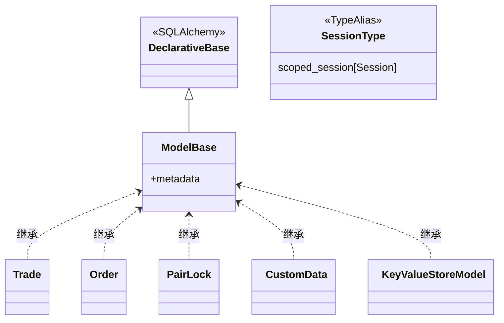

# base.py

## 概述

持久化层的基础模块，定义了 SQLAlchemy ORM 的声明基类 `ModelBase` 和 session 类型别名 `SessionType`。所有数据库模型类（Trade, Order, PairLock, _CustomData, _KeyValueStoreModel）都继承自 `ModelBase`。

## 架构图



## 核心类/函数

### SessionType

```python
SessionType = scoped_session[Session]
```

类型别名，表示 SQLAlchemy 的 scoped session 类型。scoped session 是线程安全的 session 代理，每个线程（或 FastAPI 请求）自动获取各自独立的 session 实例。

### ModelBase

```python
class ModelBase(DeclarativeBase):
    pass
```

SQLAlchemy 2.0 风格的声明基类。继承自 `DeclarativeBase`，所有 ORM 模型类通过继承此类来注册到同一个 metadata 中，确保所有表能在同一个数据库中被创建和管理。

## 依赖关系

### 内部依赖（本项目模块）
无

### 外部依赖（第三方库）
- `sqlalchemy.orm.DeclarativeBase` -- ORM 声明基类
- `sqlalchemy.orm.Session` -- 数据库会话
- `sqlalchemy.orm.scoped_session` -- 线程安全的会话作用域管理

### 被依赖（谁引用了本文件）
- `freqtrade.persistence.trade_model` -- Trade, Order, LocalTrade 模型定义
- `freqtrade.persistence.pairlock` -- PairLock 模型定义
- `freqtrade.persistence.custom_data` -- _CustomData 模型定义
- `freqtrade.persistence.key_value_store` -- _KeyValueStoreModel 模型定义
- `freqtrade.persistence.models` -- 数据库初始化中使用 ModelBase.metadata.create_all()
