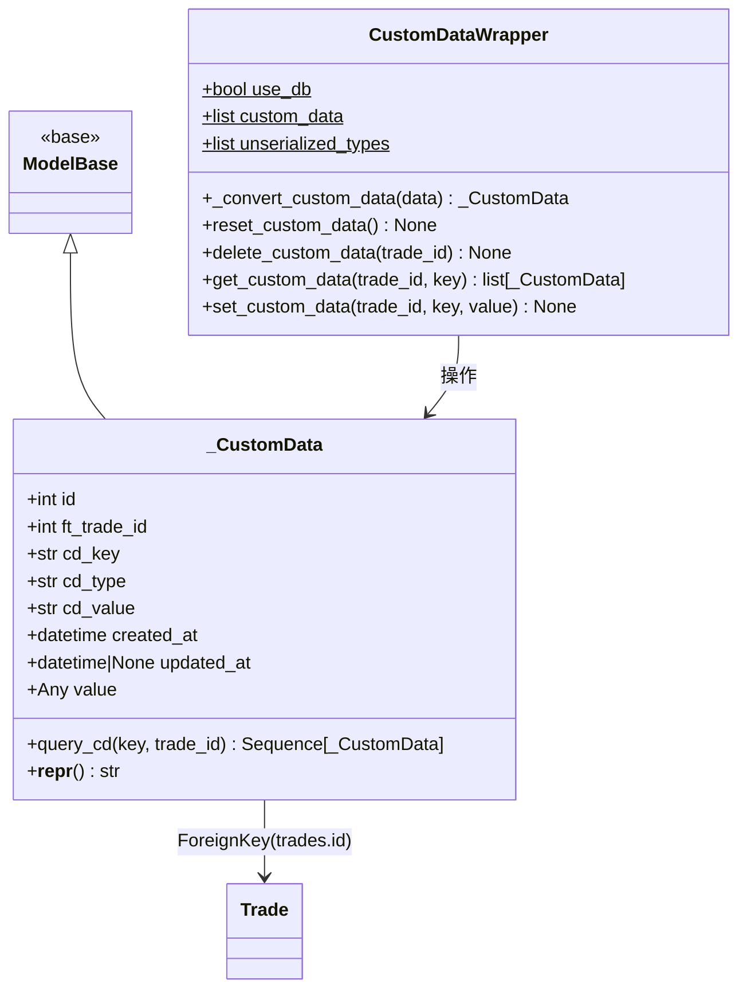

# custom_data.py

## 概述

自定义数据持久化模块，提供交易级别的键值对元数据存储能力。支持两种运行模式：数据库模式（实盘/模拟盘）和内存模式（回测）。允许策略为每笔交易附加任意自定义数据，数据类型支持 `bool`、`float`、`int`、`str` 以及可 JSON 序列化的复杂对象。

## 架构图

## 核心类/函数

### _CustomData

数据库 ORM 模型类，映射到 `trade_custom_data` 表。

**表结构：**
| 字段 | 类型 | 说明 |
|------|------|------|
| `id` | Integer, PK | 主键 |
| `ft_trade_id` | Integer, FK(trades.id) | 关联的交易 ID |
| `cd_key` | String(255) | 数据键名 |
| `cd_type` | String(25) | 数据类型名称（如 "str", "int", "dict"） |
| `cd_value` | Text | 序列化后的数据值 |
| `created_at` | DateTime | 创建时间 |
| `updated_at` | DateTime, nullable | 更新时间 |
| `value` | Any (非持久化) | 反序列化后的值，查询时填充 |

**唯一约束：** `(ft_trade_id, cd_key)` -- 同一交易下键名唯一。

**关键方法：**
- `query_cd(key, trade_id)` -- 类方法，根据 key 和 trade_id 查询自定义数据。key 支持 SQL ILIKE 匹配（大小写不敏感）。

### CustomDataWrapper

自定义数据的中间件类，抽象了数据库层，使其在回测模式下可选。

**类属性：**
- `use_db: bool = True` -- 是否使用数据库（回测时设为 False）
- `custom_data: list[_CustomData]` -- 内存中的自定义数据列表（回测模式使用）
- `unserialized_types` -- 不需要 JSON 序列化的基本类型列表：`["bool", "float", "int", "str"]`

**关键方法：**

- `_convert_custom_data(data)` -- 将数据库中的字符串值转换回 Python 原生类型。基本类型直接转换，复杂类型使用 `json.loads()` 反序列化。
- `reset_custom_data()` -- 重置所有自定义数据，仅在回测模式下生效。
- `delete_custom_data(trade_id)` -- 删除指定交易的所有自定义数据。
- `get_custom_data(trade_id, key)` -- 获取指定交易的自定义数据。数据库模式下使用 SQL 查询，回测模式下使用列表过滤。返回经过 `_convert_custom_data` 转换的数据列表。
- `set_custom_data(trade_id, key, value)` -- 设置自定义数据。如果 key 已存在则更新，否则创建新记录。基本类型直接转为字符串存储，复杂类型使用 `json.dumps()` 序列化。

## 依赖关系

### 内部依赖（本项目模块）
- `freqtrade.constants.DATETIME_PRINT_FORMAT` -- 日期时间格式化字符串
- `freqtrade.persistence.base.ModelBase` -- ORM 基类
- `freqtrade.persistence.base.SessionType` -- Session 类型
- `freqtrade.util.dt_now` -- 获取当前 UTC 时间

### 外部依赖（第三方库）
- `json` -- JSON 序列化/反序列化
- `sqlalchemy` -- ORM 框架，提供数据库映射

### 被依赖（谁引用了本文件）
- `freqtrade.persistence.models` -- 在 init_db 中初始化 session
- `freqtrade.persistence.trade_model` -- LocalTrade 中通过 CustomDataWrapper 操作自定义数据
- `freqtrade.persistence.usedb_context` -- 控制 use_db 标志
- `freqtrade.persistence.__init__` -- 导出 CustomDataWrapper
- `freqtrade.commands.db_commands` -- 数据库命令中使用
